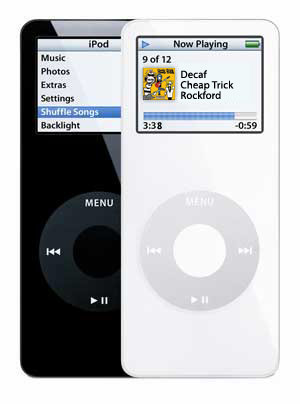

 Creo que cuando Apple se pone a hacer las cosas bien... no es que salen bien, es que salen redondas. Pensaba que no me podría sorprender más alguna actuación de Apple, pero sin duda esto supera todo lo que he visto hasta el momento. Y es que a todos los que tengamos un iPod nano de primera generación —adquiridos desde septiembre de 2005 hasta diciembre de 2006— nos los van a reemplazar gratis por uno, del mismo modelo, pero nuevo.

El motivo de este programa de remplazo ha sido detectar un mal funcionamiento en las baterías de algunos de los dispositivos vendidos de este modelo concretamente.

Con este programa de reemplazo nos aseguramos que la batería de nuestro iPod no va a estropearse, va a estar nueva, y va a tener la misma duración que tenía el día en que lo compramos. Vamos a tener un producto nuevo seis años más tarde. Para más información, cito su descripción del problema:

> Apple ha determinado que, en muy contadas ocasiones, las baterías de los iPod nano de primera generación pueden recalentarse, lo que puede suponer un riesgo para la seguridad. Los iPod nano afectados se vendieron entre septiembre de 2005 y diciembre de 2006.
> 
> Este problema se atribuye a un único proveedor de baterías que las produjo con un defecto de fabricación. Aunque la probabilidad de que se produzcan incidentes es pequeña, esta aumenta con la edad de la batería.
> 
> Apple recomienda que dejes de usar tu iPod nano (1ª generación) y que sigas el proceso que se describe a continuación para solicitar la sustitución de la unidad sin ningún coste.

Yo ya he hecho mi petición para formar parte del programa de sustitución, pues todavía conservo este iPod y sigo dándole uso como el primer día, tantos años después. Y funciona de maravilla, todo sea dicho. Podéis encontrar [más información sobre el programa de sustitución](http://www.apple.com/es/support/ipodnano_replacement/) en este enlace, y también, la página para [solicitar el reemplazo del iPod nano](https://supportform.apple.com/201110/).

Ahora decidme, ¿qué compañía, después de seis años, hace un reemplazo de esta magnitud con productos que, como el mío, durante seis años han funcionado a la perfección? Simplemente, porque hayan habido casos en los que no haya sido así. Cualquier otra compañía se lava las manos y achaca esos errores al paso del —mucho— tiempo.

**ACTUALIZACIÓN, 09/01/12**: [Ya tengo el iPod nano de reemplazo, ¡yeah!](http://fjp.es/ya-tengo-el-ipod-nano-de-reemplazo-yeah/)
