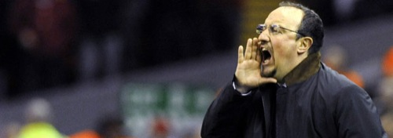

Debido al hipotético pero más que probable cambio de entrenador en el [Valencia CF](http://fjp.es/etiqueta/valencia-cf/), para así hacer un cambio de ciclo, **muchos de los aficionados están deseando que, ya que Rafa Benítez está sin equipo y escuchando ofertas, fuera él quien ocupara el banquillo valencianista la próxima temporada**. Incluso yo, si pensara con el corazón, sin duda diría que sí a esto; **pensando con la cabeza es imposible dar rienda suelta a esa imaginación**.

En primer lugar, **porque Rafa Benítez jamás lo haría**. Uno de los principales motivos por los cuales se marchó del Valencia es porque quien hoy en día es presidente, **Manuel Llorente, tenía una relación pésima con Rafa**. Entonces no era mas que un directivo... **hoy en día es presidente. Si entonces eran incompatibles, hoy lo serían aún más**.

En segundo lugar, porque **a la afición valencianista no debería interesarnos**. Tal y como están las cosas, conforme están el Real Madrid y el Barcelona, **es muy difícil que, de venir, Rafa pudiera hacer una campaña digna de ser recordada**, tal como lo fueron, son y serán siempre las temporadas en las que nos obsequió con su presencia en el banquillo valencianista. **Aquí, en el Valencia, Rafa Benítez es Dios, literalmente**. Siempre **será recordado como ese entrenador que se ganó a la afición, a los futbolistas y que, pese a no tener ninguna estrella mediática en ese momento, consiguió sacar petróleo de donde parecía no haber nada** y nos regaló algunos de los momentos de los que con más cariño guardo. **Y de los más importantes en la historia reciente del Valencia**.

Si Rafa volviera al club y no consiguiera igualar o superar aquellos momentos, des afortunadamente perdería todo ese encanto que logró. Y pasaría de ser una estrella a estar estrellado. Pasaría de ser recordado como **EL ENTRENADOR**, en mayúsculas, a posiblemente _ese hombre que vino por segunda vez ilusionando y que se marchó por la puerta de detrás_.

**No sé quién debería ocupar el puesto de Unai Emery**, ni siquiera si para la próxima temporada lo ocupara otro entrenador o será el mismo —espero que no—, pero sé que **aunque me gustaría por un lado, no sería buena idea que lo ocupara el gran Rafa Benítez**.
