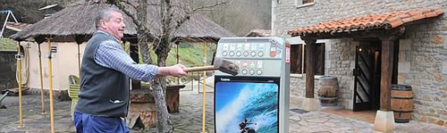

En este país de pandereta tenemos una más para contar. Y es que lejos de la obligación de pagar por sacarte la licencia para poder vender tabaco en tu establecimiento, todavía **hay más obligaciones amén de la monetaria**. Y es que **aparte de darte el derecho a vender, también desde ese momento adquieres la obligación de hacerlo. No es voluntario**. Si tienes una licencia, debes vender. No hay más. **Otra forma más de sacar dinero por parte de esta gentuza que nos gobierna**.

De no hacerlo, **te puede pasar como ha pasado a los dueños de dos establecimientos de Alaior, en Menorca**. La Guardia Civil **les ha puesto una denuncia por tener una máquina desconectada de la red eléctrica**, y por tanto, hacer imposible su venta. No es bastante con que no se permite fumar en los bares ni con que la gente ya no compre tabaco en los bares puesto que es más caro que en los estancos. **Deben arruinarles más el negocio de alguna forma**. Si en tu bar no entra a comprar nadie tabaco, por ejemplo, ¿para qué quieres tener la máquina conectada?, ¿más gasto?

> Esto es como si te compras un coche y te obligan a utilizarlo porque si no te multan.

**Tan absurdo como lo sería esa misma cita**. Los dueños del primer establecimiento alegaron que tenían la máquina apagada **porque no tenían dinero para poder reponerla, no podían comprar más tabaco**. Gracias a la ley que nos ha impuesto el Partido Socialista. En el segundo caso, simplemente alegaban que la máquina estaba estropeada... Aun así, **en ambos casos, la multa ya la tienen puesta**. Veremos, si tras recurrir, les quitan la multa o se quedan con ella.

Visto lo visto, **habrá que hacer como hizo Pedro Mari Garaialde**, el hostelero de Otxandio que encabeza este artículo. Así, no habiendo máquina, no hay tampoco denuncia. **Pero no deberían ser casos aislados, debería ser todo el país**. Y cuando a Zetaparo se le acabara el chollo de los impuestos que le ingresa un producto prohibido en la mayoría de lugares de este país, y que mata, a ver qué hacía. Conociéndole, [regalaría 300 millones de euros más a Túnez](http://www.europapress.es/nacional/noticia-espana-abrira-linea-credito-300-millones-euros-tunez-20110302171453.html), o algún otro país, ¡qué más da cual sea! **¡Que vamos sobrados, oiga!**
