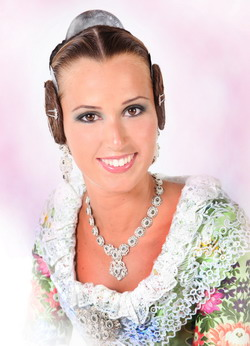
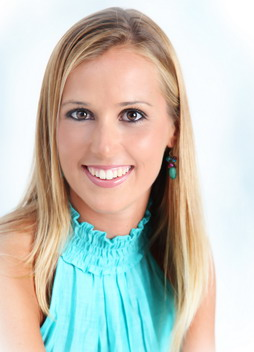
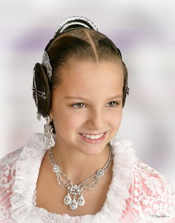
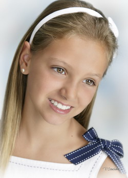

Ya tenemos Falleras Mayores de Valencia para el año 2012. Como siempre, todos los valencianos nos hemos enterado con la clásica llamada telefónica de la Alcaldesa de la ciudad, Rita Barberá.

   
**Fallera Mayor de Valencia 2012**

La Fallera Mayor de Valencia 2012 se llama **Sandra Muñoz Pérez**, pertenece a la comisión Carcagente-Compromiso de Caspe, sector Jesús. Tiene 28 años y trabaja como ingeniera agrónoma.

   
**Fallera Mayor Infantil de Valencia 2012**

La Fallera Mayor Infantil de Valencia 2012 se llama **Rocío Pascual Candel**, pertenece a la comisión **Santa Genoveva Torres-Arquitecto Tolsa-Alfahuir**, sector Rascanya, tiene 12 años.

Al principio me he desilusionado, porque el mensaje en el hemiciclo ninguna de las dos lo ha hecho en valenciano. Después, en las entrevistas a Canal 9, ambas lo han hecho en valenciano. Hay que decir que la Fallera Mayor Infantil tiene mucha más soltura hablándolo, pero la Fallera Mayor lo intenta, al menos, así que también me sirve. Para mí, quienes me seguís, ya sabéis que lo considero algo imprescindible.

No quiero olvidarme tampoco del resto de las fallares seleccionadas, que acompañarán a Rocío y a Sandra durante todo este año en todos los eventos a los que tengan que asistir.

**Corte de la Fallera Mayor de Valencia 2012**: Ángela Ballester Milán, Alba Garrido Martí, Carmela Borrás Morell, Patricia Juliá Fernández, Sara Madrid Carmona, Aroa Alamino Bautista, Andrea Bellver Blat, Cristina Ribera Llisó, Sheila Caicedo Suay, Mª Amparo Terrones Sánchez, Beatriz Mondéjar Marco y Laura Boscá Sancho.

**Corte de la Fallera Mayor Infantil de Valencia 2012**: Luna May Borja Quiles, Marina Asensi Esparcia, María Sancho Prats, Carmen Alepuz Salvador, Claudia Ausina Soler, Mar López de Briñas Sáez, Macarena Bonal Bonora, Roser Serrano Pons, Andrea Jaime Fullana, Valeria Sánchez Sanlorenzo, Angel Soler Nuñez de Arenas y Paula Cucarella Tormo.

Deseo a todas y cada una de ellas que pasen un año genial. Ya tengo ganas de verlas en **La Cridà**.

¡Empiezan las Fallas de 2012!
