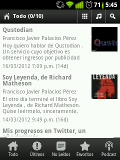

Eric, un amigo y lector del blog, hace unos días me sorprendió contactando conmigo para decirme que había programado una [aplicación del blog para Android](http://dl.dropbox.com/u/15580841/APK/blogfjp.apk). Enviándomela, y diciéndome que la compartiera con los lectores de este blog. Para que siempre estéis atentos de lo que sucede por estos lares.

**Todos los que tengáis un teléfono con el sistema operativo de Google podréis instalarla**; su nombre, como no podía ser otro: [FJP](http://dl.dropbox.com/u/15580841/APK/blogfjp.apk).

**Cuando abráis la aplicación por primera vez os descargará automáticamente los últimos diez artículos escritos**; estarán marcados como no leídos —podréis marcarlos como leídos desde el menú de opciones—. Desde las opciones **pueden activarse las notificaciones** —que avisará cuando haya una nueva actualización— **y fijar un tiempo para comprobar si hay un nuevo artículo**. Dada la ocasional actualización de este blog, el consumo de batería extra que ocasionaría y las opciones disponibles: **no os recomiendo fijar el intervalo actualización a menos de 24 horas**.

Si hasta el momento sólo habéis instalado aplicaciones desde Android Market Google Play, para permitir la instalación desde terceros tendréis que ir a Ajustes > Aplicaciones. Y habilitar «orígenes desconocidos».

Ahora ya no tenéis excusa para comentar en cada uno de mis artículos. Que ya sabéis que me encanta.

Por último: **agradecer a Eric el desarrollo de la aplicación**. Y a vosotros, que me leéis: dejad en los comentarios vuestras impresiones sobre esta aplicación. Qué os parece, todo eso.
