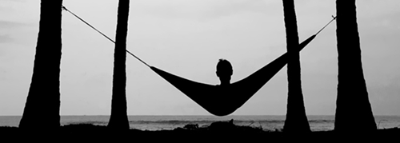

[fotografía de Grigory Gorbushin](http://500px.com/photo/28891)

Hace mucho, demasiado tiempo, que no me paso por aquí. La típica crisis de ideas; he vivido tantas que ya no me avergüenza reconocerlo. Lo que más me importa es que, aunque esto parezca abandonado, nunca lo está en realidad; siempre planeo un retorno, porque me encanta escribir, porque me siento a gusto haciéndolo y porque me da la libertad que necesito. En mi rincón, en mi morada, donde nadie me dice qué está bien o qué está mal. Donde puedo aporrear el teclado con cualquier cosa que se me pase por la cabeza —y sin límite de caracteres, cosa importante para mí. Y eso es bueno.

Como me comentó una vez [mi amigo Carlos](http://carlos63ccp.blogspot.com.es): parece que [la vuelta de Mauricio Pellegrino al Valencia](http://fjp.es/mauricio-pellegrino-nuevo-entrenador-del-valencia-cf/) me dejó trastocado. Y sí, es cierto, es evidente. Me dejó tan frustrado que ya se me fueron las ganas de escribir nada más durante todo este tiempo, jaja.

Quiero hacer una especie de recopilatorio entre todas las cosas que me han ido sucediendo, o que considero dignas de mención. Y a las que ya no dedicaré un artículo completo por hacer demasiado tiempo desde que sucedieron hasta ahora. Así que vamos allá y espero no dejarme nada _en el tintero_.

### Nuevo teléfono móvil

Es lo que más contento me ha puesto este año, sin duda. Al menos hasta el momento, aún queda algo de año por delante. Y sí, es un teléfono móvil, aunque la función de teléfono de ese dispositivo sea la que menos utilice, como cada vez va siendo más habitual. @NiaLunera, que es la chica más especial que internet me ha dado el placer de conocer, a la que quiero muchísimo, que es genial, y que me cuida un montón, quiso que dejara atrás el suplicio de lidiar cada día con el anterior teléfono. Del que acabé hasta donde ya podéis imaginar. Y ahora todo es diferente, gracias a ella. Nunca sabrá hasta qué punto agradezco que haya hecho eso por mí.

El teléfono es un [Huawei Ascend G300](http://faqsandroid.com/huawei-ascend-g300/). Quienes me sigáis por Twitter o Facebook ya lo sabréis pues he dado mucho la tabarra con él. Pero es que merece la pena, porque es sin duda el mejor móvil que he tenido nunca. Pantalla de 4", que me ha hecho _ver la luz_, ya que la anterior… Bueno, dejémoslo en que era una _pantallita_. Va súper rápido, tiene panel IPS con Gorilla Glass —el mismo cristal que utiliza el iPhone, por ejemplo—, el doble de memoria ram que el anterior, y en fin, un montón de cosas técnicas en las que no entraré ya que en el enlace que puse anteriormente está todo explicado al detalle.

### Falleras mayores de 2013

¡Ya tenemos falleras mayores para el próximo año! Aunque no dedicaré un artículo completo a ellas como en años anteriores sí quiero dejar sus nombres para el recuerdo.

La Fallera Mayor infantil para 2013 es Carla González Hortelano; tiene 10 años, pertenece a la comisión Guardacosta-Músico Jarque Cualladó del sector Zaidia. Y esta es su Corte de Honor, compuesta por: María Fita Lluna, María Valero Félix, Ana Rubiero Peris, Lucía Enderiz Cuenca, Inés Rodrigo Lerma, Clara Guiñón Aparici, Noelia Martínez Blanco, María Isern García, Verónica Vives Lull, Izaskun Albertos García, Carla Romero Olaso y Carmen Tarazona Barrachina.

La Fallera Mayor para 2013 es Begoña Jiménez Tarazona; tiene 22 años, pertenece a la comisión Isabel la Católica-Cirilo Amorós del sector Pla del Remei-Gran Via. Su corte de honor está compuesta por: Carla Desamparados Esteve de la Orden, Rebeca Aguado Carsí, Elena Bosch Gómez, Andrea Carrilero Robredo, Patricia Marset Lara, Ana Isabel Bordas del Prado, Isabel Vicente Pérez, Alba Ballester Poves, Jessica Domínguez Roca, Begoña Amorós Quilis, Teresa Ferrer Párraga y Marta Chico Bayona.

Enhorabuena a las dos; la mejor de mis suertes para este reinado. Aún no he tenido ocasión de oírlas hablar en valenciano, pero espero que sepan hablarlo, y que lo hablen correctamente. Y con correctamente no me refiero a lo que la AVL entiende por correcto, claro.

### Enganchado a series

¡Ha vuelto [The Walking Dead](http://www.imdb.com/title/tt1520211/)! El pasado 14 de octubre arrancó la tercera temporada —para quienes hayáis leído los cómics, la parte de la cárcel— y tiene una pinta impresionante. Siempre tuve debilidad por esta serie, y aunque más o menos sepa cómo va a avanzar el argumento por haberme leído los libros, no deja de interesarme lo más mínimo. Hacen un papel fantástico todos ellos.

Pero no sólo eso, además de todas las que seguía hasta entonces empecé con [666 Park Avenue](http://www.imdb.com/title/tt2197797/), [The Newsroom](http://www.imdb.com/title/tt1870479/), [Revolution](http://www.imdb.com/title/tt2070791/), [Person of Interest](http://www.imdb.com/title/tt1839578/) y [New Girl](http://www.imdb.com/title/tt1826940/). Y claro, el regreso de todas las series que terminaron temporada y vuelven a la carga. En fin, que no me quejo, tengo bastantes cosas por ver.

Y aunque no es una serie, también empecé a ver la edición española de [La Voz](http://www.telecinco.es/lavoz/). Típico _reallity show_ musical, pero con algo interesante. Y es que las audiciones son _a ciegas_; es decir, quienes seleccionan a los concursantes, teóricamente, sólo escuchan la voz de esa persona, no tienen ni idea de quién ni cómo es. En la edición española el conductor y presentador del programa es el recurrente Jesús Vázquez; los _coaches_ David Bisbal, Rosario Flores, Malú y Melendi. Nada nuevo.

David Bisbal ya me caía mal, pero ahora es que me cae de pena. ¡Qué tío más payaso! Rosario Flores no puede caerme bien en la vida, aunque ni la conozca ni me interese, ya que lo que representa me da grima. Y no entremos en asuntos raciales que ya me lo veo venir; me refiero únicamente a la música, a la industria musical para ser más preciso. En cuanto a Malú y Melendi tengo mejores sensaciones; ambos siempre han hecho canciones que me han gustado, aunque personalmente no sabía absolutamente nada de ellos. Conociéndolos más, han pasado de un _ni fu ni fa_ a caerme bastante bien.

### Finiquitando, que me enrollo

Mi vida ahora mismo no es demasiado emocionante. Si esperabais leer cosas alucinantes deberíais haber empezado a leer algún libro de [Tolkien](http://es.wikipedia.org/wiki/Tolkien) —y digo «algún» porque os prometo que tiene más de uno, en serio. Y sí, me habéis pillado, menciono los libros porque queda muy guay.

Básicamente, espero ir escribiendo más regularmente a partir de ahora. Y como siempre digo: no sé cuánto me durará. Aunque en esta ocasión pienso variar mucho más de temas que antes, para no quedarme sin saber qué decir, como pasó la última vez. Ahora tengo un buen teléfono con el que poder descubrir nuevas y geniales aplicaciones, y os hablaré sobre ellas. Que ahora sí puedo probarlas como es debido. También meteré algo de otras cosas donde tenga algo interesante que decir, sin dejar de lado las chapas estas personales donde _pongo a caer de un burro_ a alguien al azar, que me sirven de desahogo.

Y eso, que sigo vivo. ¡Hasta pronto!
