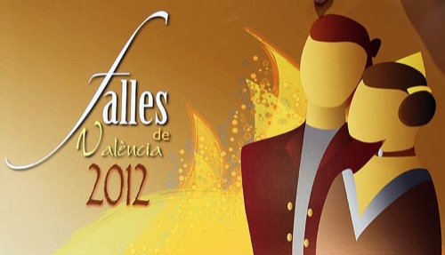

Acaba de presentarse el calendario oficial de eventos pirotécnicos para las Fallas de este año 2012. Y como viene siendo tradicional, cada año, me hago eco de uno de los eventos que más me gustan en las fallas. Aunque realmente son muchos, y distintos, pero con un denominador común. Claramente hablo de la pólvora.

Ese primer estruendo, los primeros humos, el olor a pólvora, los primeros lagrimeos si el aire cambió de dirección y te va el humo hacia tu cara, estruendos medianamente flojos y aislados, que cada vez van sonando más rápido, hasta el momento en que notas el temblor en tus pies, ya no diferencias dónde termina el estruendo de la anterior explosión y empieza una nueva, notas que se acerca el final, el temblor es cada vez más intenso, más, más... Suenan las primeras carcazas aéreas dando paso a un terremoto final aéreo atronador. Todo el mundo aplaude, satisfecho, alegre, con una sonrisa de oreja a oreja. Acabas de presenciar un espectáculo musical _in crescendo_, una sonata perfecta... Música para mis oídos, gloria para mis fosas nasales.

Y esto, apreciado lector, es más o menos lo que se te pasa por la cabeza cuando contemplas tal obra de arte. En la que los valencianos, sin modestia alguna ya que no la necesitamos, claramente somos los mejores. ¿Y aún sigues preguntándote por qué me encanta la pólvora? ¡Vuelvo al tema, que me disperso!

### Mascletàs en la Plaza del Ayuntamiento, 14:00h.

- **1 de marzo**: Pirotecnia Peñarroja.
- **2 de marzo**: Fuegos artificiales Hermanos Ferrández, de Alicante.
- **3 de marzo**: Pirotecnia Gironina.
- **4 de marzo**: Pirotecnia Gori.
- **5 de marzo**: Pirotecnia María Angustias, de Granada.
- **6 de marzo**: Pirotecnia Borredà.
- **7 de marzo**: Pirotecnia Crespo.
- **8 de marzo**: Pirotecnia Martí.
- **9 de marzo**: Pirotecnia Zarzoso.
- **10 de marzo**: Pirotecnia Aitana.
- **11 de marzo**: Pirotecnia Tomás.
- **12 de marzo**: Pirotecnia Caballer FX.
- **13 de marzo**: Pirotecnia El Portugués.
- **14 de marzo**: Pirotecnia Hermanos Caballer.
- **15 de marzo**: Pirotecnia Europlà.
- **16 de marzo**: Pirotecnia Turís.
- **17 de marzo**: Pirotecnia Valenciana.
- **18 de marzo**: Pirotecnia Ricardo Caballer.
- **19 de marzo**: Pirotecnia Caballer.

### Castillos de fuegos artificiales

- **15 de marzo, 00:00h.**: Pirotecnia Turís - Paseo de la Alameda.
- **16 de marzo, 01:00h.**: Pirotecnia Valenciana - Paseo de la Alameda.
- **17 de marzo, 01:00h.**: Pirotecnia Ricardo Caballer - Paseo de la Alameda.
- **18 de marzo, 01:30h.**: Pirotecnia Caballer (NIT DEL FOC) - Paseo de la Alameda.

Estos son los eventos pirotécnicos más destacados de Valencia en Fallas. Aunque no son los únicos. En cada célebre evento se utiliza la pólvora como nota final, como la _guinda del pastel_, como la apoteosis final. Porque no hay Valencia sin pólvora, ni pólvora sin Valencia.

A continuación una lista de eventos menos conocidos por los turistas, pero que como culminación a tales, también llevan como denominador común esa pólvora que tanto me gusta. **La hora de inicio de la mascletà nocturna del día 4 de marzo es la del inicio del acto en sí, la parte que nos interesa no llega hasta que no finalice**.

- **4 de marzo, 17:00h.**: Pirotecnia Gori - Plaza del Ayuntamiento, al finalizar la cabalgata del ninot.
- **10 de marzo, 00:00h.**: Pirotecnia Europlà - Plaza del Ayuntamiento, mascletà de colores.

Este año, como estamos aún más afectados por la crisis, lamentablemente se han eliminado bastantes eventos pirotécnicos, a saber: la mascletà aérea napolitana, la mascletà en miniatura al finalizar _El cant de l'estoreta_, las mascletàs en honor a la Policía y Bomberos tras su homenaje, y las que se disparaban tras el homenaje al Maestro Serrano y a Maximiliano Thous. Espero que pronto se esfume esta crisis que nos acecha, y que nos obliga a ser algo más austeros con los presupuestos para nuestras fiestas. Ya que, como dije: Valencia es pólvora.

Los horarios obviamente pueden modificarse según cambios de última hora. Me limito a transmitir el programa con sus horarios previstos. No me hago responsable de las alteraciones en los mismos.
