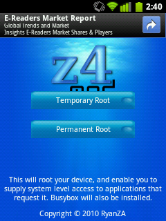
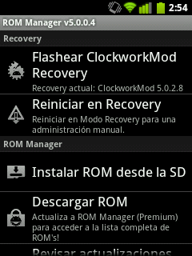

Desde este tutorial aprenderemos a instalar el _port_ de CyanogenMod en el Vodafone 858 Smart (Huawei U8160) desde ROM Manager —el nuevo método—, para las antiguas versiones —la forma tradicional— visitad [el tutorial anterior](http://fjp.es/cyanogenmod-en-vodafone-858-smart-huawei-u8160/).

Sin duda, **los poseedores de este pequeño smartphone estamos de enhorabuena**. Aunque, sobre todo, para aquellos que se aventuren ahora al manejo e instalación de diferentes ROMs desde este teléfono. Ya que una de las mejores, si no la mejor, desde el pasado día 3 de febrero de 2012 es ahora mucho más fácil de instalar que antes. Es, por qué no decirlo, **asombrosamente sencillo**.

De forma resumida, CyanogenMod sirve para añadirle un plus a nuestro teléfono. **Nadie que se compre este smartphone puede esperar maravillas de él**, porque no las encontrará, pero dentro de sus limitaciones, **la instalación de esta ROM hace que se noten mucho menos, y que podamos disfrutar mucho más de la experiencia que puede ofrecernos este teléfono**. En el anterior tutorial puse un ejemplo, el cual vuelvo a poner porque considero que ejemplifica muy bien lo que quiero decir: con la ROM que viene de serie, la que instala Vodafone, **no hay forma de hacer que Google Street View funcione**, siempre termina dando error y sale de la aplicación; con esta ROM, acorde al hardware del teléfono, eso sí, pero **podemos hacer uso de esa aplicación sin que dé error**. Explota el poco hardware del teléfono al máximo.

### Qué necesitamos para instalar CyanogenMod

 Esta vez, como ya dime anteriormente, es mucho más sencillo, por lo que los pasos a realizar tanto para actualizar como para instalar de nuevo son más sencillos.

Al igual que sucedía anteriormente, tanto si es la primera vez que cambiamos de ROM —es decir, pasamos de la que viene de origen de Vodafone a esta—, como si anteriormente habéis instalado otra ROM diferente y queréis probar CyanogenMod, **todos los datos del teléfono se perderán**, exceptuando los que estén sincronizados con los servidores de Google, como puedan ser los contactos —Google Contacts—, la lista de aplicaciones instaladas desde el Market —ojo, no las aplicaciones instaladas, si no una lista de las que teníamos instaladas—, o las llamadas perdidas —si lo configuramos así— y los sms, gracias a la fantástica app [SMS Backup+](https://market.android.com/details?id=com.zegoggles.smssync), una aplicación por la cual merecería la pena pagar si tuviera algún coste, porque encima es gratuita. Si nos lo montamos bien, es un ratito el que _perdemos_... **Y os lo aseguro, ganamos mucho**.

Si estás decidido, vamos a empezar a descargar. Lo primero: la aplicación [z4root](http://www.mediafire.com/?dz1id34fxkrdfj5) —ojo, descargar desde el navegador web del teléfono—, esto servirá para hacer root al teléfono. Después debemos descargar la aplicación [ROM Manager](https://market.android.com/details?id=com.koushikdutta.rommanager) desde Android Market. Para la instalación de z4root necesitamos entrar en **Ajustes** > **Aplicaciones** y ahí activar la casilla de **Orígenes desconocidos**, de lo contrario no nos permitiría instalarla tras descargarla; ROM Manager se instala como cualquier otra aplicación de Android Market, seguro que todos sabéis ya.

Si venís desde otra ROM o actualizáis desde las versiones viejas de CyanogenMod **el paso de rootear el teléfono desde la aplicación z4root ya lo hicisteis en su momento, así que esta vez olvidadlo**. Y si actualmente utilizáis CyanogenMod, la aplicación ROM Manager la tenéis instalada por defecto.

**Ahora debemos descargar CyanogenMod** desde su [página de descarga](http://get.cm/?device=u8160); descargarnos la última versión disponible. **Si queremos mantener nuestra instalación actualizada tendremos que repetir este proceso cada cierto tiempo**.

Y, por último, descargamos el [último pack de Google Apps para CyanogenMod 7.2](http://goo.im/gapps). Tanto los archivos que nos hayamos descargado de CyanogenMod como el pack de Google Apps **los metemos en nuestra tarjeta SD**, conectando el móvil a nuestro ordenador mediante el cable USB.

### Al tajo, instalando z4root y ROM Manager

 Una vez descargada la aplicación z4root, tal como vimos antes, su instalación es muy sencilla; sólo tiene dos botones: Temporary Root —root temporal— y Permanent Root —root permanente. Simplemente debemos seleccionar el botón de roto permanente y la aplicación automáticamente se pondrá a trabajar sola, no tenemos que hacer nada más.

Una vez termine lo indicará, y en caso de que no se reiniciar a automáticamente, lo haremos nosotros de forma manual: desconectando el teléfono y volviéndolo a encender.

Para asegurarnos de que todo ha salido bien, como debería, después del reinicio del teléfono buscaremos en la lista de aplicaciones una nueva, cuyo nombre será Superusuario. Si la tenemos instalada, todo funciona bien. En caso de que no lo esté, volvemos a repetir el proceso de rootear el teléfono mediante z4root, pero es una posibilidad muy remota.

 Ahora vamos a dejar preparada la aplicación ROM Manager para instalar después, a través de ella, CyanogenMod. Nada más abrir la aplicación veremos lo que se muestra en la imagen de la izquierda. Accedemos a la opción **Flashear ClockworkMod Recovery** y seguimos los pasos que nos pide para instalarlo, es muy sencillo.

Atención, puede que la aplicación Superusuario de la que antes hice mención nos pida acceso root para esta aplicación, sin problema se lo concedemos.

Con esto cambiamos el recovery _de fábrica_ por otro diferente que nos permitirá: acceder a él en caso de necesitarlo, que la aplicación ROM Manager pueda trabajar correctamente, la instalación de diferentes ROM y su gestión, y algunas configuraciones del sistema, las cuales ahora no necesitamos. La versión actual —de hoy— es la que aparece en la imagen: 5.0.2.8. Pasada esta fecha se actualizará, seguro; desde esta aplicación siempre podremos tener la última.

### Y por fin... ¡a instalar CyanogenMod!

Ahora, desde ROM Manager nos vamos a la sección **Reiniciar en Recovery**. Si nos sale una ventana de confirmación aceptamos. Se nos reiniciará el teléfono y nos aparecerá un menú de color azul, con muchas opciones. Para navegar por ese menú lo haremos con las teclas de volumen +/volumen -. Y para entrar en una sección, con el botón de encendido, de la parte superior del teléfono.

1. **Lo más importante de todo: realizar una copia de seguridad**. Y, para ello, nos vamos a la opción **backup and restore**. De ahí nos dirigimos a la opción **backup** e inmediatamente nuestra copia de seguridad empezará. Tardará un poco —o _un mucho_—, cuando finalice nos llevará automáticamente al menú principal.
2. Entramos en la sección **install zip from sdcard**. Una vez dentro elegimos la opción **choose from sdcard**, navegamos por la lista de archivos que tenemos en nuestra tarjeta y buscamos el correcto. Lo seleccionamos. Ahora nos aparecerá una pantalla de confirmación con un montón de opciones **No** y sólo una **Yes**; nos desplazamos hasta **Yes** y confirmamos que queremos instalar ese archivo.
3. Con esto estará instalada la versión más reciente. Ahora, si esa versión tiene uno o más hotfix, repetimos el proceso anteriormente citado por cada uno de los hotfix que vayamos a instalar. Eligiendo, obviamente, cada vez uno de los hotfix. En orden de menor a mayor número. **Si no dispone todavía de ningún hotfix, saltamos al paso número 4**.
4. Ahora debemos instalar el paquete de Google Apps que hemos descargado. Y sí, la forma de instalarlo es la misma que para instalar la versión más reciente de CyanogenMod o cualquiera de los hotfix disponibles. Ya sabemos cómo hacerlo, así que a por ello.
5. Si instalamos CyanogenMod por primera vez o actualizamos desde una versión de CyanogenMod donde se recomiende dejar el teléfono de fábrica —hacer wipe— tendremos que seguir este punto. De lo contrario, es decir: **si actualizamos desde una versión anterior donde no haga falta realizar este proceso saltamos al paso 6** y omitimos el punto siguiente.

- Seleccionamos **Go Back** para regresar a la pantalla principal. Entramos en la sección **wipe data/factory reset**. Nos aparecerá la conocida pantalla de confirmación y seleccionamos **Yes**. Ahora seleccionamos la opción **wipe cache partition**, situada también en la pantalla inicial del menú. De nuevo, confirmamos en la ventana que nos aparecerá.

7. Nos dirigimos la menú principal, entramos en la sección **advanced** y de ahí vamos a la opción **wipe Dalvik cache**. Nos aparecerá la pantalla de confirmación, seleccionamos **Yes** y confirmamos.
8. Por último, desde el menú principal, seleccionamos **reboot system now**. El teléfono se reiniciará y esperaremos un rato a que termine —puede rondar los 10 minutos, es normal—.

### Últimas consideraciones

En caso de catástrofe con todos los pasos anteriores, recordad que —**si me habéis hecho caso**— se ha realizado una copia de seguridad para restaurar el sistema en caso de fallo. No creo que os suceda, pero si es así, simplemente deberéis entrar en ROM Manager, entrar en la opción **Administrar y restaurar copias**, elegís la copia de seguridad que tengáis —si sólo habéis hecho una, esa; si hay varias, la más reciente—, la seleccionáis y elegís la opción de **Restaurar**. Tras esto, se os reiniciará el teléfono, volverá a entrar en modo recovery como antes y empezará a volcar la copia de seguridad para dejar el teléfono tal cual lo teníamos.

Si queréis estar al tanto de las novedades que va teniendo este port de CyanogenMod para nuestro teléfono, podéis echar un vistazo al [foro de XDA-Developers](http://forum.xda-developers.com/showthread.php?t=1259739), donde el desarrollador nos mantiene informados de sus avances y además ofrece soporte para los usuarios en caso de problemas.

### Advertencia

**Quiero dejar claro que no me hago responsable de cualquier daño que se le pueda hacer al teléfono móvil mientras se sigue este tutorial**. También quiero dejar claro que **yo lo he hecho, que no me ha pasado nada, y que no tiene por qué pasar nada**. Es algo seguro, que cientos de personas hacen y no ocurre nunca nada. No tiene por qué. Pero ya sabéis.

### Restaurar el teléfono de fábrica

Gracias a **Yokema**, en los comentarios, podemos conseguir una forma de restaurar el teléfono y dejarlo con el [firmware de fábrica de Vodafone](http://www.mediafire.com/?x8136da80s2xg9y). Dentro del archivo comprimido que se descarga viene un documento explicativo para saber cómo debemos proceder. **Personalmente no lo he probado; en los comentarios ha habido al menos dos casos de gente que lo ha probado y les ha funcionado**.

**Espero que os haya servido de utilidad.**

\[ayuda\]
