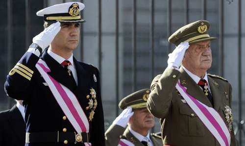

Lo primero que quiero dejar claro, como se deduce que será —pero por si acaso—, es una opinión personal. Mía, propia, nada más. Quería hablar de esto, porque es el tema en boca estos días y no comenté nada sobre ello. Dejaré claro en primer lugar que **soy monárquico**. El simple hecho de pensar en Mariano Rajoy o Alfredo Pérez Rubalcaba dirigiendo el país sin que nadie pueda poner _un filtro_ a las decisiones más comprometedoras, amén de llevarse a fin de mes todavía más dinero, **me pone los pelos como escarpias**. En cierto modo, es como veo yo este tema; para los que nos manejamos con productos tecnológicos: una especie de _control parental_. Sólo que con un pequeño matiz: la vida de todo un país está en juego.

### Monarquía

Aunque todos somos conscientes del papel fundamental que nuestro actual rey, Juan Carlos I, ha hecho por este país. En la época de la transición, la instauración de una democracia y una Constitución como la que hoy tenemos —aunque en demasiadas ocasiones quienes nos gobiernan se olviden de su existencia—, **nunca puede considerarse un aval vitalicio para su cargo**. Esa época pasó, cumplió sus funciones con creces y así figura en los libros de historia, eso jamás se lo quitará nadie. Ahora bien, como dicen: **renovarse o morir**.

Arreglo a los tiempos que corren, y lo que los españoles necesitamos, es evidente que la Familia Real no aporta al país lo que los españoles reclaman. **Ni comunicación, ni transparencia, ni un aporte notable en la resolución de los problemas que tenemos debido a la crisis**. Aunque estos problemas no los haya ocasionado él, es cierto.

**Los viajes que haga, para lo que sea que haga en ellos, no es más ni menos que lo que hace cualquier otra persona con un nivel adquisitivo como el de él**. No estoy a favor de las cacerías, ni del maltrato animal, pero lamentablemente es así. Además, **habría que ser muy cínico para decir que nos enteramos ahora que el rey se va de caza**. Lleva haciéndolo toda la vida, aunque no es lo que quisiéramos. Seamos claros: en ese país la caza de elefantes es legal, si no lo hace él, lo haría cualquier otra persona. **Está bien tener sueños**: acabar con las guerras, acabar con la tortura animal, con el hambre en el mundo… **Pero son utopías**.

Es por ello que pienso que, **si no quiere que con él mismo se acabe la monarquía** en este país —cosa que yo tampoco quiero— **debería abdicar cuanto antes en el Príncipe Felipe**. Persona a la que veo mucho más capaz ahora mismo, sería **el primer rey con estudios universitarios**. Creo que podría dar la transparencia que reclamamos los españoles. Y en definitiva: que la imagen de la Casa Real no esté por los suelos continuamente. **La monarquía que se precisa en 2012 no es la misma monarquía que se necesitaba en 1975**.

### República

Repito de nuevo: pensar en Mariano Rajoy o Alfredo Pérez Rubalcaba dirigiendo el país sin que nadie pueda poner _un filtro_ a las decisiones más comprometedoras **me pone los pelos como escarpias**. Y si hablamos de mi querido José Luis Rodríguez Zapatero, probablemente prefiriera una patada en mis partes más sensibles.

Hay quienes dicen que con una república el Jefe de Estado del país lo elige el pueblo, **evidente lo dicen porque no tienen ni idea de lo que dicen**, ya que quien elige al representante y mandamás del país son **las Cortes**.

Hay otros que aseguran que el presupuesto económico para la Familia Real española es _desorbitado_; **otra falacia**: primero habría que comparar el presupuesto… podrían empezar comparándolo con el presupuesto de las monarquías de Reino Unido o Suecia.

Y los más atrevidos directamente afirman que una república es más económica para el país que cualquier monarquía; **de nuevo, otro error**: que empiecen revisando el presupuesto para países republicanos con Jefe de Estado activo, como Estados Unidos o Francia; o mejor: hacer una comparación con países como Portugal, Alemania o Italia, cuyas repúblicas tienen un Jefe de Estado con funciones similares a nuestro Rey.

Y con esto, señoras y señores, **todos los argumentos de los que están a favor de la tercera república se han ido al traste**. A los cuales, cómo no, respeto. Pero **que se busquen unos argumentos de verdad**, no éstos. Dudo que con otros argumentos válidos pudiera nadie hacerme cambiar de opinión, porque como ya dije en dos ocasiones: **me niego a ver a los políticos de este país al frente de todas las decisiones**. Pero al menos sabríamos que sus argumentos tienen algo de veracidad.

### YPF

Otro tema que está en boca de todos es el de la petrolífera YPF; hasta ahora, afiliada a Repsol. La presidenta argentina, Cristina Fernández de Kirchner, ha decidido nacionalizarla, consiguiendo con ello un bien para su país. **Seré claro y rápido: bien por ella**. ¿Acaso si nosotros pudiéramos hacer algo que perjudicara no sólo a los argentinos, si no a cualquier país del mundo, que trajera notables beneficios para España, no lo haríamos? Pues eso. Además, recordemos: **no perjudica a nuestro país _per se_; perjudica a Repsol**. Esa misma compañía que **cuando sube el precio del petróleo, sube nuestro combustible**… **pero cuando éste baja, misteriosamente nuestra gasolina sigue subiendo**. Argentina no es quien perjudica a España; **quien perjudica a España y a los españoles es Repsol**. ¿Por qué debería yo preocuparme de cómo les vayan a ellos las cosas?

### Resumiendo

Para poner punto y final a esto, lo haré con una pregunta: **don Juan Carlos, ¿cuándo abdicará en su hijo, don Felipe, Príncipe de Asturias?**
