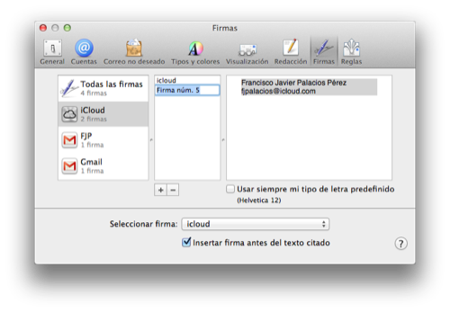
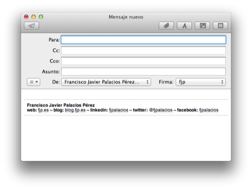

 Hace tiempo escribí [un tutorial](http://fjp.es/tutoriales/) en el cual enseñaba a [adjuntar firmas con código HTML a nuestras cuentas de Apple Mail](http://fjp.es/firmas-html-en-apple-mail/) —sólo versiones anteriores de OS X. Ya que Apple no pensó —y sigue sin hacerlo, al parecer— que pudiéramos necesitar estas herramientas… aunque ni tan siquiera un editor de texto enriquecido con lo básico —negritas, cursivas, enlaces, etc.

El caso es que en Mountain Lion, con la sexta versión de Mail, complicaron un poquito más la labor; ya no es tan sencillo como antes, aunque sigue siendo una tarea fácil si sigues los pasos que te indico en este nuevo tutorial. **Si has actualizado desde anteriores versiones de OSX te habrá importado las firmas que ya tenías creadas con el método anterior**, así que no tendrás que hacer nada nuevo. Eso sí: sólo hasta que quieras cambiar una firma existente, o añadir una nueva.

### Creando nuestra firma

Este tutorial no es para enseñar a hacer una firma en HTML; previamente debemos de tener una ya creada. Si no sabes cómo hacerla hay páginas web como [firmasdecorreo.com](http://www.firmasdecorreo.com/) que lo hacen por ti. También pueden emplearse aplicaciones como Dreamweaver o similares, que aunque no son tan sencillas como las herramientas online que citaba antes, facilitan enormemente la creación de la firma.

Si optamos por crearla nosotros mismos, sea de la forma que sea, en caso de tener pensado añadir una imagen hay que tener en cuenta que como Apple no ha pensado tampoco en que necesitásemos añadirlas no podrán ser adjuntadas en el correo como sí sucede en otros clientes. Así pues, tendremos que alojar las imágenes en un servidor de alojamiento externo que permita obtener un enlace directo a la imagen que subamos, como pueda ser [ImageShack](http://imageshack.us/), por ejemplo. Y claro, añadir ese enlace al código HTML donde se inserte la imagen.

### Al tajo

Tal como hacíamos la otra vez, tenemos que «engañar» a Mail para que acepte nuestra firma. El primer paso es crear una firma válida para Mail. Simplemente abriremos Mail, entraremos en la ventana de **Preferencias** y seleccionaremos la sección de **Firmas**. Seleccionaremos la cuenta para la que hayamos creado nuestra firma y haremos click en el botón de añadir una nueva firma (**+**). Esto que crea una firma de ejemplo, que llevará nuestro nombre y apellidos y nuestra dirección de correo electrónico; no es necesario que la modifiquemos porque esa no será la firma que tendremos. **Ahora cerramos la aplicación Mail**, importante.

Antes podíamos acceder desde Finder a nuestro directorio personal de **Librería**, pero ya no. Por defecto viene oculto: existe, pero desde Finder no podemos verlo. Pero todo tiene solución. En caso de que no lo hayáis hecho previamente, nos iremos a nuestra carpeta de **Aplicaciones**, de ahí accedemos a la carpeta de **Utilidades**, y ejecutamos la aplicación **Terminal**. Ésta es la consola de Mac, desde donde podemos teclear ciertos comandos que representan determinadas acciones. Una vez abierta simplemente tenemos tenemos que escribir el siguiente comando y darle a enter.

chflags nohidden ~/Library

No habrá ninguna respuesta tras la ejecución del comando, no nos informará de si está bien o mal. Simplemente debemos escribirlo tal cual y funcionará. Después entraremos en nuestra carpeta de usuario; ahí debería aparecer una nueva carpeta: **Librería**, que antes no estaba. Si por cualquier caso no apareciera habrá que introducir de nuevo el comando, estando seguros de que está bien escrito —se puede copiar y pegar.

Una vez aparece entraremos dentro de la carpeta **Librería**, de ahí accederemos a la carpeta **Mail**, seguidamente en **V2**, de ahí a **Mail­Data** y finalmente a **Sig­na­tu­res**.

En caso de que únicamente haya una firma creada sólo habrá que localizar el único archivo con extensión **.mailsignature** que haya; en caso de haber más de una firma podemos saber cuál es el que necesitamos, por ejemplo, obteniendo la información del archivo —click secundario y **obtener información**— y comprobando la fecha y hora de creación. Normalmente será el archivo que esté en último lugar, nos aseguramos por si acaso no fuera así.

Ahora, una vez localizado el archivo, hay que abrirlo con un editor de textos. En mi caso uso **TextWrangler** —disponible en la [Mac App Store](https://itunes.apple.com/es/app/textwrangler/id404010395?mt=12)— ya que me ofrece un montón de posibilidades, pero puede hacerse mismamente desde **TextEdit**: el editor de textos que Apple incluye por defecto. ¡Ojo! Nunca debe abrirse con una suite ofimática como Pages, Microsoft Word, OpenOffice, LibreOffice, etc. Cuando lo abramos veremos algo similar a esto.

Content-Transfer-Encoding: quoted-printable
Content-Type: text/html;
	charset=iso-8859-1
Message-Id: <66FA76C9-71A3-45D5-AFFB-B6B68FF2F3AA>
Mime-Version: 1.0 (Mac OS X Mail 6.2 \\(1499\\))

=

Ya sólo queda eliminar todo el contenido que hay desde la séptima línea hasta abajo —séptima línea inclusive—, y tras eso, abrir el archivo que contiene nuestra firma HTML, copiarlo y pegarlo justo debajo de las cabeceras —la parte que no hemos eliminado del archivo original. Nuestro archivo con la firma también podremos abrirlo con el mismo editor de textos que hayamos empleado para abrir el archivo que contiene nuestra firma de Mail.

Ahora guardamos y nos vamos de nuevo a la carpeta donde está nuestro archivo **.mailsignature** que acabamos de editar. Obtenemos la información del archivo —click secundario y **obtener información**— y nos fijamos, casi arriba del todo —sección **General**—, en una opción que podemos habilitar marcándola que se llama **Bloqueado**: la marcamos y cerramos la ventana. Para que estemos seguros de que está bien hecho en la parte inferior diestra del icono del archivo ahora saldrá un candado.

### ¡Hecho!

Si ahora abrimos Mail y nos vamos a la sección de firmas veremos que ahora desapareció la firma sosa de ejemplo y que aparece nuestra flamante firma HTML. Ojo con editarla desde el editor: si es una edición menor en el texto puede salir bien, pero recordemos que no es un editor HTML y que puede que estropeemos nuestra firma; si queremos editar algo lo recomendable es editarlo desde el archivo **.mailsignature** de la firma en cuestión.

\[ayuda\]
