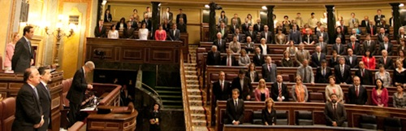

No sé cómo puedo seguir sorprendiéndome de cosas así, pero **sigo alucinando cada vez que veo lo que los políticos de este país vienen cobrando por no hacer nada para evitar los problemas que España tiene actualmente**. Y que como siempre ocurre, sólo los ciudadanos notamos. **Tengo claro que ni PSOE ni PP van a arreglar nada, porque no les interesa**. Lo único que les interesa es seguir criticándose los unos a los otros, seguir llenándose los bolsillos, y bajo ningún concepto aceptar ninguna propuesta de ley que lancen partidos minoritarios y que, de algún modo, pueda hacer que sus privilegios como políticos desciendan; **tanto económicamente, como laboralmente**.

Para alimentar mi dosis de bilis diaria con los chanchullos que se monta toda esta gente, mientras más de cinco millones de españoles estamos en paro, y ni quiero saber cuántos millones en el umbral de la pobreza —que sigan enviando ayudas a África, con dos cojones—, [estos son los sueldos que tienen nuestros queridos políticos españoles](http://biocambio.es/blog/2012/02/07/los-recortes-que-sufren-los-politicos/). Cabe suponer, que con recortes incluidos ya que estamos en una época austera. En época de bonanza no quiero saber cuántos ceros se suman por cada uno. A saber:

> **¿Qué recibe un diputado tras resultar elegido?** - Un iPhone 4S, un iPad, módem 3G, voz y datos pagados, ADSL doméstico pagado, si eres del PPSOE un asistente para cada dos diputados; si eres del resto de partidos uno privado, un despacho propio y un ordenador en el despacho.
> 
> **¿Y para moverse?** - Si usa su propio coche recibe 0,25€/km, o sea, 25€/100km y le pagan los peajes. - Si no tiene un coche oficial asignado, 3000€ anuales para taxis (250€/mes). - Billetes de primera clase para avión, tren y barco.
> 
> **¿Y el sueldo?** - Sueldo base de 3.126,52€ mensuales y dos pagas extra. Si forma parte de alguna comisión recibe entre 775,15€ y 1590,34€ más al mes. Si tiene algún cargo (portavoz, secretario, etc), en el peor de los casos recibe 2318,96€ más al mes. Puede tener trabajos y cargos fuera del congreso sin límite ni perjuicio en el sueldo o ayudas. Los sueldos que cobre del partido tampoco afectan en nada.
> 
> **¿Y las ayudas?** - Si fuiste elegido fuera de Madrid, recibes 1823,86€ mensuales más para alojamiento y manutención. - Si fuiste elegido en Madrid, recibes 870,56€ mensuales más para alojamiento y manutención. - Si viajas dentro de España: 120€ diarios. - Si viajas fuera de España: 150€ diarios.
> 
> **¿Y los beneficios fiscales?** - Las dietas relacionadas con transporte no tributan. Las dietas relacionadas con alojamiento y manunteción no tributan. Los sueldos o dietas por tener un cargo en el Congreso no tributan. Si dejas de ser diputado percibes una paga mensual de 2813,87€ hasta un máximo de dos años; no importa si tienes un sueldo privado.
> 
> **¿Y si se disuelven las cortes porque va a haber elecciones?** - Derecho a una indemnización consistente en el sueldo de los días transcurridos hasta que se forma el nuevo Congreso (el sueldo de dos meses aproximadamente), vuelvas al Congreso o no. El Congreso te paga las cuotas de la Seguridad Social, Derecho pasivo y otras cosas durante ese tiempo. El Congreso mantendrá tu póliza de accidentes durante ese tiempo. El Congreso sigue pagando el ADSL, voz y datos durante ese tiempo. La mudanza de tu despacho corre a cargo del Congreso.
> 
> **Si tienes 55 años y…** - Has sido diputado once años: 100% de la pensión máxima (2466,20€). - Has sido diputado entre nueve y once años: 90% de la pensión máxma. - Has sido diputado entre siete y nueve años: 80% de la pensión máxima. - Por el 10% del salario base, derecho a pensión privada a cargo del BBVA.

Es decir, tirando por lo bajo, dejando al margen bienes materiales y privilegios extra, **pueden cobrar mensualmente unos 8800€** mensuales. **Sumándole a eso**, por si fuera poco, **todo lo que vayan ganando extraordinariamente en sus múltiples empleos** —algunos no tenemos ni siquiera uno—, **en sueldos de sus partidos, y todo lo que de algún modo vaya entrándole en el bolsillo simplemente por ser político**.

Y mi pregunta es: **si cada vez que osan meter la pata, cobrando ese sueldo desorbitado, se les pegara un tiro entre ceja y ceja, ¿cuántos de ellos seguirían como políticos?**
