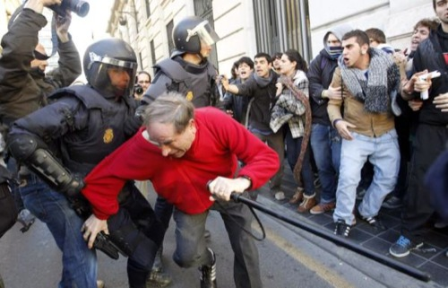

He de reconocer que **cuando empezó toda esta movida no pensaba que iba a acabar así**. Así de mal, digo. Y continuamos. Pensé que sería una de tantas manifestaciones que se hacen; una de esas en las que un grupo de gente anónima protesta y se manifiesta pacíficamente por su causa común, luego se van a sus casas y todos contentos. Pero está claro que eso no es lo que deparaba el destino.

### Policía

**Pienso que lo han hecho estrepitosamente mal; aunque no sea culpa suya el acto, sí lo son las formas y la dureza de sus intervenciones**. A quienes intentan arrinconar y disuadir no son terroristas, no son criminales, ni tampoco asesinos; son estudiantes, de secundaria, que protestan y se manifiestan por sus derechos. No van armados, **ninguno de ellos es rival para un agente de la ley armado con escopetas de pelotas, gases y acorazados con equipamiento antidisturbios**.

  

### Políticos

Decir que esto es culpa del PP me parece perfecto, es así; decir que esto con el PSOE no pasaría me parece una soberana estupidez. Os recuerdo que los altercados en la Puerta del Sol, en Madrid, ocurrían mientras el ex Presidente socialista gobernaba este país. **La Delegada de Gobierno valenciano, Paula Sanchez de León, debería ser destituida de inmediato. Ha demostrado no estar a la altura de sus quehaceres en el cargo que le ocupa**. Y cualquier político intermedio que haya dado la orden a la policía de arremeter de esa forma tan desproporcionada contra chavales jóvenes que no representan ningún peligro real contra Valencia o su gente.

  

### Presidente de la FEV

Señor Alberto Ordóñez, no sé si leerá estas humildes líneas. Desde aquí me gustaría o lanzarle una serie de preguntas: **¿usted no ha oído nunca que la mierda contra más se remueve, más olor da?** Sus palabras y actos, en un momento como este, ¿no deberían ser más proclives a contagiar calma y procurar un consenso y no avivar las llamas del fuego? Hay palabras que quedan fenomenal de cara a la galería en boca de un individuo anónimo, pero **usted debería pensar qué representa antes de poner en común sus pensamientos**.

### Estudiantes y manifestantes

Casi más manifestantes que estudiantes, porque visto lo visto, la mayoría no estudian en el colegio Lluís Vives. Al margen. **Veo estupendo que protestéis por vuestros derechos, que defendáis en la calle lo que en vuestra casa o en el colegio nadie escucharía. Pero hay sitios donde manifestares... y sitios donde no**. No todos son válidos. En Madrid por ejemplo, las concentraciones y manifestaciones principalmente se realizaban en la Puerta del Sol: sitio céntrico, a la vista de todo el mundo, y donde el resto del mundo podía enterarse de qué estaba pasando. Pero también **un sitio donde Madrid no se bloqueaba, donde no se creaba ningún caos en la circulación, y donde el resto de ciudadanos** —los cuales también tienen sus derechos, deberes y obligaciones, no sólo vosotros— **podían hacer lo que cada uno de esos días tuvieran que hacer**, libremente. Sin que la ciudad estuviera completamente sumida en el caos.

### Concretando

Bien por las reivindicaciones de los estudiantes; mal por las provocaciones innecesarias cargándose la circulación de Colón. Mal por los políticos y la Delegada de Gobierno valenciano, por no parar esta batalla antes de tiempo, que todos sabemos que se podía. Mal por la policía, porque aunque los políticos —**verdaderos culpables de todo**— les ordenen disuadir a los manifestantes, ellos son quienes coherentemente deben decidir qué grado de agresividad ejecutar en cada caso... Y este, sin duda, fue, está siendo y seguro será, desproporcionado. Al Presidente de la FEV creo que ya le dije suficiente, ya tuvo su minuto de fama en los medios.

**Diálogo, señores, diálogo. Estoy de acuerdo en que en este país no sirve, pero la violencia tampoco**.
