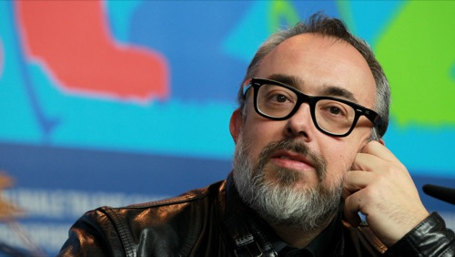

[Álex de la Iglesia](http://fjp.es/alex-de-la-iglesia-en-los-goya-2011/) nos tiene acostumbrados a su sapiencia general y, concretamente, a **su basto conocimiento en lo que a quienes deambulamos frecuentemente por internet se refiere**. Y una vez más, no decepcionó. Para hacer todavía más grande la sombra que cubrirá por completo a todos los que vengan tras el que, para muchos, ha sido **el mejor presidente de la Academia de Cine de España**. Dirige las siguientes palabras a su predecesor.

> \[...\] Internet no es, y espero que estemos todos de acuerdo, tan solo un nido de piratas. Nadie, en el mundo de los profesionales de la red, en estos dos años de debates, discusiones y coloquios, nadie, repito, defiende el todo gratis. Nadie defiende al que se lucra ilegalmente con el trabajo de los demás. Ahora bien, seamos sinceros, **¿cuál es la oferta legal? Prácticamente nula, si consideramos la urgencia de la demanda**. Las excepciones (Youzee, Wuaki, Voddler, Cineclick y Filmin, extraordinario esfuerzo de Juan Carlos Tous) demuestran que es posible y que los valientes abren camino, pero desde luego no es suficiente. **¿Podemos exigir responsabilidades y lamentarnos de nuestras pérdidas si nuestra tienda virtual permanece cerrada? ¿Podemos decir que internet no es una alternativa al negocio del cine cuando ni tan siquiera lo hemos intentado? ¿No somos responsables de no saber adaptarnos a las necesidades del mercado? ¿Cuanto tiempo vamos a esperar?** \[...\]

Enrique González Macho es ahora mismo el opuesto a su antecesor: **demuestra una ignorancia completa en cada una de sus sentencias acerca de internet**. Aunque ya no presida la Academia de Cine, necesitamos más que nunca el conocimiento de Álex para que nuestra voz llegue a quienes pueden hacer que esto cambie.

Recomiendo leer su [artículo completo en El País](http://cultura.elpais.com/cultura/2012/02/20/actualidad/1329771088_462187.html).
