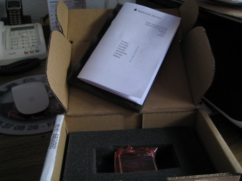

Hace unos meses hablaba de una noticia que me hizo especial ilusión. Y es que [Apple estaba reemplazando los iPod nano de primera generación](http://fjp.es/programa-de-sustitucion-de-ipod-nano-primera-generacion/). Y entonces no tenía ni idea de que la sorpresa iba a ser aún mucho mayor.

Hice mi petición para entrar en el programa de reemplazo. Me enviaron por correo las instrucciones para hacerles llegar el iPod nano de primera generación y esperé. Poco después leí rumores por diferentes blogs de Apple, en los que aseguraban que algunas de las personas que primero enviaron sus iPods habían recibido correos en los que se les informaba que el producto de reemplazo iba a ser un iPod nano actual, no uno de primera. Como en el mundo de la manzana los rumores están por todos lados, y normalmente ninguno de ellos es cierto, no hice mayor caso.

**La sorpresa vino cuando el día cuatro fui yo quien recibí un correo de Apple, comunicándome el nuevo número de serie**. Y justo, tal como se rumoreó —esta vez fueron ciertos—: **el número de serie del producto de reemplazo correspondía con un iPod nano de sexta generación** —es decir, la actual. Según se comentó, los pedidos de reemplazo superaron las expectativas de Apple, y como no tenían suficientes de primera generación los que envían son actuales —parece que éramos muchos los de la _vieja escuela_. Sin duda, una sorpresa increíble.

**Y esta es, ni más ni menos, la historia de cómo pasé de tener un iPod nano de 2GB de hace cinco años, a tener un iPod nano de 8GB actual**. Muchas más empresas deberían aprender del buen hacer de Apple. **Y de su forma de cuidar a sus clientes**.
