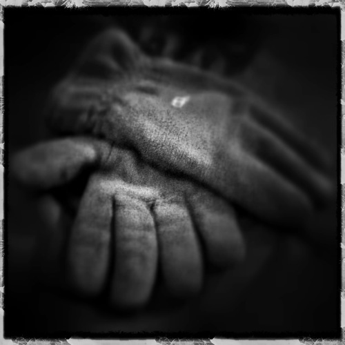

Frío. Y viento, muchísimo. Algo de lluvia, pero menos. Es lo que resume esta semana, en líneas generales. También desmotivación temporal, ganas de matar, y de cagarme en todos los santos que existan y los que estén por crear.

**Debido al tiempo no he podido empezar a hacer ejercicio**. Es decir: hubiera podido, pero empezar con unas condiciones meteorológicas como las que había esta semana probablemente no fuera una buena idea. El frío da igual, porque entras en calor rápido, pero con el viento que ha hecho iba a costar mucho más todo. Y para acabar reventado el primer día y estar el resto de la semana sin hacer nada, aunque hiciera buen tiempo, me lo pensé mejor y no hice nada. Aunque al paso que vamos… veremos si la semana próxima hace mejor tiempo.

**A ver si en Totombola hacen algún sorteo de una bicicleta elíptica y me toca**, así ya no habría ningún problema haga el tiempo que haga en la calle. Habría que buscarle hueco, porque tampoco hay mucho sitio donde meter más trastos. Pero oye, si toca se hace hueco de donde no haya.

**Sigo adelante con la dieta**, ya prácticamente no me supone esfuerzo porque las cosas que pruebo me gustan. Son sabores raros, o al menos nuevos, diferentes… pero no son sabores malos. **Y al fin he podido comer ensalada**. Eso sí, no con lechuga, sino con repollo. Aunque creo que el problema estuvo en cómo la comí. Pensé que sería mejor a trozos pequeños, ya que era la primera comida de dieta que hacía, y pensé que así sería mejor… Pero creo que me equivoqué. La semana próxima combinaré el repollo con la lechuga, para tratar de acostumbrarme, y después supongo que ya podré comer lechuga sola sin más. **El próximo objetivo es el tomate natural**: el frito me encanta, pero natural… A ver quién gana; él o yo, sólo uno saldrá vivo de esa batalla.

**La desmotivación vino cuando fui al médico el viernes**. Suelo ir una vez al mes para que pesarme y que la médica vaya viendo los progresos. Amén de otras cosas que no tienen que ver. Bueno… Como ya dije, suelo pesarme en casa los jueves. Y el viernes, como tenía que ir, para ver qué peso me daría me pesé también en casa, antes de ir. Y mi sorpresa fue cuando vi que **había aumentado de un día a otro casi dos kilos**. Obviamente, eso no era correcto. Me pesé otra vez y aún pesaba más; otra vez, de nuevo, y ésta por fin había adelgazado… **la báscula había cascado**.

Aún fue todavía más sorprendente el peso en la báscula del médico. Ya que mi báscula podía haberse estropeado ahora, y que antes funcionase bien… pues tampoco. **El peso de la báscula de casa no tenía nada que ver con la realidad**. Y el problema no es que se haya roto, que también, si no que **todos los progresos que pensaba que había hecho en realidad no existían**. Pasé de pensar que estaba adelgazando alrededor de kilo y medio semanal, a darme cuenta que había perdido tan sólo tres kilos en casi dos meses.

Tuve «la suerte» de que la báscula siempre fuera mostrándome un peso inferior al de la semana anterior, salvo por una ocasión, que lo achaqué a las navidades y no le di mayor importancia. Podría haberme pesado de más o de menos cuando le hubiera dado la gana, pero como asumía que funcionaba bien, no lo comprobé. **El varapalo fue tremendo**, aunque temporal, eso sí.

Ya no me atrevo a pronosticar cuál será la imagen de la semana próxima, mejor esperarse al domingo que viene para saberlo. Porque tal y como está el clima, aún hoy, me espero cualquier cosa.
