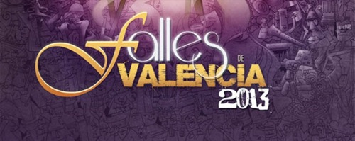

Aunque este año llego un poco tarde y ya no es noticia, como cada año me siento delante del ordenador y escribo este calendario, en un intento de hacerme sentir partícipe a mí mismo de esta fiesta que siempre me ha encantado; de la que por bastantes años pude disfrutar activamente, y aunque ya no tengo esa posibilidad, sigo disfrutándola desde la distancia, en la medida que puedo.

Este año seguimos con los recortes presupuestarios ya que la crisis aún sigue afectando y, si cabe, todavía más que en estas fechas un año atrás. Es comprensible, además, que esto sea así; ya vendrán tiempos mejores. Y los amantes del fuego y la pólvora tenemos que conformarnos con lo que nos den, que aunque sea menos lo sabremos valorar en su justa medida.

### Mascletàs en la Plaza del Ayuntamiento, 14:00h.

- **1 de marzo**: Pirotecnia Peñarroja.
- **2 de marzo**: Fuegos artificiales Hermanos Ferrández, de Alicante.
- **3 de marzo**: Pirotecnia Gori.
- **4 de marzo**: Pirotecnia Crespo.
- **5 de marzo**: Pirotecnia María Angustias, de Granada.
- **6 de marzo**: Pirotecnia Lluch.
- **7 de marzo**: Pirotecnia Gironina.
- **8 de marzo**: Pirotecnia Martí.
- **9 de marzo**: Pirotecnia Aitana.
- **10 de marzo**: Pirotecnia Borredà.
- **11 de marzo**: Pirotecnia Tomás.
- **12 de marzo**: Pirotecnia Zarzoso.
- **13 de marzo**: Pirotecnia Caballer FX.
- **14 de marzo**: Pirotecnia El Portugués.
- **15 de marzo**: Pirotecnia Hermanos Caballer.
- **16 de marzo**: Pirotecnia Europlà.
- **17 de marzo**: Pirotecnia Valenciana.
- **18 de marzo**: Pirotecnia Caballer.
- **19 de marzo**: Pirotecnia Ricardo Caballer.

### Castillos de fuegos artificiales

- **16 de marzo, 00:00h.**: Pirotecnia Europlà - Paseo de la Alameda.
- **17 de marzo, 01:00h.**: Pirotecnia Valenciana - Paseo de la Alameda.
- **18 de marzo, 01:00h.**: Pirotecnia Caballer - Paseo de la Alameda.
- **19 de marzo, 01:30h.**: Pirotecnia Ricardo Caballer - Paseo de la Alameda.

Conforme estaba escribiendo estas líneas ha ido llegándome el olor a pólvora. Aunque no será lo mismo, la televisión ayudará a sentirme más cerca de estos actos… o al menos de algunos de ellos: los que nuestra televisión autonómica, cada vez más devaluada, tenga a bien retransmitir. Si no es que se ponen en huelga, que ya _me lo veo venir_.
