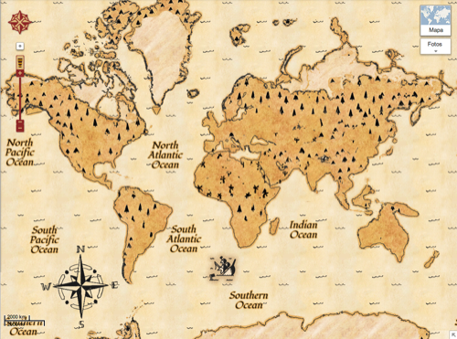

En esta vida, al final, todo es una cuestión de prioridades. Se puede priorizar para bien o para mal; acertadamente o no, pero siempre se prioriza. Y Google, cómo no, no iba a ser menos.

Hoy, día 1 de abril, se celebra en un montón de países —España no es uno de ellos— el _April Fools Day_; lo que aquí se conoce como el día de los santos inocentes, sólo que aquí lo celebramos en otra fecha distinta. Pues bien, al igual que se hace aquí, los medios de comunicación, las empresas, y normalmente cualquier ente con determinada relevancia, lanza a la red sus bromas. Ya más como un reto personal, para sorprender, que para esperar que en realidad alguien vaya a _picar_. Estos días todos estamos atentos para no hacer caso de cosas que puedan resultar inverosímiles y es difícil.

Pues bien, parece que en Google este año han tenido demasiado trabajo para celebrar a lo grande este día. Tanto que no me extraña que otras áreas de la empresa se queden mucho más descuidadas, ya que para tanto _ingenio_ y creatividad habrán necesitado muchos recursos. La imagen que veis arriba corresponde a una personalización de la capa de Google Maps que transforma todo el mundo en un [mapa del tesoro](https://maps.google.com/maps?t=8); podéis acceder desde el enlace pero no sé cuánto tiempo durará el acceso, así que por eso realicé la captura de pantalla.

Pero no se han conformado con eso, también han anunciado [el cierre de YouTube](https://www.facebook.com/photo.php?fbid=10151613081176754&set=a.456477511753.241728.7270241753&type=1); creando [un vídeo para hacerlo más creíble](http://goo.gl/GQO1X) en el que comunican que buscarán el mejor vídeo de todos los que se han subido durante estos años. Como si hubiese sido todo una especie de concurso. Y en el plan que están, de cerrar las únicas cosas buenas que tienen, ésta me parece la más verosímil de todas las bromas.

Y también han presentado [un rediseño de Gmail, completamente en azul](http://mail.google.com/mail/help/intl/en/promos/blue/index.html). Del que, como no, [también han hecho un vídeo](http://www.youtube.com/watch?v=Zr4JwPb99qU). Y [Google Nose](https://www.google.com.au/intl/en/landing/nose/): una parida para los teléfonos móviles con la que podrás saber a qué huelen todas las cosas. Y claro, también [han dedicado tiempo en hacer otro vídeo](http://www.youtube.com/watch?v=9-P6jEMtixY) para ilustrar tal sandez.

Visto lo visto, no sé si a lo largo del día saldrán más bromas, ni siquiera pienso actualizar este artículo para ir poniéndolas en caso de que salgan, porque no sé sí conocerá esta gente el dicho ese de que _lo poco gusta pero lo mucho cansa_. Que esta inversión desmedida de tiempo lo haga quien tiene una empresa en la que todo funciona a la perfección, que no tiene áreas descuidadas y, sobre todo, que tiene a los clientes contentos, gusta; que lo haga una empresa [que pasa olímpicamente de los clientes](http://fjp.es/hasta-nunca-google/), que no hace ni caso a las reclamaciones que pones por teléfono cuando el servicio no es el esperado, y que [van cerrando servicios utilizados](http://fjp.es/google-cierra-google-reader/) simplemente por su ridícula obcecación en potenciar una ¿_red social_? —para que sea social necesita gente, dejémoslo en red— que es arcaica y esta en desuso desde la primera semana de vida, no gusta.

Deberían aprender cuándo es momento de hacer bromas y cuándo no. Porque está genial reírse de uno mismo, pero lo que está haciendo Google, de la forma en que lo está haciendo, no es reírse de uno mismo sino reírse de nosotros, sus clientes —o exclientes—, y en nuestra cara.
