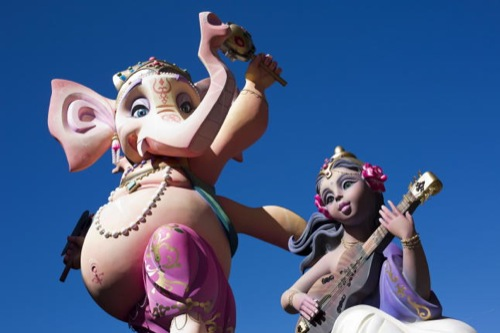

La imagen que veis sobre estas líneas plasma el _ninot_ de [la polémica fallera este año](http://www.levante-emv.com/valencia/2013/03/19/hindues-exigen-falla-queme-simbolos-religiosos/983052.html). El elefante evoca a _Shiva Nataraja_, un dios de la religión hinduista. Como curiosidad, aunque es lo de menos; el monumento en cuestión pertenece a la falla Ceramista Ros-José María Mortes Lerma. No sé ni la de veces que se habrán quemado símbolos religiosos católicos o musulmanes. Nunca sucedió nada porque se entiende como humor, como sátira, como crítica. Las Fallas de Valencia siempre fueron así, y deben tomarse como lo que son.

No parece ser así pues para _Swami Omkrananda_, presidente del Templo Hindú en Valencia. Que desde el domingo tanto él como los suyos estuvieron haciendo presión en la policía, en el juzgado, y en las instituciones, para impedir a toda costa que se quemaran los _ninots_ que hacen referencia a cualquier símbolo que para el pueblo hindú pueda considerarse sagrado. [Y lo consiguieron](http://www.levante-emv.com/valencia/2013/03/19/falla-ceramista-ros-indulta-ninot-sagrado-polemica/983087.html?fb_action_ids=4985592232234&fb_action_types=og.recommends&fb_source=other_multiline&action_object_map=%7B%224985592232234%22%3A142966419207821%7D&action_type_map=%7B%224985592232234%22%3A%22og.recommends%22%7D&action_ref_map=%5B%5D), como se propusieron; no se pudieron quemar dichos monumentos. En primer lugar para evitar la demanda; en segundo para evitar un más que probable acto viral, que los hinduistas correrían a masificar todo cuanto pudieran para que dejarnos en mal lugar.

Sé que recurro muchas veces al refranero español, pero es que es muy sabio. «_Donde fueres haz lo que vieres_», dice. Y razón no le falta. Desde que la clase política ve a las personas extranjeras, no como personas que son sino como futuros votos, las costumbres de nuestro país han pasado a un segundo lugar, relegadas por costumbres que nos son ajenas.

Cuando los españoles visitamos otros países acatamos las normas de aquéllos. Pues son impuestas y más vale no ir contra ellas, sobre todo si guardan relación con la religión pertinente. Cuando de otros países vienen al nuestro siguen siendo sus costumbres y culturas las que han de respetarse, por aquello de la tolerancia y demás. Siempre por encima de nuestra cultura, nuestro patrimonio, nuestra identidad y nuestras costumbres.

Zanjo el tema con una pregunta retórica, porque la respuesta ya la sé: **¿estamos tontos o qué pasa?**

**Actualización:** uno de esos fanáticos descerebrados [ha intentado pegarse fuego](http://www.levante-emv.com/valencia/2013/03/19/quemarse-bonzo-falla-hindu-ceramista-ros/983087.html) delante de la falla en señal de protesta. ¿Protesta de qué? me pregunto. Accedieron a quitar los _ninots ofensivos_. ¿De qué protesta pues, de que se hayan quitado? Es decir ¿quería que se quemasen? Está claro que su inteligencia no da para más.
