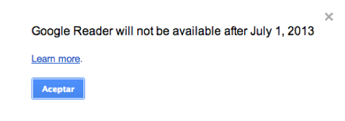

Aunque cualquiera lo diría ahora, **Google tuvo una _época dorada_ en la que innovaba y creaba servicios realmente espectaculares**. Como puede ser el caso del que nos ocupa: **Google Reader**. Un servicio para gestionar nuestros feeds RSS y que, además, sirve como sincronización para aplicaciones de terceros, que usaban su enorme potencia para poder leer nuestras noticias allá donde estemos, mediante el dispositivo que tengamos entre manos, y con la aplicación que consideremos oportuna en cada momento.

Desde aquella _época dorada_, como la me aventuré a llamarla, nos ha acompañado hasta ahora uno de los servicios que, a mi juicio, hacían destacar sobremanera a Google respecto a alternativas a las que consideraría un insulto para Google Reader siquiera llamarlas competencia, porque es evidente que no lo son. Y no nos acompañará en el futuro porque Google, en una de esas decisiones incomprensibles que tiene, [ha decidido darle muerte en plena vida](http://googleblog.blogspot.com.es/2013/03/a-second-spring-of-cleaning.html?m=1), porque en plena vida es como seguía estando, por más años que hayan pasado desde su inauguración.

> We launched Google Reader in 2005 in an effort to make it easy for people to discover and keep tabs on their favorite websites. While the product has a loyal following, over the years usage has declined. So, on July 1, 2013, we will retire Google Reader. Users and developers interested in RSS alternatives can export their data, including their subscriptions, with Google Takeout over the course of the next four months.

Si esto va de cerrar servicios que van decreciendo en número de usuarios activos ¿a qué esperan para cerrar Google+? Empezó a decrecer en su primera semana de vida; ahora aquello está más desértico que el Gobi.

Con esta decisión tan absurda han dejado tirados a un montón de gente que, como yo, nos pasamos leyendo noticias todo el tiempo. En las diferentes aplicaciones depende del dispositivo que estemos usando. En mi caso: Flipboard y Reeder. Imagino que buscarán alternativa pero… ¿y si no es la misma? ¿Y si cada una de las aplicaciones opta por un servicio de sincronización diferente? Pasa que el que siempre sale perjudicado es el mismo: el usuario, que no tiene culpa de decisiones tan absurdas como ésta.

¿Lo bueno de todo esto? Que una vez más Google demuestra que sus usuarios no le importan absolutamente nada; ni un poquito siquiera, cero. Google Reader es un servicio que nos facilitaba la vida a muchísimas personas, pero que a Google no le es rentable porque la mayor parte de su uso es a través de aplicaciones de terceros; dejando el servicio como un mero motor de sincronización de noticias pendientes de leer. Ellos no pueden poner ahí publicidad, ni nada que haga rentable el servicio.

Como siempre, todo es cuestión de prioridades. ¿Usuarios contentos o dinero? Google parece que lo tiene claro.
