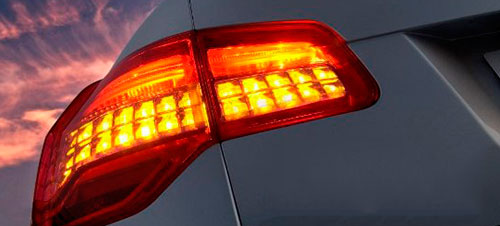

Pongámonos en situación. Abres la puerta del coche, te sientas, justo delante de ti tienes un volante cómodo, a la altura que corresponde —si no es así, observarás que en la parte inferior hay una palanquita para regularlo, es muy útil—; a la izquierda hay _un palo_; desconocido y molesto para algunos, que inconscientemente pensarán que quién habrá sido el idiota que pone ahí ese adorno, que hace que de vez en cuando tropieces con él, pese a tus intentos de girar el volante sin rozarlo tan siquiera. ¡Maldito _palo_!

Pues no, amigo, no es un palo molesto e inútil; es una de las herramientas más útiles de que dispone tu coche. Tanto para ti como para los demás que tienen la suerte o desgracia de circular a tu lado; dependiendo de si eres de los pocos que le da uso adecuado a ese _palo_, o por contra crees que además de ser un adorno raro, no queda nada bien estéticamente esa cosa ahí enganchada.

Estoy cansado de acabar enfadándome cada vez que salgo con mi vehículo. Siempre, no falla. Recuerdo que antes esporádicamente alguien no señalizaba correctamente sus movimientos, pero ahora mismo lo que es esporádico es que alguien los señalice correctamente. A pesar de que los años de experiencia en carretera te brindan un sexto sentido contra energúmenos que se pasan las normas de seguridad vial por donde todos sabemos, y en contra de lo que la mayoría de ellos pensarán: el resto de conductores no somos adivinos; no tenemos ni idea de hacia dónde va cada quien, ni tenemos por qué saberlo. De ahí que sea útil indicar a los demás qué vamos a hacer; con la antelación necesaria para que nadie tenga por qué hacer un cambio de sentido violento o tenga que frenar bruscamente para evitar una colisión con aquellos que piensan que si accionan la palanca de intermitencia las luces se fundirán.

No tenemos por qué fijarnos hacia dónde se dirige la cabeza de quien conduce el vehículo, ni siquiera esperar a ver qué movimiento hacen las ruedas para intentar anticipar, de algún modo, cual será la dirección que tomará ese temerario individuo al volante de su coche. Y los servicios de seguridad deberían controlar estas cosas, mucho más que otras en las que se fijan con puro afán recaudatorio. Aunque la culpa no sea de ellos, sino de quienes lamentablemente nos gobiernan.

Sólo por respeto hacia los demás conductores habría que señalizar correctamente nuestros movimientos, que no supone esfuerzo alguno para quien lo hace, pero que ayuda muchísimo al resto de conductores. Pero como algunos no entienden ni qué significa esa palabra, deberían hacerlo porque, como nos enseñaron en la autoescuela —aunque algunos ya no recuerden nada de lo aprendido— **es obligatorio** y [sancionable](http://www.boe.es/buscar/doc.php?id=BOE-A-2003-23514) la incomprensible adversidad hacia su utilización.
