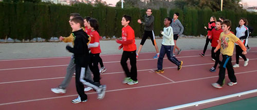

Hay algo que lleva tiempo rondándome la cabeza: **el deporte cuando somos niños**. En esa época llega el momento de dar a conocer el deporte a los más pequeños, ofrecerles el enorme abanico existente, con las distintas disciplinas que pueden practicar según su físico y gustos personales, y que los pequeños se decanten por lo que prefieran, si es que prefieren algo; por muy saludable que sea correr, por ejemplo, no creo que nadie tenga derecho a imponer por la fuerza a otra persona que lo haga en contra de su voluntad. Tenga siete años, dieciséis o cincuenta.

En relación con esto, quiero citar un párrafo del libro que estoy leyendo ahora mismo: [De qué hablo cuando hablo de correr](https://www.goodreads.com/book/show/7997569-de-qu-hablo-cuando-hablo-de-correr), de [Haruki Murakami](https://www.goodreads.com/author/show/3354.Haruki_Murakami). Piensa igual que yo de esto, y sin duda sus palabras plasmarán mejor que las mías a dónde quiero llegar con todo esto.

> Cada vez que veo en una escuela esa escena en la que todos los chicos son obligados a correr en la hora de gimnasia, no puedo evitar compadecerlos. Obligar a correr largas distancias a personas que no desean correr, o que, por su constitución, no están hechas para ello, sin ni siquiera darles opción, es una tortura sin sentido. Me gustaría advertir a los institutos de secundaria y bachillerato, antes de que se produzcan víctimas innecesarias, de que es mejor que dejen de obligar a correr largas distancias de manera tan estricta a todos sus estudiantes, pero, aunque lo hiciera, estoy seguro de que no me harían caso. Así es la escuela. Lo más importante que aprendemos en ella es que las cosas más importantes no se pueden aprender allí.

Hablando sobre mi caso personal, de pequeño experimenté con algunos deportes: fútbol, baloncesto, patinaje en línea y, derivado de ello, hockey pista, ciclismo, natación… Siempre me gustó patinar, pero a mi aire, y la bicicleta todavía hoy sigo cogiéndola —me encanta—, en los demás deportes nunca fui bueno, aunque de entre los citados la natación es siempre el que más me ha gustado y todavía sigo teniendo pendiente aprender a nadar de forma más o menos correcta. Pese a ello las clases de educación física —o de gimnasia, como se llamaban en mi tiempo— nunca me gustaron; es más: las odiaba. No era especialmente bueno en nada, aunque tuviera preferencias en unas cosas sobre otras; parecía un pato mareado —y quizá todavía hoy lo parezca, pero al menos ya un poco menos mareado—, y todo eso sumado a **un profesor que parecía un instructor militar**, que no daba tregua alguna y exigía lo mismo a todos, hicieron que básicamente odiara el deporte. Consiguieron que lo viera como algo traumático, un castigo, una pesadilla…

¿De verdad es ésa la forma adecuada de darle a conocer a un niño el deporte? **No sé cómo es posible que piensen que alguien va a descubrir la parte buena del deporte y se va a enganchar si recrea la película de [La teniente O'Neil](http://es.wikipedia.org/wiki/G.I._Jane)** durante la hora de gimnasia del colegio o instituto. Es más, no sé cómo será en otros centros, pero en el que yo iba siempre se impartía esta clase a primera hora; si cuando estás de verdad interesado en el deporte y lo haces por voluntad propia muchas mañanas se te viene a la cabeza el típico «_quién me mandaría a mí…_», ¿qué no debe pasarte por la cabeza cuando además están obligándote? Y que si encima no rindes como el profesor espera de ti: a correr; ¡da _equis_ vueltas, _y rapidito_! Para alguien que ya está del deporte, literalmente, hasta más arriba de sus partes nobles, ¿a qué va a asociar correr? En mi caso al menos: al peor castigo que te puedan imponer.

Al igual que no todos los niños sin un entrenamiento específico desarrollan su cerebro de la misma forma, no entiendo por qué no pueden caer en que con el físico pasa lo mismo: no todo el mundo tiene un cuerpo atlético, no a todo el mundo se le puede exigir lo mismo, y no todo el mundo tiene por qué rendir bien en las mismas modalidades deportivas. Pero como en casi todas las materias del colegio: están pensadas para la mayoría; y son así porque sí, sin más. Si alguien se sale de la mayoría tanto por arriba como por debajo, mala suerte. «_Tendrás que adaptarte_», «_esfuérzate_», y más «_bla, bla, bla_», que no hacen otra cosa que hundir más al niño y excluirlo. **Me pregunto si también le pedirían a un pájaro que se adapte a nadar y a un pez que se esfuerce por volar**.

Pasé mucho tiempo viendo el deporte como un enemigo mortal, hasta que por mi cuenta y a mi ritmo volví a practicarlo, centrándome únicamente en las cosas que me gustaban. ¡Hasta me apunté al gimnasio! Aunque, bien pensado, eso no tiene mérito, la frase correcta sería: ¡hasta me apunté al gimnasio **y acudía a entrenar regularmente**! Hoy día, como ya todos los que me conocéis sabéis: hago deporte prácticamente a diario. ¡Y hasta salgo a correr! Y no creáis que no me costó dar el paso: **mi mente asociaba todavía el correr con las interminables vueltas al patio simplemente por no estar preparado para el ejercicio físico**. Me hicieron creer que no valía, que era lo opuesto a un deportista, que era un vago y no sé cuántas palabras de ánimo más.

¿Y sabéis qué? Que me encanta el deporte. Que la satisfacción personal de ir superándote a ti mismo que te da el deporte muy pocas otras cosas en la vida te la dan. Que te conoces a ti mismo; aprendes a descubrir en cada momento dónde está tu límite y, lo más importante, cómo superarlo. Que aprendes a confiar en tus posibilidades, pese a que muy poca gente confíe en ellas, o algunos que confían en que ni existan. Que todo eso y seguro que muchas cosas más te las proporciona el deporte, ese mismo deporte al que puedes llegar a odiar si quienes te lo dan a conocer no lo hacen con conocimiento, pero también ese mismo deporte que si vas experimentando y descubriéndolo tú mismo seguro que te engancha, te proporciona una vida más saludable, y además te entretiene y te evade de los problemas y quebraderos de cabeza que puedan haber en el día a día.

Lo que en un principio parecía el problema, con calma y descubriéndolo de otra forma, al final no es que no es tal problema, si no que te atrapa y te evade de ellos. Y ese cambio radical por el simple hecho de creer que un niño puede ser un pequeño soldado, y que si no hace lo que le ordenas no tiene por qué ser porque no quiera, sino porque probablemente no pueda. **¿Y lo peor sabéis qué es? Que seguro que no todos los niños a los que les hacen comprender el deporte como un fuerte castigo —si no el peor— tienen la oportunidad de experimentarlo de más mayores, porque probablemente ni busquen esa oportunidad; recordarán lo que pasaron en la infancia y huirán de ella como un gato del agua**.
