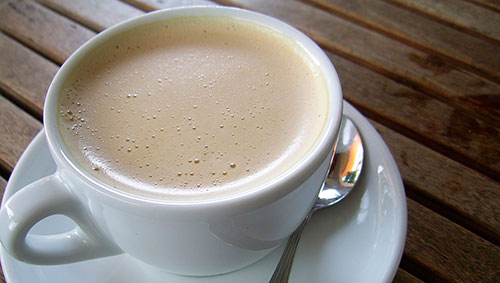

[fotografía](http://www.flickr.com/photos/betasoluciones/9423680764) de flickr

En las últimas letras que plasmaba ayer por estos lares decía que, si me encontraba con ganas, quizá contaría mi opinión sobre este berenjenal del que, por suerte y según mi criterio, nos hemos salvado _por los pelos_. De momento, claro; todavía quedan ediciones de los juegos olímpicos a las que poder presentarse y malgastar el dinero de los impuestos que pagamos todos los españoles. Jugar con dinero ajeno es muy bonito; solíamos hacerlo en el _Monopoly_, pero en éste los errores no tenían consecuencias reales. Ganas de escribir realmente siempre tengo, así que si lo que **a veces** faltan son ideas, ésta es una buena ocasión que aprovechar.

Aunque con lo que he escrito hasta ahora no creo que fuera necesario matizarlo, por si acaso, allá va: soy uno de ese [9% de españoles que estaba en contra del paripé de Madrid 2020](http://www.elmundo.es/elmundo/2013/09/04/madrid/1378327989.html), y de que ésta se presentara como cadidata para ser sede olímpica tanto en ese año como en sucesivos mientras siga el panorama como está ahora. Que ésa es otra —en este país todo se hace igual… de mal—; podrían decir que el 91% de encuestados estaba a favor de la candidatura y me parecería correcto —más allá de saber familia de quién son esos encuestados, o qué se les prometió—, pero que 2000 llamadas —teóricamente al azar— representen a algo más de 47 millones de ciudadanos, tiene tela.

Pero más tela que tener la idea de presentarse, que todos sabemos que los políticos siempre tienen que estar pensando algo con lo que derrochar dinero público y llevarse tanto o más _pa' la saca_, es que los demás lo sepan, el resto del mundo; ¿no será suficiente con que nosotros sepamos quiénes nos representan? Ya se nos cae bastante la cara de vergüenza, ¿para qué meter el dedo en la llaga?

¿Qué necesidad de Juegos Olímpicos tiene un país que no se preocupa por los jóvenes? ¿Para qué quieren unos Juegos Olímpicos si ni siquiera son capaces de fomentar el deporte entre los niños? Con unas infraestructuras que se caen a pedazos; de las cuales la mayoría son de pago, aunque sean públicas. Y la gran mayoría de personas que tendrían tiempo para practicar algún deporte, por su culpa, tampoco pueden permitírselo porque supone un desembolso de dinero del que no disponen. ¿Alguien de verdad puede pensar que éste es un país que se preocupa por el deporte? Abramos los ojos: por los únicos deportes que se preocupan es por los que puedan sacar tajada ahora o en el futuro. Fórmula 1, motociclismo, fútbol, tenis, America's Cup, y para de contar. Dinero, dinero, y más dinero. Para ellos; como dije: ahora o en un futuro, cuando se retiren y presidan alguna de las entidades que se implican en los gastos multimillonarios que en este país suponen dichos deportes; y que en otros, por fortuna, no corren la misma _suerte_. Me podría subir al carro diciendo multitud de disciplinas a las que no se les hace caso alguno, de personas individuales que consiguen proezas y que no tienen ni un segundo en televisión porque no vende, pero sobra con decir que en un país realmente volcado con el deporte estas cosas sí serían noticia de portada y muchos informativos las comentarían, porque a la gente les interesarían.

Cuando se dirige un país hay que centrarse en los focos más conflictivos para la mayoría de los ciudadanos del país. Un país que está en una etapa en la que bate récords históricos de paro, de desahucios, de abandono escolar, de colas en los comedores sociales y bancos de alimentos, en la que se pega el tijeretazo en educación, ciencia, bienestar social y sanidad, en lo que menos debe de pensar es en organizar unos Juegos Olímpicos —que más que olímpicos, y aunque es un _chiste_ demasiado conocido, más bien serían _del hambre_—. Los atletas profesionales son una reducida minoría en comparación con toda la gente que lo está pasando realmente mal; y no, no acepto hacer deporte en territorio extranjero como un grado comparable de pasarlo mal. Los deportistas amateurs no necesitan público español para competir, y el número es increíblemente superior, así que ellos podrán apañárselas sin ese _plus_ de motivación; no me cabe duda de que lo harán genial de todos modos.

Y volviendo al tema de meter el dedo en la llaga. ¡Por favor! ¿De quién fue la idea de elegir a dedo a _Annie Bottle_ como alcaldesa de Madrid? Al menos podría _haberse puesto enferma_ ese día y haber llevado a alguien competente en su lugar. ¿Dónde va alguien con un nivel de inglés como el de esa persona a representar una ciudad como Madrid? ¡La capital de España, por Dios! Que no hablamos de una aldea de 100 habitantes. ¿Y cómo osa pretender vender Madrid como sede olímpica en un congreso internacional donde habla inglés _hasta la que limpia_ con ese nivel de párvulos? Espero que esto de dejarnos a los españoles por gilipollas allá donde van sea una moda pasajera; como se convierta en hobby la hemos liado.

\[youtube hhJt3Tzjy8I\]

Ahora se presentan varias incógnitas: pueden optar por destinar el dinero que se iba a invertir en los Juegos Olímpicos en otros menesteres de más utilidad ahora mismo y, obviamente, no volver a presentarse más hasta dentro de una temporada y cuando apenas haya gente en el país que esté pasándolo mal… o pueden optar por todo lo contrario: _ahorrar_ ese dinero para unos hipotéticos Juegos Olímpicos que en algún año venidero y con suerte por desgracia quizá nos concedan la candidatura olímpica, y presentarse vez tras vez, convertirnos en los eternos candidatos hasta que nos lo concedan por mero aburrimiento —o lástima—, e ir derrochando mientras parte de ese dinero que se supone que no existe, pero que cuando a ellos les conviene sale hasta de debajo de las piedras.

Y como no se puede despedir esto de otra manera, lo despediré a lo grande: con _a relaxing cup of café con leche in Plaza Mayor_. Todos los turistas extranjeros son conocedores de esta delicia al alcance de muy pocos —muy pocos bolsillos, porque vaya _cañazo_ te _soplan_ por el maldito café con leche—. Está en el top de la gastronomía española; entre la paella valenciana, el pulpo a la gallega, y el jamón serrano de Guijuelo. El café con leche de Plaza Mayor. El auténtico, rechace imitaciones.
