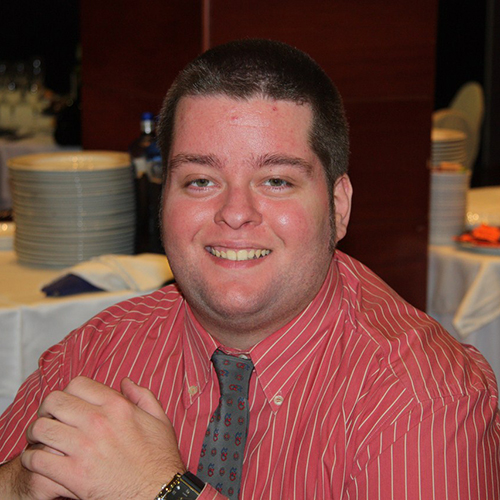
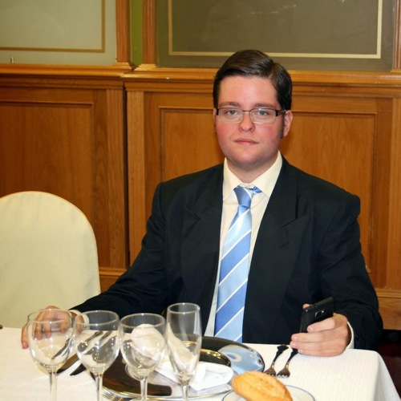

Este 2013 ha sido el año de los cambios, de los objetivos, y las correcciones. Han habido varias, he cumplido más objetivos de los que pensé cuando me los propuse, y en el cómputo global aunque hubieron cosas que podrían haber salido mejor ha sido un año bastante redondo.

Uno de los cambios más visibles y significativos en mi vida ha sido el físico. Para conseguir este cambio puse en marcha dos pequeños objetivos: **comer de forma saludable** y **hacer ejercicio regularmente**. Tenía claro que ambos objetivos debían cumplirse para que el objetivo principal tuviera un final al menos aceptable, y que de nada servían _el uno sin el otro ni el otro sin el uno_.

**No soy ningún experto de nada. Soy una persona más, que quería algo y luchó por ello**. Y con estas líneas simplemente trato de animar a quien tenga el mismo objetivo que yo, para que vaya a por ello, para que no desista, para que se esfuerce y por fin lo consiga. Quiero comentar qué sentí, qué hice, y qué me pasó a mí personalmente; cada persona es un mundo diferente, y lo que a mí me ha funcionado no tiene por qué funcionar a los demás, pero al menos doy unas pistas de _por dónde van los tiros_, para los indecisos…

A decir verdad, cuando me embarqué en todo esto lo hice bastante escéptico. No porque dudara de mí, o de no tener una causa que me motivara lo suficiente, más bien porque habían demasiadas cosas que cambiar y a las que tendría que habituarme. **Prácticamente la verdura ni la probaba**. Decía que no me gustaba, pero realmente no la había probado; simplemente habían cosas que me eran más apetitosas a la vista y no les di oportunidades. **En muchas ocasiones a lo largo del día me comía una barra de pan de cuarto entre la comida del mediodía y la cena**. Si hay algo que me chifla es una barra de buen pan; es un vicio, como el que pueden darte los frutos secos, y cuando un pan me gusta me cuesta demasiado controlarme… **El dulce: otra de las cosas que puede conmigo**. Me da igual lo que sea, desde un pastelito procesado y a tope de grasas saturadas, a una tarta casera; soy un goloso desde que nací y el chocolate sobre todo es una de mis pasiones. **La Coca-Cola**. Es cierto que no tengo otros vicios como puedan ser el tabaco o el alcohol, mucho más perjudiciales que éste, pero éste también lo es si lo que queremos es tomar una dieta equilibrada y hay que tenerlo en cuenta.

Como veis soy humano, con las mismas tentaciones y debilidades que cualquier otro, pero que no son demasiado recomendables si pretendemos conseguir un cambio físico notable. Ojo, que no hablo de suprimirlas, sino de controlar sus cantidades. Muchos, como yo, no nos conformamos con _sólo un poquito_…

### Primer paso para lograr el objetivo final

Para mí el primer paso es **no proponértelo como propósito de año nuevo**. Creo que este es el primer paso para que el objetivo no fracase, y es que asociamos este tipo de propósitos como algo que quieres hacer y que **todo el mundo se propone pero que luego nadie cumple** y no pasa nada aunque tú tampoco lo cumplas porque es lo habitual.

Nuestra mente es muy poderosa, siempre busca excusas para hacer lo que en principio sea lo más cómodo para nosotros. Siempre encontrará un motivo para convencerte de que para qué vas a hacer algo que te cuesta si no hacerlo es mucho más fácil para nosotros. Y **si no tienes el firme convencimiento de que de verdad lo quieres hacer, de que vas a conseguirlo sea como sea, a toda costa, acabará _ganándote el pulso_ y no lo lograrás**. Suena duro pero es así; esto no es fácil, por eso tanta gente quiere conseguirlo pero acaban por dejarlo a mitad, por pura comodidad.

### No lo intentes: ¡hazlo!

_Me gustaría… Este año haré… Tengo que…_ **¡Para!** Cuando tu objetivo es de tal magnitud no tienes que intentarlo; a ver si ocurre un milagro y de repente me encanta la comida saludable, salgo a la calle y me posee Usain Bolt y paso de no haber hecho deporte nunca a ser el rey de la pista… Esto no va así. Si esperas que te salga sin darte cuenta, que sea fácil, que no requiera un sacrificio más grande de lo que puedas imaginarte: olvídate.

Aunque **mi consejo nunca será que te olvides**, sólo que tengas bien presente que vas a tener que esforzarte al máximo. ¿Prefieres ser tú el dueño de tu vida o que tu vida se adueñe de ti?

### Paso a paso lograrás lo que te propongas

¿Estás decidido ya? En serio y a por todas, ¿no? ¡Pues controla tu euforia! **Si el primer día empiezas con la dieta y te da por salir a correr no vas a conseguir nada**. Es más: lo más probable es que sea el primero y el último de _tu nueva vida_. Poco a poco, paso a paso; esto es una carrera de fondo, no un _sprint_.

Como dije: cada persona es un mundo, y cada uno conoce sus límites y para qué y para qué no está preparado. En mi caso me tomé la primera semana únicamente para empezar con la dieta; empezar a probar verduras, nuevas comidas y acostumbrarme a los nuevos sabores que se convertirían en mi menú diario un poco más adelante. Nada de deporte; con este esfuerzo por ahora había suficiente.

Por no comer, ni siquiera comía ensalada. El primer paso fue incluirla en un menú habitual que me gustara, para saber que si sufría demasiado comiéndomela al menos me quedaba el _premio_ de poder disfrutar después comiendo algo que de verdad me gustara. Y esto de los premios es importante, porque si sólo trabajas y sufres, pero sin ninguna recompensa a corto plazo, todo será mucho más complicado.

Aquí viene un consejo para que no caigas en el mismo error que yo. ¿Qué haces cuando tienes que comerte algo que previsiblemente no te gustará? Lo habitual es disimularlo e intentar comértelo lo más rápido posible, ¿no? Pues pese a que nadie me lo recomendara **pensé que para acostumbrarme al sabor de la ensalada me sería más fácil picándola con el accesorio picador de la trituradora y haciéndola en mil pedazos… No recuerdo haberlo pasado tan mal en mi vida**. La primera vez que empezaba a probar y estaba costándome horrores; conforme iba comiéndomelo estaba sufriendo tanto que hubiera preferido que me dieran una patada en los cojones antes de tener ese plato del infierno delante de mí. Mi mente estaba haciendo un trabajo de estrés digno de admiración; **se inventaba excusas que ni pensaba que existieran**, me ponía pancartas imaginarias donde podía leer el clásico: **¡qué necesidad tendrás de hacer esto!**, o el **¡quién me mandará a mí meterme en este lío…!** Me dejé un cuarto de ensalada, pero pude con el resto. Para mí y en ese momento estaba suponiendo un esfuerzo titánico; es cierto que no conseguí el pequeño objetivo de ese día, pero quizá fuera porque empecé más fuerte de lo que cabría recomendar. Y que en contra de lo que pudiera imaginar, mi idea de hacerla en mil pedazos fue pésima, no recuerdo haber tenido idea peor en mi vida.

Y de ese error aprendí que cuando todo el mundo come un determinado alimento de una forma, es porque es la forma más aconsejable de comérselo. ¿A que nadie cogería un pollo entero e intentaría metérselo en la boca tal cual y comérselo sin trocearlo? Pues quizá la forma más apropiada de comerse una hoja de lechuga no sea hacerla en mil pedazos de un milímetro y que eso acabe siendo una aberración de puré pastoso y aceitoso con materias no identificables de múltiples colores que menos apetitoso podría resultar cualquier cosa.

### Cambia el chip

Hay montones de cosas que creemos conocer y darlas por hechas, pero en realidad lo más seguro es que no tengamos ni idea, aunque como seres humanos que somos creamos estar siempre en posesión de la verdad absoluta. Aquí unos cuantos ejemplos.

- Ya sabes que tienes que comer menos de lo que comías si quieres conseguir tu objetivo, pero en contra de lo que piensas **hay una variedad de alimentos que sacian por sí mismos, sin necesitar ingerir grandes cantidades de los habituales para notarnos saciados**.
- **Hay que levantarse de la mesa saciado**, lo suficiente como para tener energía para afrontar el resto del día, pero **no hinchado como una burra**. Por más que nos empeñemos en negarlo, nuestro cuerpo necesita una determinada ración de energía en forma de alimento; todo lo que sobrepase ese límite máximo es un exceso que se almacena en forma de grasa en los sitios que más cuesta eliminarla.
- Debes aprender a diferenciar cuándo tienes sed y cuándo tienes hambre. Muchas de las veces que te notas hambriento y vas a picar algo de comida para saciar tus ansias en realidad lo que tu cuerpo está pidiéndote es agua, pero tú no conoces las señales de tu cuerpo y nuevamente estás dándole energía que no precisa y que almacenará en tu almacén de grasa personal. Cuando sientas esto lo primero que debes hacer es beber agua; verás como en la mayoría de los casos y pasados unos minutos ni recuerdas que _tuvieras hambre_. Porque en realidad no era cierto.
- Hay cosas que se creen verdades absolutas pero que no son del todo ciertas. Lo primero que te dice la gente cuando comentas que vas a empezar una dieta saludable, hacer ejercicio, etc, es: **¡ahora nada de pan ni dulces!** por ejemplo. Es más: seguro que hasta tú mismo lo piensas, y no es así. Antes hablaba de los premios; **si para ti la ausencia habitual de estos alimentos puede suponerte un trastorno, tómalos como premios**. Pero no es necesario que estés todo el día premiándote, que ya sabemos lo traicionera que es la mente.

Conseguir este objetivo no es ningún misterio; no necesitas ninguna cátedra ni hacer conjuros, rituales o cosas extrañas; ¿es difícil y requiere un sacrificio importante? sí, por supuesto; ¿complicado? para nada. A más grasa acumulada, más grasa debes quemar. A más kilocalorías ingeridas, más ejercicio aeróbico tendrás que hacer para que el excedente no se transforme en grasa y en lugar de reducirla estés aumentándola. Es la base, no tiene más misterio.

Déjate de tonterías y de tópicos. ¿Alimentos prohibidos? Ninguno. ¿Límite de comida ingerida? Ninguno. Simplemente debes ser consciente de qué te estás comiendo, cuántas kilocalorías necesitas ingerir cada día, cuántas tiene el alimento que te apetece comerte y, sobre todo, cuando termines de comértelo cuánto te habrás excedido, si es que eres rebelde y lo has hecho, y cuánto ejercicio tendrás que hacer para enmendar la travesura y, ya puestos, un poquito más para perder lo que ya tienes acumulado, que no se trata de mantenerte sino de ir vaciando tu almacén personal. Si cuando termine el día necesitarías más horas de deporte que las que tienes libres para dedicarle al mismo es que algo estás haciendo mal.

Retomando lo que decía antes: las verdades universales. El pan te engorda, ¡eso lo sabe todo el mundo! Desmontemos el mito: tú empieza a hacer deporte en serio a las 8:00 y termina a las 15:00. Siéntate a la mesa y cáscate dos barras de pan de cuarto. Así, sin pestañear. Tranquilo que no habrás engordado absolutamente nada. En cambio no hagas nada en todo el día y a mediodía zámpate media barra de pan; probablemente ya habrás consumido más calorías de las que te tocarían para la comida del mediodía teniendo en cuenta que todavía te quedan más comidas por delante con las que engañar al estómago, y sobre todo a la cabeza, para que crea que no tienes más hambre. No es qué comes sino cuánto comes.

Obviamente la comida saludable ayuda; mucha de ella apenas tiene calorías, y puedes comer más cantidad con un menor aporte calórico en tu cuerpo. Aunque yo cambié el chip muy rápido por pura fuerza de voluntad, habrá para quienes no les será tan fácil ir incorporándola en el menú. Pero hay que tener en cuenta que la principal culpable de esto es nuestra mente; si consigues desconectarla un rato comprobarás que lo que estaba gritándote que no era comestible, que no iba a gustarte, y demás excusas que siempre se inventa, en realidad no era para tanto y además incluso puede que algo te sorprenda y termine por gustarte de verdad, aunque el principio no lo creas. A mí por ejemplo me ha sucedido esto con el repollo, con la berenjena y con los hongos comestibles aunque especialmente con el champiñón. A día de hoy forman parte de mi selecto grupo de alimentos favoritos.

### Deporte

**Todos estamos hechos para hacer deporte**; no existe nadie en el mundo que salvo por problemas médicos no esté apto para practicar algún tipo de deporte. Lo que sí es cierto es que **no todos tenemos por qué ser aptos para practicar cualquier deporte**; bien porque no te motiven lo suficiente o porque por genética no estemos preparados para practicarlo. Un ejemplo para entender esto: por mucho que te guste el baloncesto si mides 1'50 mejor búscate otra disciplina.

Lo primero que piensa todo el mundo cuando se te pasa por la mente esto de hacer deporte es: **¡voy a salir a correr!** Una vez más: cada uno somos un mundo, y aunque haya quien de primeras pueda empezar a trotar, no para todos es recomendable esto. **Si pesas tanto como pesaba yo, o incluso más, empezar corriendo puede ser un suicidio**. No lo vas a conseguir, te vas a ahogar, vas a frustrarte, y probablemente hasta termines por lesionarte alguna articulación si insistes. Correr es un deporte de fuerte impacto, las articulaciones se resienten cada vez que damos una zancada y apoyamos nuestro pie en el suelo; el peso de nuestro cuerpo se multiplica por dos cuando impacta sobre una superficie dura, y esto puede ser terrible para nuestra salud y bienestar físico. Estarás equivocándote, y más que conseguir un beneficio, lo que estarías haciendo será perjudicarte a ti mismo.

**En cambio algo para lo que sí estaremos preparados será para caminar**. Primero moderadamente y conforme tu forma física vaya mejorando se puede ir aumentando la cadencia de paso y por ende la velocidad. Estuve mucho tiempo haciendo esto antes de empezar a dar unos trotes; al principio no imaginaba que fuera a tardar tanto tiempo en sentirme preparado, pero mejor pecar de prudente que de inconsciente. **Mis caminatas y paseos los alternaba con la bicicleta; un deporte que me encanta desde siempre y sin impacto**, no perjudica para nada a nuestras articulaciones, y podemos disfrutar de él tranquilamente, pero siempre con conocimiento, porque no nos reportará nada negativo. Y repito: con conocimiento. El ciclismo no nos perjudicará siempre que lo practiquemos acorde a nuestro estado y forma física; si de repente te crees el rey de las dos ruedas y quieres coronar el [Angliru](http://es.wikipedia.org/wiki/Angliru) te lesionarás o te frustrarás al, obviamente, no conseguirlo. Otro deporte muy aconsejable y sin impacto es la natación. ¡Hay miles de deportes! Sólo debes ir probando y encontrarás el tuyo, garantizado.

Una vez más: poco a poco. No necesitas hacerlo todo en un día. Piensa que tiene más mérito el que consigue ponerse en forma de este modo que el que decide pasar por el cirujano y hacerlo de forma artificial. Y ni que decir tiene la satisfacción personal de ir consiguiéndolo poco a poco conforme vas viendo progresos. Te sientes un superhéroe y cada vez más motivado. En ese momento es cuando sabes que todo el trabajo ha tenido sentido y que lo que al principio parecía una montaña difícil de escalar ahora es algo habitual; lo han integrado en tu vida y ya forma parte de ti. Ahora llega el momento de disfrutar, después de tanto padecer, y por supuesto de seguir con el trabajo diario. Que seguirá siendo igual de duro, pero ya estás acostumbrado a ello.

No hay nadie que el primer día que se pone a hacer ejercicio sea capaz de correr una maratón, ni siquiera una media maratón, pero con fuerza de voluntad, constancia y paciencia todos podemos conseguirlo si de verdad es lo que queremos. Todo empieza dando un paso, caminando, progresando; no te darás cuenta y cada vez irás haciendo más kilómetros, te gustará, irás aumentando voluntariamente el tiempo que dedicas a la actividad física, y eso te llevará a hacer también más kilómetros. Y digo voluntariamente porque el deporte engancha, y cuando algo te gusta va escalando posiciones en tu lista piramidal de prioridades; lo que al principio estaba a ras de suelo conforme vayas acostumbrándote, vayas dosificando mejor tu energía, tu cuerpo vaya teniendo una mejor forma física, y sobre todo tu mente vaya viendo que el progreso es tan evidente que ni ella muchas veces es capaz de engañarte diciendo que no es así, será una de las cosas con más protagonismo en tu vida. ¡Hazme caso, es así!

Otro consejo es que **no te limites solamente a practicar un ejercicio aeróbico** y te olvides de lo demás. **Cuando cogemos peso a todos se nos acumula grasa en el vientre, y la mejor forma de que esa grasa desaparezca es haciendo ejercicio abdominal**. Por otro lado, **lo que más grasa consume de nuestro cuerpo es la masa muscular**, por eso tampoco debemos olvidarnos de ella; los kilos que se pierden reduciendo el nivel de masa muscular son un engaño. Muchas de las llamadas _dietas milagro_, que son una estafa, se basan precisamente en esto. Y tal como los pierdes los recuperas, porque el músculo tiende a volver a una forma saludable para nuestro organismo aunque nosotros queramos impedirlo. A más masa muscular, más quema de grasas por cada movimiento que realice nuestro cuerpo, y no permitas que te engañen con trucos absurdos: **la única forma de mantener o aumentar la masa muscular es haciendo ejercicios de carga con pesas**.

### Mi evolución

Este proceso me ha llevado un año, en el que han habido muchos sacrificios, muchos momentos tristes pero todavía más alegres al ver la recompensa al trabajo realizado. Ha sido el primer paso, pero durante 2014 todavía me queda mucho trabajo por delante. Aunque el cambio ha sido brutal, todavía mi almacén de grasa personal sigue teniendo excedente. Mi meta está en conocer mis abdominales; sé que están ahí, pero no los he visto. Y una vez los conozca quiero mantenerlos y que pueda seguir viéndolos durante el máximo tiempo posible.

Para que os hagáis una idea de si merece la pena todo el esfuerzo y sacrificio invertido os voy a dejar con el típico antes y después. La diferencia es evidente que es abismal, pero comentaba anteriormente, cuando has creado la rutina y te gusta lo que haces, estás contento y feliz, y necesitas el deporte; este 2014 será el año para aumentar lo ya conseguido en 2013, y mejorar todavía más mi condición física y mi cuerpo. Que aunque lo conseguido es mucho, todavía queda mucho camino por recorrer.

El de la fotografía anterior era yo en 2012. Con 124,6kg. Hasta ese momento lo máximo que había llegado a pesar eran 120kg; adelgacé un poquito hasta que decidí no pesarme más. El día que me pesé de nuevo calculaba que habría vuelto a retomar los 120kg, pero cuando me di cuenta que estaba más próximo de los 125kg que de los 120kg me di cuenta que había que hacer algo para remediarlo. Y así, un año después, es como me veo ahora.

**Lo más duro viene cuando ya no tienes tanto que perder**; los primeros kilos se pierden rápido, porque tienes tanto excedente de grasa que cuando haces ejercicio aeróbico da igual de la zona en la que el cuerpo utilice esa grasa sobrante para quemarla, la hay en todas partes. Cuando queda la grasa focalizada es cuando la progresión se vuelve más lenta y necesitas el doble de esfuerzo para conseguir lo mismo que antes conseguías de forma más fácil comparándolo con la actualidad.

Esto es así, no es que estés haciendo nada mal; nos pasa a todos y entra dentro de lo normal. Así que si te encuentras en este punto, o te estás animando a ver cumplido este objetivo dentro de un tiempo, sabes que cuando llegues a este punto en el que yo me encuentro ahora mismo no debes desanimarte, porque ya tienes la rutina, la costumbre, y seguro que estás enganchado ya al deporte.

**Sólo recuerda la primera vez que empezaste a hacer ejercicio, lo duro que fue**. Y si no empezaste todavía, cuando empieces acuérdate. Verás como es tremendamente más costoso ese primer día que cuando tienes cogida la marcha y te mueves por inercia. **La forma más fácil de no tener que pasar de nuevo por ese trámite es no dejando de hacer ejercicio**; tantas veces como lo abandones, las mismas tendrás que pasar por ese primer día tan traumático y agotador.

Y en cuanto a la mente: **no te creas que cuando estás en el punto en que me encuentro esa maldita deja de joderte la vida**. Nada más lejos de la realidad; **sigue siendo nuestra peor enemiga y nosotros seguimos siendo débiles, pero con entrenamiento, constancia y esfuerzo podemos aprender a no hacerle caso cuando se invente las mismas excusas de siempre** para intentar que no hagamos cualquier cosa que requiera un mínimo de esfuerzo. Aunque sepa de sobras que no sirven ya esas excusas, seguro que llega el día en que estás un poco más cansado, en que no has dormido bien, en que tienes tareas que hacer y caes en la tentación de no hacer ejercicio ese día. Nos pasa a todos y es normal; si consigues evitar hacerle caso siempre serás mi ídolo, si no es así, al menos trata de hacerle caso las mínimas veces posibles.

¡Suerte y mucha fuerza!
