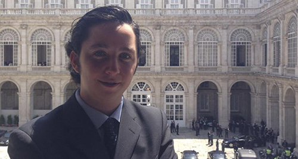

Esta es mi opinión personal. Como tal, es subjetiva. Francisco Nicolás Gómez Iglesias, o como todos a estas alturas le conocemos: el pequeño Nicolás. **Para mí es un héroe**. Es el primero de _los de abajo_ que pone en jaque a _los de arriba_. El primero que en realidad los pone en evidencia, el primero que los cabrea; y que pese a que no haya cometido más delito moral que pretender ser quien no es —algo muy frecuente en esta sociedad en la que vivimos— no dudarán en descargar todo el peso de la ley sobre él por lo que ha supuesto para sus ya maltrechas reputaciones personales.

Ha sido difícil elegir una foto de él en solitario y que no esté más pixelada que [Minecraft](http://es.wikipedia.org/wiki/Minecraft). ¿Por qué? Porque para mí ninguno de todos con los que sale fotografiado están a su altura. Pese a que todo eso sea lo que le haya valido estar donde está. Porque los ha dejado en evidencia y nos ha demostrado que, en esencia, en este país da igual quién seas, qué hayas hecho con tu vida, qué hayas estudiado o de qué hayas trabajado; para ganarte un nombre y una reputación sólo necesitas ser _amigo de_; alguien conocido, de quien los que tienen más que ocultar que tú puedan fiarse porque si unos son delatados los otros también lo serán.

Estos engaños le han supuesto un poder adquisitivo que para muchos quisiéramos; todo a costa de burlar a quienes presumen de no poder ser burlados. Le han brindado la posibilidad de poder llevar por un tiempo el nivel de vida de quienes, gracias a nosotros, ganan más en un día que la mayor parte del país en un mes; y que no conformes con eso se empeñan en hundirnos cada vez más en una miseria que ellos desde tan alto ni la atisban, los insolentes piensan que cosas así sólo pasan en países del tercer mundo.

¿Cómo voy a pretender mal alguno para alguien que ha conseguido tanto? Alguien que se ha creado a sí mismo como le gustaría ser; alguien con tanta clase y educación que es digno de alabanza entre quienes presumen de tenerla pero que en su mayoría no la tienen.

Espero de verdad que, haciendo gala de la inteligencia que ha demostrado tener, se haya salvaguardado las espaldas y que los que lo único que quieren es todo el mal para él tengan que conformarse con tragar bilis porque no puedan hacer nada más. Que se haya destapado el asunto le privará de volver a llevar una vida como la que llevaba hasta ahora y la confianza de unos, pero seguro que eso no le exime de haberse ganado la simpatía de otros y que, sabiendo que dentro de la cabeza tiene algo más que aire, no dudarán en confiar en él para otros asuntos con los que no tenga que sufrir para llegar a fin de mes.

Mis respetos.
