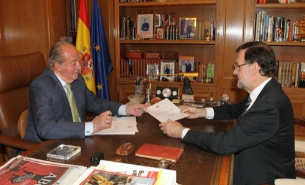

Rompo mi silencio por estos lares, ¿qué mejor momento que éste para hacerlo? ¡Ha tenido que abdicar un rey para encontrar un pretexto! Abdicar, por cierto, qué bonita palabra. Parecía que en este país no la íbamos a emplear jamás con tintes de noticia de última hora; tan sólo en los sueños de algunos. Cuando esta mañana se filtró el contenido de la rueda de prensa de Rajoy —sin televisiones de plasma mediante, ¡ojo!— lo primero que me vino a la cabeza fue: «_a estos pringaos se la ha colado **El Mundo Today** con una noticia falsa_». Pero no, era verdad.

Con toda probabilidad será Felipe VI el nuevo rey de España. Quiero decir: se prevé que ese será su nombre elegido; está claro que quien sucederá el trono será el actual Príncipe de Asturias. En Valencia no solemos llevarnos demasiado bien con los reyes llamados Felipe; el último nos churrascó Xàtiva y todavía permanece colgado bocabajo su retrato en estas tierras, pero ese es otro tema.

O la mentalidad de los Borbón ha cambiado mucho con el paso de las generaciones, o éste será el rey de España sin que ninguno de nosotros tengamos la libertad de opinar si nos parece bien o no. Meto esta frase aquí con el único objetivo de captar la atención de Pablo Iglesias, si es que está leyéndome.

El concepto que tengo del príncipe Felipe es bastante alejado del que tengo de su padre. Opuesto, tal vez. Y también puedo equivocarme, claro, pero creo que es lo suficientemente inteligente como para que una de las primeras cosas que haga cuando le cedan el trono sea convocar el referéndum que muchos ansían; incluso aquellos que no van a votar para protestar contra el sistema. Aunque eso de **sistema** ya quedó anticuado; ahora se llama **casta**. Llamadme iluso, pero creo —y creo que también él lo cree— que aunque hayan unos cuantos que reclamen la república siguen siendo una minoría muy ruidosa, y en caso de referéndum la monarquía ganaría en España por goleada. Y más si es el próximo rey quien propone que se vote. Sea como sea, ésta sería la única forma que tendría de reinar en paz, sin que nadie esté increpándole que está puesto a dedo. Yo al menos preferiría dejar de reinar que pasarme cada día del resto de mi vida acosado por la gente en la calle y por los medios en televisión, radio y prensa; además, siempre será mejor que lo recuerden por ser el monarca que quitó su culo del trono convocando un referéndum, a que llegado el momento en que los partidos políticos en pro del referéndum tomen un poder más relevante del que hoy en día tienen, ese referéndum sea impuesto y salga por la puerta de atrás porque la gente para entonces estaría bastante más quemada que ahora.

Eso sí: **recomiendo pensar bien qué se desea**. Porque todo eso de la república es muy bonito hasta que nos cuentan que el presidente de la república puede ser Mariano Rajoy y el segundo al mando puede ser Gallardón. Porque queridos amigos, por mucho que os cuenten desde el partido de turno, una república no tiene por qué ser de izquierdas. Y aunque ahora mismo la mayoría absoluta no la tiene el PP, en las últimas elecciones todavía le sobraron votos al señor Mariano para ganarlas. ¿Estáis seguros de que queréis que vuestro máximo representante sea Rajoy?

Algunos diréis, como buenas mentes adoctrinadas: ¡pero es que la Casa Real es un despilfarro económico brutal! Y para abriros los ojos recurro a [esta noticia de La Sexta](http://www.lasexta.com/programas/el-objetivo/noticias/cuanto-cuesta-monarquia-relacion-otros-sistemas_2013110300355.html) (04/11/2013) donde analizan los presupuestos generales destinados a la monarquía y donde se comparan con otros países republicanos. Y vemos que la monarquía nos cuesta a los españoles 7,9 millones de euros anuales; pero también que la república francesa cuesta 103 millones de euros y que la italiana cuesta 228 millones de euros. Parece que no es todo tan bonito como lo pintan algunos.

Ahora salid a las calles con vuestra banderita tricolor; que los mismos que decidirán quiénes son los cabeza de lista de cada partido en una hipotética república son los mismos que lo serán o no. Y precisamente también son los mismos que planean un gran pacto entre PP y PSOE para las elecciones generales en caso de que algún partido minoritario ponga en peligro sus valiosos escaños. ¿De verdad pensáis que habrá regeneración política en esa tercera república que muchos ansiáis?

¡Ay, almas de cántaro!
