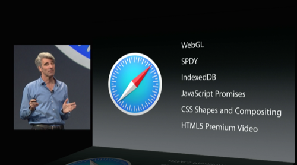

Siempre me ha gustado Safari, pero en algunas de sus versiones Apple ha hecho todo lo posible para que me dejara de gustar. Durante todo el tiempo que llevo usando ordenadores Apple, y ha llovido ya un poco desde entonces, el navegador que más he usado ha sido Safari; han habido interrupciones en el uso, reemplazándolo por Chrome, Firefox u Opera, dependiendo de cual sintiera más ágil en cada una de sus versiones, pero al final en cada nueva versión de Safari he acabado volviendo a él a la mínima que lo notaba con algo de mejor rendimiento en mi equipo.

**Safari desde hace tiempo no estaba siendo el navegador ágil que acostumbraba a ser**. Y me alegra sobremanera comprobar que **en OS X Yosemite se han puesto las pilas para devolver a este navegador al lugar donde se merece** estar por mérito propio. **Es alucinante, va como un rayo**. Ahora mismo **dista un mundo entre Safari y cualquier otro** navegador en OS X. Si fuera un deportista tenía el positivo asegurado en el control anti-doping.

Además han acompañado el rendimiento de una interfaz gráfica muy chula, repleta de transparencias para estar en consonancia con el resto del sistema operativo, y por fin han desterrado del mapa un fallo que atormentaba mi mente cada vez que ocurría: era incapaz de recordar las dimensiones y posición de la ventana tras cerrar la aplicación y volver a abrirla; ahora se comporta de forma normal, como siempre debería haber sido.

En un próximo artículo hablaré de las extensiones que para mí son imprescindibles y que hacen de éste un navegador todavía más completo.
