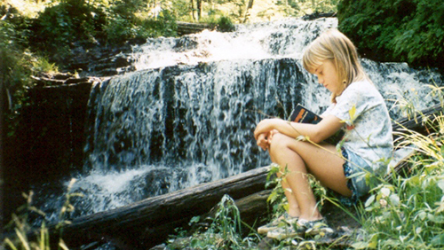

foto de [Julie Falk](http://www.flickr.com/photos/piper/10571972/)

Me entero gracias a mi amigo Alex, del blog [Semilla en la Tierra](http://www.alexbolea.es), de un artículo escrito en **Zoom News** cuyo revelador título ya permite hacernos una idea de lo que quiere transmitir: [¿Matan las lecturas obligatorias a los futuros lectores?](http://www.zoomnews.es/207167/letras-y-tretas/matan-las-lecturas-obligatorias-futuros-lectores); no obstante recomiendo su lectura ya que lo encuentro muy interesante y comparto todo lo que dice.

Básicamente ahonda en un problema que yo mismo sufrí en mi época estudiantil: **la imposición generalizada en el colegio de un material que deberíamos relacionarlo, instintivamente, con una buena forma de entretenimiento**. Bastantes libros de texto nos imponen en el colegio, y que en muchos casos terminamos por odiarlos, como para que libros ajenos al ámbito escolar también nos dejen mal sabor de boca; **y que las poquísimas ganas que pudieran quedarnos de darle una oportunidad a la lectura mueran agónicamente una vez pasada la época en la que otros pueden obligarte a leer lo que no te interesa**; o lo que tú no quieres leer, por el motivo que sea. Aparte de fomentar la lectura de clásicos con versiones alternativas adaptadas al lenguaje actual, como se comenta en el citado artículo, opino que también deberían variar un poco la temática y la época de los mismos; lo que en teoría se pretende cuando se le obliga a un alumno a leer determinado libro es que la pasión por la lectura surja en él y, en la medida de lo posible, no cese con el paso de los años. En las edades a las que nos referimos, ya pasada la época en la que se aprende a leer, la actividad que se realiza tras leer un libro suele ser un resumen; no sólo se valora la capacidad lectora del alumno, sino también su posterior reflexión y extracción de ideas principales para que cualquiera que no haya leído el libro tenga una idea bastante aproximada de qué se encontrará en él. Y yo me pregunto: ¿ese ejercicio no puede hacerse con cualquier libro del mundo? ¡Puede hacerse hasta con cómics!

Un clásico escrito en un lenguaje que nos hace recordar [las cuevas de Atapuerca](http://es.wikipedia.org/wiki/Sierra_de_Atapuerca) y un cómic son extremos opuestos, ¿por qué no quedarnos en un punto intermedio? **Cuando le obligas a un alumno a comprar un libro y le parece un tostón; le obligas a comprar otro, y de nuevo le resulta un tostón; y así, tostón tras tostón, acaba asociando los libros y la lectura a una de las cosas más negativas que pueden pasarle en su día a día**. En mi época de estudiante, cuando pasaba algo así, ya buscábamos por internet resúmenes de los libros que nos mandaban leer y después los modificábamos con expresiones propias y dándole nuestra forma para que no sospecharan; ni me imagino lo que podrán hacer hoy día quienes estudian y tienen un sinfín de posibilidades para engañar al profesor y hacerle creer que se lo han leído cuando incluso ni siquiera lo han comprado, sabiendo de antemano que lo que iban a poder leer iba a ser más efectivo que el más poderoso somnífero. Como decía: ¿por qué no buscamos un punto intermedio? ¿Por qué no se les ofrece comprar algunos de los ejemplares buenísimos que hay publicados en la literatura juvenil? Les divertirán muchísimo más; y no sólo eso: también aumentará la probabilidad de que se enganchen a la lectura; que no lean sólo lo que les imponen, sino también por iniciativa propia, porque es muy diferente hacer algo por obligación que hacerlo por devoción.

Ya comenté en un artículo hace tiempo [las desventajas de creer que todos los alumnos son iguales](http://fjp.es/obligando-a-ninos-a-correr/); éste es un caso más: **ni todos los libros son para todas las personas, ni todas las personas para todos los libros**. Me pregunto si a los autores de los clásicos les obligarían en el colegio a descifrar pinturas rupestres, o les enseñarían aquella parte de la historia adaptada a un lenguaje común que fueran capaces de entender; los idiomas deben ser herramientas universales que sirvan para comunicarnos. Cuando en lugar de ser útiles simplemente son barreras y obstáculos que aprender a saltar, su función principal: comunicar, desaparece.

Amigo estudiante: **lee, lo que te dé la gana pero lee**. No caigas en el error en que caímos muchos, pensando que todos los libros iban a ser tan tremendamente aburridos como los que te obligan a leer cuando vas al colegio. Piensa qué te gusta; seguro que ves alguna serie, o tienes alguna película favorita. ¿Qué temática tiene? Ve a buscar libros de esa temática y te sorprenderás. ¿Sabías además que muchas películas y series de televisión están basadas en libros? Investiga un poco por internet si esa película que tanto te gusta está basada en algún libro y dale una oportunidad. No toda la literatura es una mierda, seguro que hay algo que te gusta; la diferencia entre un tostón y un buen rato de lectura sólo depende de una acertada decisión.
