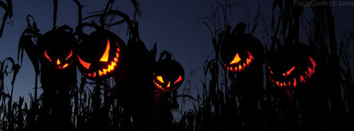

Halloween. El invasor americano. Esa bonita palabra que todos reconocemos mientras está escrita pero que en este bendito país, en su mayoría reacio a hacer propias tradiciones ajenas, ¿por qué no reconocerlo? seguimos armándonos lío para pronunciarla; ¡ni que decir escribirla correctamente!

Todos conocemos a alguien que, cuando se acerca este día, grita a los cuatro vientos lo en contra que están de esta fiesta. Quien diga que no conoce a nadie así es porque es uno de ellos. Una fiesta ajena, exportada del país invasor, el enemigo. Fiesta ajena como por ejemplo también lo es el carnaval —fiesta pagana con origen en Oriente Medio—, pero ésta parece estar aceptada socialmente puesto que no veo ningún colectivo alertándonos de lo perjudicial que es para nuestras vidas.

Nos quejamos de que Halloween es una fiesta que viene a invadir nuestras costumbres; no nos damos cuenta de que celebrar Halloween y conservar las tradiciones del día de Todos los santos son compatibles, aunque no a todos nos agraden éstas.

https://twitter.com/Garrafa/status/527088077966036992

Por ejemplo, hace unos días retuiteaba lo que veis sobre estas líneas. Y creo que no puede ser más acertado. No creo que haya niño en el mundo, por poco católico que sea, que cambie una emocionante estancia en el cementerio, viendo a sus familiares llorar mientras depositan flores junto a trozos de piedra con inscripciones, por una triste noche disfrazado rodeado de amigos que tienen el despropósito de estar contentos mientras a los vecinos no se les ocurre cosa más descabellada que regalarles caramelos y golosinas.

Yo no me veo yendo al cementerio por voluntad propia. Ni dejaré tras mi paso por la tierra con la obligación moral a nadie para que vaya a llevarme flores. Eso sí: respeto a todo el que quiera hacerlo. Basemos nuestros actos en el respeto y permitamos optar por divertirse a quien guste y llorar a quien tenga ganas de hacerlo.

Aunque eso sí: estoy totalmente en contra de la hipocresía; hay montones de casos de familias que no se hablan los unos con los otros pero en cuanto uno _se va de visita guiada al otro barrio_ era una excelente persona y hay que ir cada año el 1 de noviembre a llevarle flores para conseguir que sea la lápida más engalanada del cementerio y que todos sepan cuánto le queríamos… Todo el bien que queráis para mí procurádmelo en vida; una vez me haya muerto dejadme tranquilo.

Y disfrutad también de Halloween los que podáis, que un poco de emoción y de alegría en la vida no va a hacerle daño a nadie; aunque al día siguiente no os podáis desprender del pañuelo, que como ya dije, es perfectamente compatible.
