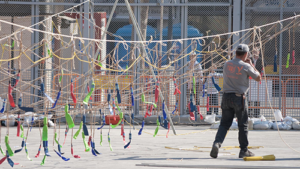

foto de [Luis PF](http://www.flickr.com/photos/luisoyo/3375215280/)

Cuando pensé en escribir este artículo mi nivel de cabreo era descomunal; entonces no se esperaba siquiera que pudiéramos ver ninguna de las tradicionales _mascletàs_ que se disparan del 1 al 19 de marzo en la Plaza del Ayuntamiento a las 14:00h por la televisión de todos los españoles; los que vivimos en Valencia estábamos cubiertos tanto por [Levante TV](http://www.levantetv.es) como por [Mediterráneo TV](http://tvmediterraneo.es), que emitirán entre ambas la totalidad de los actos que hasta el año pasado podíamos seguir mediante la ya difunta RTVV.

[Las cosas cambiaron](http://hortainformacio.com/2014/02/28/rtve-retransmitira-por-primera-vez-las-mascletas/), a mejor; pero no todo lo que cabría esperar. De lunes a viernes RTVE retransmitirá por TVE1, durante el corte territorial las _mascletàs_ del mediodía; esto quiere decir que las que caen en fin de semana no les importan, y también que sólo tendrán acceso a ellas quienes residan en la Comunidad Valenciana. Y en cuanto a la ofrenda floral será el programa España Directo quien se encargue de ir ofreciendo cortes retransmitiendo en directo, bajo su criterio personal, los mejores momentos —o los más importantes— de ambos días. Es lo más subjetivo que leí en mi vida, porque en cuanto a la ofrenda se refiere, el momento más importante para cada valenciano es diferente; generalmente suele coincidir con el paso de la comisión a la que pertenecen, la de su barrio, o la de algún allegado. Imagino que en este caso serán únicamente las comisiones importantes para Rita Barberá. Culminarán su programación especial con la _cremà_, el día 19, que la retransmitirán como cada año han hecho siguiendo en directo la falla de la Plaza del Ayuntamiento y las fallas ganadoras de los primeros premios en monumentos infantiles y grandes.

Cuando te pones a cubrir un evento de este calibre, no te quedes a medias; o lo haces bien o mejor no lo hagas. ¿Qué es la pantomima esa de hacer la programación especial durante la desconexión territorial? ¿Esto acaso significa que RTVE considera que las fallas sólo son importantes para los valencianos? Les recuerdo que son conocidas a nivel mundial, y que impulsan la más que perjudicada «Marca España» allende los mares. Y no será porque no tienen capacidad, medios, y experiencia. Sólo hay que echar un ojo al seguimiento que hacen de los sanfermines; una _fiesta_ en la que alguien sale herido en el mejor de los casos, y que a cuyos personajes principales, los toros que no sólo acaban heridos sino también torturados, nadie les preguntó si les parecía bien que madrugaran para echarse unas carreras y que por la tarde _les dieran matarile_ en el redil.

Que los safermines son conocidos a nivel mundial nadie lo puede discutir, más allá de que sea algo con lo que comulgues o no. Pero que las fallas también lo son, tampoco. A juicio de cada cual queda discernir si las fallas son más o igual de importantes que los sanfermines, pero desde luego de ninguna forma lo son menos.
