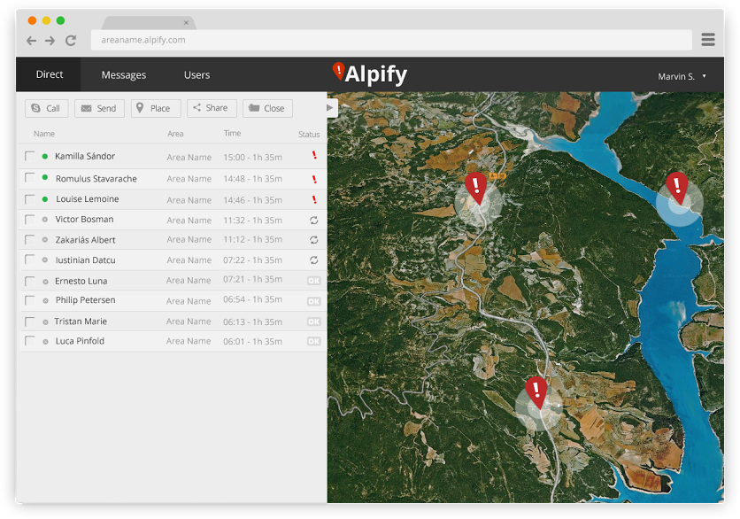
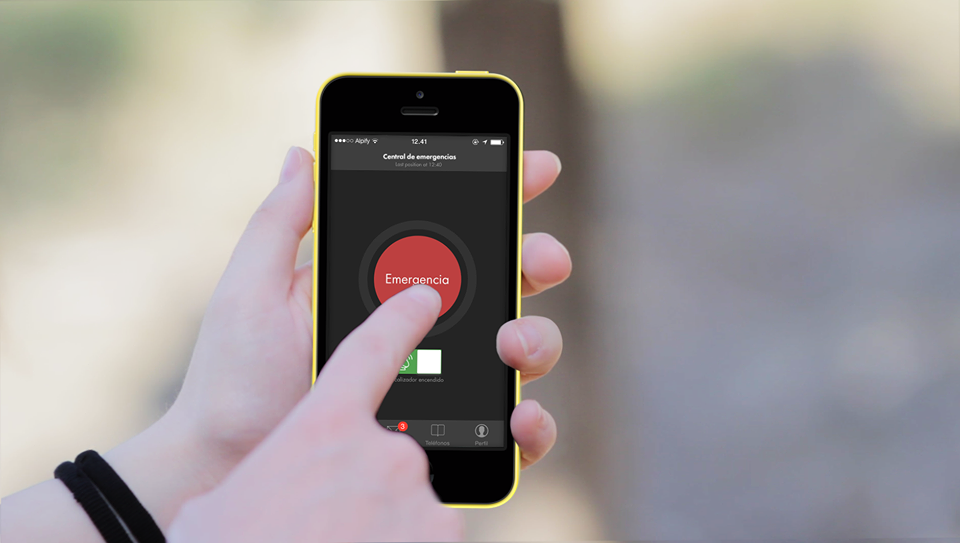

Hoy quiero aportar mi granito de arena para dar a conocer **Alpify**: la aplicación que **puede salvar tu vida**. Una aplicación imprescindible para todos aquellos a los que nos gusta la montaña.

Disponible en [App Store](https://itunes.apple.com/app/alpify/id622546357)  
y [Google Play](https://play.google.com/store/apps/details?id=app.alpify).

La conocí por casualidad hace ya bastante tiempo en una de esas visitas que hacía por Google Play para toparme con aplicaciones nuevas o interesantes. Por aquel entonces me pareció una idea genial, pero sólo estaba disponible en Andorra y País Vasco, por lo que a mí en realidad no me era de mucha utilidad. Había dos opciones: bien se hacía popular en aquellas zonas y crecía por todo el mundo —como pocos casos— o caía en el olvido y quedaba sólo en una buena idea que no se llegó a explotar —lo que es más habitual—. El tiempo ha demostrado que esta aplicación debe incluirse en el primer grupo: **la cobertura de esta aplicación actualmente ya incluye todo el territorio español** y **algunas de las estaciones de esquí más importantes del mundo**.

**Alpify está conectada directamente con los servicios de emergencias**; en España: con el 112 y distintos cuerpos de rescate en montaña. Esta conexión se realiza mediante un panel de control como el que aparece en la imagen sobre estas líneas, en el que se muestran las personas dentro de la zona de acción del correspondiente cuerpo de emergencias que han lanzado una solicitud de rescate desde la aplicación móvil.

Si cuando instalas la aplicación das permiso para que se active el _localizador_ **Alpify no se limita únicamente a indicar el punto en el que estás cuando pulsas el botón de emergencia** desde tu dispositivo móvil sino que **va almacenando** —al igual que hacen aplicaciones deportivas como Strava, Endomondo, etc— **la ruta que has seguido** para que en caso de que hayan distintas formas de llegar a tu posición se pueda saber más concretamente **cómo has accedido allí** y **qué pudo ocurrir** cuando sufriste el percance.

Y además dispone de una función de **localización externa** —que podemos activar o no, desde las opciones— para que **en caso de denuncia por desaparición por parte de algún familiar o amigo los servicios de Alpify puedan saber tu última localización y enviar a un equipo de rescate** en caso de ser necesario incluso sin necesidad de que nadie presione el botón de emergencia en el teléfono móvil —tras el accidente el usuario puede estar inconsciente y no poder hacer nada.

https://www.youtube.com/watch?v=t5VpNBCdOVo

La aplicación debe asociarse a un número de teléfono durante la instalación; el sistema nos enviará un mensaje de texto con un número de verificación que tenemos que introducir para que se sepa que es un número de teléfono real; **éste será el número de teléfono que aparecerá en los paneles de los servicios de emergencias** para que puedan saber quién es quien está pidiendo auxilio. Pero no únicamente les aparecerá esta información: la configuración de la aplicación nos permite introducir **nuestro nombre completo**, **un campo de texto personalizable donde podemos indicar nuestro grupo sanguíneo**, **nuestra fecha de nacimiento o nuestras alergias** —si las tenemos—, y **un número de teléfono de contacto de algún familiar o amigo** al que poder avisar de nuestro accidente, de nuestra situación y de nuestro estado.

Una aplicación que, estando activa todo el día mientras estamos practicando algún deporte por la montaña, **consume entre un 7% y un 10% de batería a nuestros dispositivos**; y que, en caso de emergencia, será muy útil para avisar a los servicios de emergencia de **nuestra posición exacta** y que no tengan que perder un tiempo valioso rastreando un área más o menos extensa intentando descubrir dónde podríamos estar.

Por último queda añadir que **en caso de disponer de conexión a internet en el móvil** todos los datos de nuestra ubicación en caso de emergencia **se enviarán a los servicios de emergencia por esta vía**; pero en caso de que estemos **en una zona sin cobertura de datos serán enviados mediante mensaje de texto**.

No pierdas más tiempo e instálala en tu dispositivo móvil: por lo que pueda pasar; nunca sabes cuándo podrás necesitarla.

Más información: [página web oficial](http://www.alpify.com).
