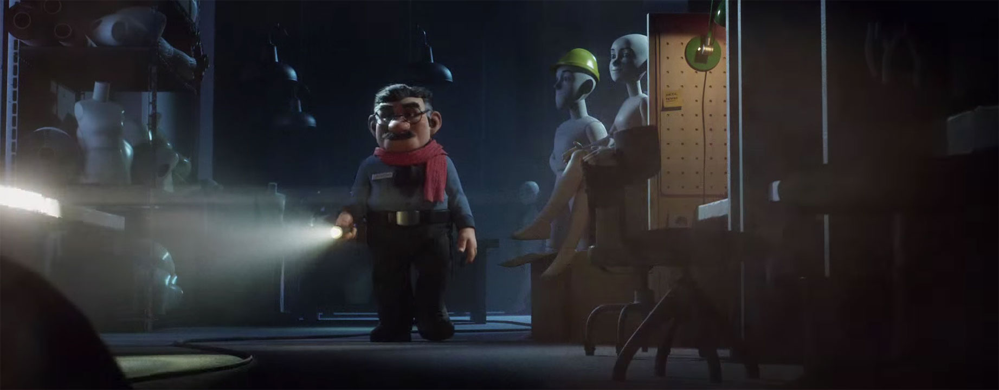

Pocas cosas en España son tan criticadas, casi sistemáticamente además —decisiones políticas al margen—, como el anuncio de la Lotería de Navidad. Cada año nacen cientos de anuncios diferentes, y la mayoría de ellos pasan con más pena que gloria por nuestras vidas; muchos quedan en el olvido, pero otros directamente son tan pésimos que ni somos conscientes de que hayan existido alguna vez. Es algo que no ocurre con el anuncio de la Lotería de Navidad; puede gustar o no gustar, se le puede alabar o criticar, pero si hay algo que no causa es indiferencia: todos lo comentamos por la calle la primera vez que lo hemos visto, con nuestros amigos. Y creo que valoramos cuando, al menos, tiene una calidad aceptable.

En años anteriores el anuncio es cierto que parecía más una parodia de sí mismo que algo de lo que sentirse orgulloso y que simbolice el espíritu navideño y la unión que el país necesita; cuando las cosas se hacen mal ya hay muchas voces que claman al cielo criticando el anuncio y, aprovechando la ocasión, también a España, porque si hay algo que nos encante a los españoles es criticarnos a nosotros mismos y cualquier cosa que salga de nuestro país.

Cuando las cosas se hacen bien es cuando a mí me gusta comentarlo, porque pienso que es preferible valorar lo que está bien que ir a degüello con aquello que no es todo lo bueno que nos hubiera gustado o, por qué no decirlo: cuando es una absoluta birria.

https://www.youtube.com/watch?v=tY3vQTrCn7I

Y creo que este anuncio se merece la mejor de las valoraciones; hacía mucho tiempo que no me sentía tan orgulloso de un anuncio patrio como de éste; y no me remonto a anteayer, más bien a tiempos del _calvo_. En esencia es muy parecido al del año pasado; de hecho, la agencia de publicidad es la misma: [Leo Burnett](http://www.leoburnett.es). He de aclarar, aunque vaya contracorriente, que a mí el anuncio del año pasado me gustó cuando lo vi por primera vez; no como éste, en absoluto, pero creo que no era tan pésimo como, por ejemplo, el de 2013… que se llevó la palma por lo rematadamente cutre que fue… en mi opinión, claro.

Y creo que lo que le hace especial a este anuncio es su conjunto, todo en él; no sería igual prescindiendo de cualquiera de sus partes. La animación 3D es maravillosa, y aunque sea apreciado con ojos de alguien con un conocimiento nulo en diseño 3D se le suponen un buen montón de horas para lograr ese resultado final. El personaje principal, Justino, creo que es amor puro; en cada historia, aunque sea un «simple» anuncio publicitario, se necesita algo o alguien con quien poder empatizar, y creo que no hubiera podido existir mejor conexión entre el espectador y el anuncio que la que nos brinda Justino. Y la música, maravillosa, un solo de piano fantástico con melodía armónica que nos hace olvidarnos de que hay música, centrándonos en el anuncio, pero a la vez que sin darnos cuenta la interioricemos y sepamos de qué anuncio se trata únicamente escuchando las primeras notas y sin siquiera estar mirando la pantalla; para los curiosos, por cierto, se trata de «Nuvole Bianche», compuesta por Ludovico Einaudi.

Entra directamente a formar parte de mi lista de anuncios televisivos favoritos; y concretando en cuanto a anuncios de navidad se refiere, hasta ahora para mí el mejor era el de la campaña publicitaria navideña que lanzó la cadena de supermercados inglesa Sainsbury's en 2014, en el que se rememoraba la conocida como [Tregua de Navidad](https://es.wikipedia.org/wiki/Tregua_de_Navidad) que tuvo lugar durante la [Primera Guerra Mundial](https://es.wikipedia.org/wiki/Primera_Guerra_Mundial) de forma improvisada entre los soldados de ambos ejércitos. Ahora los dos anuncios compartirán posición número uno _ex aequo_ de mis anuncios navideños favoitos.

https://www.youtube.com/watch?v=NWF2JBb1bvM

Sólo resta quitarme el sombrero ante la agencia publicitaria Leo Burnett, por lo bien que lo han hecho y por haber sido capaces de crear algo de lo que, unánimemente y cuando más lo necesitamos, todos los españoles podemos sentirnos orgullosos.
