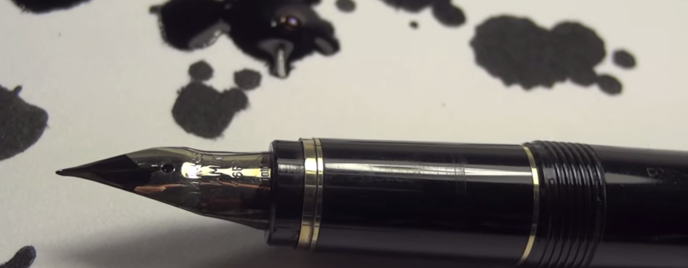

Tener una bonita caligrafía es importarte para sentirse bien con uno mismo, sobre todo cuando escribes y terceras personas deben leer —o en según qué casos, tratar de descifrar— ese texto. Además, poner en práctica nuevos tipos de letra, experimentar, jugar escribiendo, también puede ser muy relajante. Y quién sabe si entre experimento y experimento das con un tipo de letra que te gusta y puedes utilizarla con frecuencia cuando necesites escribir cualquier cosa.

Quienes me seguís desde hace tiempo sabréis que uno de mis objetivos ya lleva siendo desde hace tiempo el conseguir tener una mejor caligrafía. Hubo una época en que escribía tan rápido que luego ni siquiera yo mismo sabía lo que había escrito… ¡cómo para que los demás tuvieran que esforzarse intentándolo!

https://www.youtube.com/watch?v=leutgQ0QwIA

Nunca he llegado a conseguir el tipo de letra que quería, pero también es que siempre soy demasiado exigente conmigo mismo: mi caligrafía ha mejorado notablemente; y por lo menos sé a ciencia cierta que terceras personas que tengan que enfrentarse a algo que he escrito yo no tendrán que esforzarse demasiado para comprender qué narices pone, como pasaba antes.

https://www.youtube.com/watch?v=XMolEvB5EqA

Entre otras cosas, y es lo que realmente vengo a compartir con este artículo, me han servido como inspiración vídeos como los que veis. En el vídeo anterior se utiliza una de las mejores —y caras— plumas estilográficas que existen; equipada con plumín flexible, que permite variar el grosor del trazo dependiendo de la presión ejercida con la pluma sobre el papel.

https://www.youtube.com/watch?v=xN8naCb\_nyw

Aunque para conseguir algo similar nosotros mismos no se necesitan grandes inversiones: hay estuches de iniciación a la caligrafía a precios muy económicos; mis progresos no han sido siquiera con esos estuches, me encanta escribir con pluma estilográfica desde hace muchos años, y para mejorar mi caligrafía he usado una pluma estándar con plumín rígido… seguramente con un bolígrafo podría haber conseguido los mismos resultados, aunque sabiendo escribir con estilográfica a mí se me hace más sencillo conseguir una buena caligrafía así que con un bolígrafo o _roller_, cuestión de gustos.

Con paciencia se pueden hacer verdaderas obras de arte como las que podemos disfrutar en estos vídeos. Porque la caligrafía también es un arte… una bonita caligrafía, claro; no la que tenemos la mayoría.
