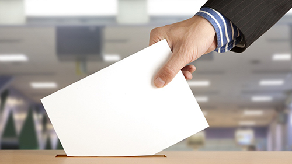

Hoy, día de elecciones, me he acordado de mis primeras elecciones; las primeras elecciones, recién cumplidos los 18 años, en las que pude participar activamente de nuestra amada democracia que, a mi pesar, en según qué casos no lo parece tanto… pero ése es otro tema.

¿Qué partido votar? Ésa es la pregunta clave, porque la verdad es que la gran mayoría no tenemos ni pajolera idea de política en esa época; ni siquiera conocemos qué opciones tenemos. Siempre hay honrosas excepciones de quienes se han interesado por la política desde bien jóvenes, pero debemos ser conscientes de que no es lo más frecuente.

En el mejor de los casos votaremos lo mismo que voten nuestros padres —si es que ambos votan al mismo partido— confiando en que, como padres y adultos que son, estarán optando por la mejor de las opciones existentes, aunque no tengamos ni idea de cuál ni por qué. En este caso, que como digo es el mejor o en todo caso el menos malo, estaremos desaprovechando con ello tomar realmente la primera decisión relevante de nuestras vidas; estaremos confiando nuestro voto a las mejores personas en quien podemos confiarlo, pero no estará siendo, realmente, nuestro voto el que depositemos en la urna.

En el peor de los casos… vete tú a saber lo que puede pasar por la mente de cada cual. Desde votar a quien le haga gracia el nombre del partido, a votar el único que les suene de algo —aunque con ello estén votando a la Falange con lo que ello pueda implicar—, o a hacer una apuesta en común para votar a un partido haciendo uso de la frase por excelencia: _¿a que no hay huevos?_ Y como muestra de que lo que digo no es utópico bien vale la pena ver el vídeo que dejo a continuación.

https://www.youtube.com/watch?v=ebdTgQ60Ilw

¿Y por qué sucede esto? Porque en el colegio han insistido en que aprendamos la historia de los partidos más relevantes de épocas pasadas, haciendo especial hincapié en aquellos cuyos líderes resultaron ser personas sin escrúpulos y que han llevado a sus respectivos países a cometer las peores atrocidades del mundo… lo cual está genial, no se me mal interprete, porque no hay mejor manera de evitar futuros errores que enseñar a evitar los ya cometidos, pero siempre y cuando se ceda una parte del tiempo lectivo a aprender sobre qué hacer en la actualidad.

Nadie nos enseñó qué es el [sistema d'Hondt](http://es.wikipedia.org/wiki/Sistema_D%27Hondt), cómo ni por qué se emplea en las elecciones españolas —entre otros países—; nadie nos ha enseñado un listado de las diferentes opciones políticas ni en qué consiste cada cual; nadie nos ha enseñado qué errores y aciertos han tenido los presidentes del Gobierno más recientes de nuestro país, y cuáles de ellos se deben al programa del partido al que representan o a una decisión personal valiéndose del poder que tiene su cargo; nadie nos ha incentivado a profundizar en nuestros ideales para averiguar qué formación guarda el mayor parecido a nuestra forma de pensar; y mucho menos nos han animado a formar parte activa en las juventudes de ese partido con el cual podamos sentirnos identificados.

Tenemos un sistema de educación que se centra muy poco en el presente y pasa por alto que en esa edad no estamos preparados para afrontar de forma apropiada las decisiones más próximas que tenemos. Y si no queremos acabar como la gente del vídeo anterior más valdría que quien corresponda enseñe a los futuros votantes a hacerlo con criterio.

De pequeños nadie nos enseñó a quién votar… **y luego pasa lo que pasa**.
