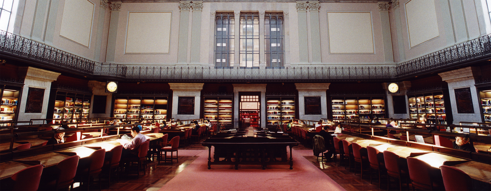
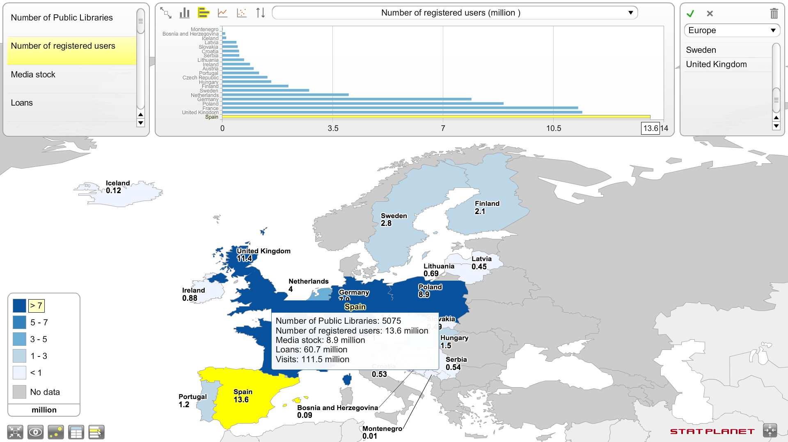

Un reciente estudio revela que **España está a la cabeza de Europa en cuanto número de socios de bibliotecas públicas**. No hay estudio que demuestre esto otro que voy a decir: a todos los españoles nos ha sorprendido esta noticia; además de ir en cabeza en cuanto a número de socios de bibliotecas públicas, también vamos en cabeza en cuanto a infravalorarnos a nosotros mismos; quien más duramente puede criticar a España y a los españoles —aparte de Angela Merkel— somos nosotros mismos: los españoles; que acostumbrados a ser noticia exclusivamente por cosas de las que nos sentimos avergonzados nos sorprende que una noticia como ésta sea realidad.

Biblioteca Nacional de España

En total hay **56 664 bibliotecas públicas en Europa**, que cuentan con **70 873 025 socios**. Durante el periodo del estudio hay un total de **1 392 053 241 préstamos realizados**, y de **880 178 775 visitas recibidas**. Y cuentan con un total de **153 816 personas trabajando** en estos centros.

Como decía: **España a la cabeza de Europa** en cuanto a número de socios de bibliotecas públicas, concretamente con **11,6 millones**; se lleva la medalla de plata en este ranking **Reino Unido con 11,4 millones**, y la de bronce **Francia con 11,3 millones**.

Los españoles somos tan rápidos leyendo que no necesitamos siquiera llevarnos los libros a casa.

En cuanto a número de préstamos no vamos tan bien: **España cuenta con 60,7 millones de préstamos anuales**. A la cabeza están **Alemania con 380 millones**; **Reino Unido con 309,5 millones**; y **Francia con 300 millones**.

Y quizá la broma que hice anteriormente no esté tan lejos de la realidad, porque en cuanto a visitas también estamos en cabeza, aunque en esta ocasión nos llevamos la medalla de bronce: **en España contamos con 111,5 millones de visitas anuales**; nos preceden en esta ocasión **Reino Unido con 306,6 millones** y **Alemania con 125 millones** de visitas anuales.

No digáis que no: **éstos sí son números de los que sentirse orgulloso**; éste sí es un buen motivo para cantar aquello de: «yo soy español, español, español…».

Más información: [EBLIDA](http://www.eblida.org/activities/kic/) Fuente: [Papel en blanco](http://www.papelenblanco.com/bibliotecas/espana-a-la-cabeza-en-el-numero-de-socios-de-bibliotecas-publicas)
