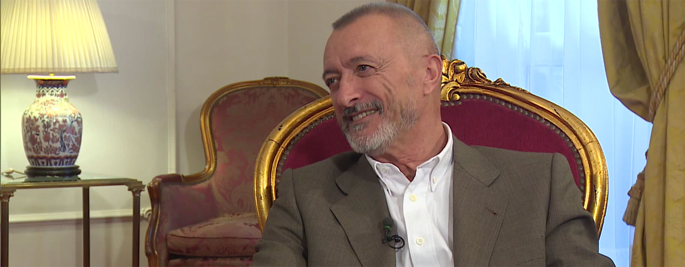

Pocos de quienes me conocen desconocerán mi admiración por don [Arturo Pérez-Reverte](http://fjp.es/autor/arturo-perez-reverte/), pero es que en cada entrevista, en cada opinión vertida en sus columnas o en Twitter, siempre hay algo interesante para extraer y pensar en ello. Me maravilla cuando habla profundamente de lo que sabe, cuando se explaya, cuando lo ves en su salsa, disfrutando como un niño por el simple hecho de compartir una parte de sí con quien quiera escuchar; y uno de los temas en el que más conocimiento desborda es en la historia, y por supuesto, en la literatura.

Hoy han publicado [una entrevista en JotDown](http://www.jotdown.es/2015/12/arturo-perez-reverte), en la que hay un fragmento que me encantaría compartir aquí. La conversación venía de su trabajo en la Academia, de su papel en ella como _académico rebelde_ y _disidente_ en su más que conocida guerra contra la supresión de los acentos en los demostrativos y el _sólo/solo_, y en qué tipo de ambiente se respira por allí. Decía que lo que menos le gusta de ésta es el conformismo; por ejemplo, cita un artículo que se escribió sobre el sexismo en la lengua, a saber: aquello de los _miembros_ y las _miembras_, decía que una mayoría optaron por una actitud cobarde y recomendaron olvidarse del tema y simplemente dejarlo pasar para no crear polémica. Y en esto coincidimos ambos: una opinión no puede reprimirse por el miedo al qué dirán. Y puestos en antecedentes viene la parte que quiero destacar:

> **P: Es decir: ¿la cultura y la erudición no nos hacen mejores, es el ambiente que se encuentra en cualquier otra parte?**
> 
> **R:** No, uno culto puede ser tan cobarde y conformista como uno inculto. Incluso más. La cultura no nos hace mejores.
> 
> **P: ¿De qué nos sirve?**
> 
> **R:** Para no gritar cuando se cae el avión _\[risas\]_. ¿Te cuento porqué te digo esto? Un día iba volando de Chipre a Beirut. Cuando subo a un avión, sé que se puede caer, porque soy razonablemente culto, como cualquiera con un mínimo de vida y lecturas, y sé que según la ley de la gravedad las cosas que pesan se caen. A veces se caen. Y cada Titanic tiene su iceberg. Porque he leído, y eso es ser culto: saber que cada Titanic tiene su iceberg o que cada avión se puede caer. Y ese día, volando en ese avión cayó un rayo, y al perder altura la gente empezó a gritar, y yo me dije: «Fíjate, estos idiotas gritando, no sé de qué se sorprenden, si los aviones se caen, ¿qué esperaban? Me voy a morir entre gente gritando, vaya forma más idiota de morir». ¿Por qué yo no grité? Porque sabía que los aviones se caen, y esos bobos creían de verdad que el avión no se iba a caer nunca. Suben al Titanic pensando que no se va a hundir. Lo creen de verdad. Creen que el coche en el que viajan no se va a estrellar contra el árbol, creen que son inmortales. Y la cultura te permite saber que no lo eres. La cultura da una actitud asuntiva, o como se diga, frente a la vida y la muerte. La parte positiva de la cultura es que, cuando llegan los bárbaros, tú estás en tu biblioteca, apoyado en la ventana, viendo cómo gritan las matronas, cómo las violan, cómo arde Roma, y todo el mundo gritando, y tú dices: «Pero gilipollas, ¿qué esperabais? Los bárbaros hacen estas cosas. Si hubierais leído sabríais que tarde o temprano pasan estas cosas».

No sé a los demás, pero a mí estas palabras me parecen sublimes. Y más allá de la anécdota se puede extraer la metáfora y aplicarse en multitud de ocasiones; por ejemplo, y retomando lo comentado anteriormente: en la historia. La historia, desgraciadamente, siempre se repite; porque la historia la escribimos los humanos y no nos caracterizamos precisamente por ser una raza que aprenda de sus errores. Todos los conflictos que puedas leer en los libros de historia volverán a suceder: con mayor o menor crueldad, ocasionando una guerra bélica o no, quizá en distintos escenarios y con diferentes bandos, pero en general todo vuelve. Y sí, los aviones cayeron y seguirán cayendo, los coches se estamparon y seguirán estampándose, los barcos en su inmensidad a veces se topan con un bloque de hielo y el hielo queda ahí pero el barco se hunde, y por supuesto, por mucho que a veces nos creamos inmortales o por encima del bien y del mal, no lo somos. Siempre acabarán llegando los bárbaros, que violarán a las mujeres y matarán a sus maridos; nosotros ya fuimos verdugos en el siglo XV, y tarde o temprano llegará alguien que sea nuestro verdugo. Porque la historia siempre se repite.
