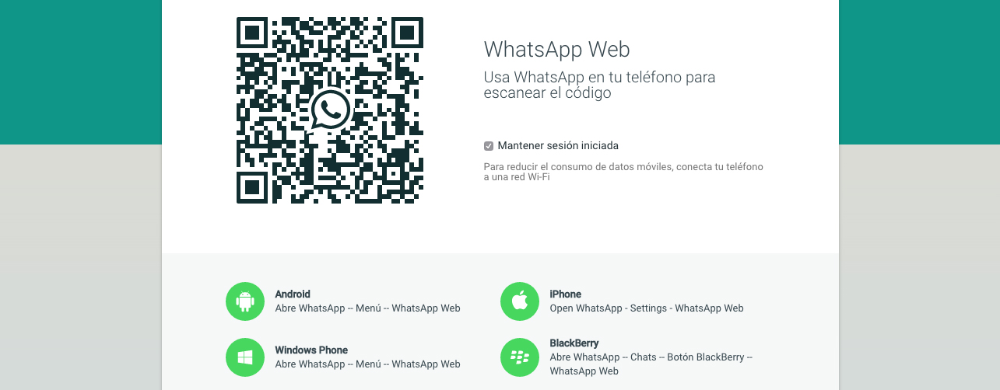

Los poseedores de un iPhone estamos de _enhorabuena_: WhatsApp ha tenido a bien sacar, por fin, su **versión Web para los usuarios de iOS**. Por fin podremos conversar con nuestros contactos desde la comodidad que ofrece un ordenador respecto a un teléfono móvil; porque aunque algunos se empeñen en apartar el ordenador de sus vidas pienso que **un monitor y un teclado físico siguen siendo más rápidos y cómodos para usar durante largo tiempo que un dispositivo móvil**, sea el que sea. Por no hablar de lo ridículo que me parecía estar delante de un monitor con el cuello torcido cara al móvil y escribiendo desde allí, cuando podríamos estar haciéndolo con el teclado que tenemos justo delante de nosotros.

Infinitamente más tarde que algunas aplicaciones de la competencia, como Telegram; aunque también ridículamente más tarde que los usuarios de teléfonos móviles con Android, los cuales llevan pudiendo usar WhatsApp Web desde principios de 2015. Según WhatsApp por culpa del hermetismo de Apple no pudieron sacar su versión vía web de la aplicación a la par que en Android, pero que yo sepa el hermetismo de Apple sigue siendo el mismo ahora que en enero, así pues podemos convenir que el absurdo reparto de culpas desde WhatsApp hacia Apple no ha sido sino una metedura de pata y una evidencia de su ignorancia sobre qué les estaba permitido hacer en iOS y qué no.

WhatsApp fue pionera en su sector: **la primera aplicación que se atrevió a plantar cara a las operadoras móviles y recortar el jugoso pastel que tenían en beneficios por cada mensaje SMS que se enviaba**. Hoy en día los mensajes SMS son prácticamente historia; y los beneficios que sacan las operadoras móviles con ellos son irrisorios, tanto que la mayoría incluyen un buen montón gratuitamente en el contrato mensual… y me atrevo a decir que un alto porcentaje, aunque sean gratis, nunca llegan a utilizarse.

¿Qué pasó tras esto? Que en lugar de aprovechar el tirón y afianzar su posición de poder respecto al resto de aplicaciones que pudieran seguir sus pasos se acomodaron. Y se acomodaron tanto que ni siquiera supieron ver que la competencia no sólo estaba igualándoles sino también superándoles. Se olvidaron de sus usuarios; jamás respondían cuando se les enviaba solicitud de ayuda al soporte técnico; no sacaban ninguna novedad, y cuando a actualizarse para integrar funciones nativas del sistema operativo se trataba lo hacían tarde y con fallos; no parecían hacer caso a las funciones que demandaban sus usuarios… y para rematar, aunque en realidad sea más que económico, cambian su modelo gratuito por un modelo de suscripción que requiere de pago previo para que te permitan usar la aplicación durante el periodo de tiempo contratado.

Durante todo este tiempo las alternativas a WhatsApp crecieron poco a poco; algunas durante más tiempo, algunas durante menos; hasta que llegó Telegram y desde un inicio se hizo con la base de usuarios que las demás no habían conseguido hasta ese momento. Presentando una aplicación que hacía envidiar su uso a los usuarios de WhatsApp; con aplicaciones de escritorio y versión web para poder usar tu cuenta en el ordenador desde el primer momento en que nació la aplicación; con una seguridad en la encriptación de mensajes que por aquel entonces en WhatsApp era tan sólo un sueño; y con un nivel de atención personalizada al usuario a través de soporte y redes sociales que darían seguro para una genial _master class_ a muchas empresas…

Al menos en España WhatsApp sigue dominando; muchos tienen también cuenta en Telegram, pero a día de hoy cuando conoces a alguien y debes contactar con esa persona es mucho más frecuente la pregunta _¿tienes WhatsApp?_ que _¿tienes Telegram?_ Eso no quita que en el país donde más usuarios tenía WhatsApp, buena parte de ellos se haya desencantado con el servicio y se hayan pasado a cualquiera de las múltiples alternativas de que dispone el mercado. Y todo por una estrategia errónea: **creer que cuando estás arriba ya no bajarás**; creer que **el hecho de haber sido el primero en algo no puede hacerte _caer_ cuando alguien, pese a que no haya sido el primero en hacer ese algo, sí sea alguien que lo hace mejor**.

Y algo que nos ha demostrado WhatsApp con el paso del tiempo, aparte de que fueron unos visionarios en el momento en que crearon lo que podría haber sido la mejor aplicación del mundo —y que durante un tiempo lo fue—, es que **estancarse es lo peor que puede suceder a una persona, a un proyecto o a un negocio**. **Nada dura eternamente**: ni el dinero, ni la fama, ni los usuarios de un servicio; que por muy fieles que puedan ser, lo serán hasta cierto límite: en el momento en que exista un servicio mejor y con mejores garantías, por nuevo que sea, con toda probabilidad buena parte de ellos harán el cambio.
