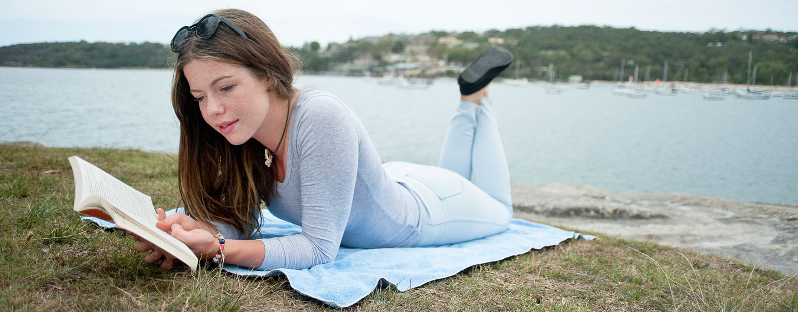

Parafraseando al conocido refrán: _dime qué lees y te diré quién eres_… Creo que esta afirmación es errónea en la mayoría de casos; excepto, por ejemplo, que estés leyendo _Mein Kampf_ con una esvástica tatuada en el pecho… en esa situación es posible que ya estemos legitimados para sacar conclusiones precipitadas.

A la literatura juvenil, así como concepto global y sin separar unos subgéneros de otros, se le está sometiendo a una crítica furibunda y, en mi opinión, muy poco justificada. Estamos acostumbrados a que se lleve más el aparentar que el ser, a que uno se preocupe más por el qué dirán que por hacer lo que realmente quiere hacer en ese momento, a que se juzgue si no se hace o se piensa lo que socialmente está establecido como correcto… y entre tanto tabú, tanta falsa apariencia y tanta tontería choca que haya quien le importe un pimiento lo que otros puedan pensar de lo que haga o diga.

Procedo, como si estuviera en un grupo terapéutico, a confesarme: hola, soy Javi, tengo 28 años y me gusta la literatura juvenil. Estamos en 2015, cada uno debería poder tener los gustos literarios que le vinieran en gana sin que tenga que someterse a críticas por ello. Lejos debería haber quedado eso de ir a la librería y decir que el libro o cómic que tantas ganas tienes de leer es para un regalo, o para tu hijo, y que si te lo pueden envolver. Es cierto que Amazon ha puesto las cosas más fáciles en ese sentido, pero pienso que hay un montón de motivos por los que querer hacer compras de libros online y que ése no debería ser uno de ellos.

Disfruto mucho leyendo libros que teóricamente no son para adultos, en los que puedes encontrar escenas, tramas y personajes tan complejos como muchos de los que puedan encontrarse en libros cuya sección se encuentra al otro extremo de la sala y donde no serás juzgado si te parece interesante la sinopsis de un libro. También disfruto enormemente con libros fantásticos ¡incluso infantiles! y de hecho una de mis sagas favoritas es de fantasía aunque, eso sí, en mayúsculas: El señor de los anillos, de [Tolkien](http://fjp.es/autor/j-r-r-tolkien/).

Pero también disfruto mucho con el género de terror, por ejemplo, considerado para adultos; [Stephen King](http://fjp.es/autor/stephen-king/) es mi autor favorito de este género de todos los tiempos… y digo bien: de todos los tiempos; mis inicios en el género de terror cuando era niño —y no digo siquiera adolescente— fueron, entre otros, con el gran genio del terror ¡y tan sólo era un niño! Alguno pensará que debe ser que me gusta ir contracorriente: de niño leyendo libros _de adulto_ y de adulto leyendo libros _de niño_. ¿Y qué? Cuando pasas de un libro denso no hay nada como ponerse con uno que simplemente te haga pasar un buen rato y si puede sacarte alguna sonrisa mucho mejor; quien no haya experimentado esa sensación, la del reírse, le recomiendo encarecidamente hacerlo… estar siempre odiándolo todo y con cara de vinagre es muy malo para la salud.

También, cómo no: disfruto con los considerados como libros clásicos. Que para no faltar a la verdad me cuestan bastante más que el resto de digerir, por la forma de relatar de la época y que el lenguaje utilizado no resulta tan familiar hoy en día.

Y ni leer un género literario ni otro me legitima para criticar a alguien que lea, porque por el mero hecho de interesarse por la cultura y la literatura ya tiene mi respeto; lea lo que lea. Hay clásicos que me han parecido un tostón, libros de ciencia ficción —que me encantan— que he abandonado a mitad por resultarme indigeribles, y también como no podía ser de otra forma libros de literatura juvenil que son insulsos hasta reventar y que pueden hacer pensar que sólo un Teletubbie podría disfrutar de su lectura. ¿Y acaso toparse con un libro malo de un género concreto hace que el resto de libros de ese género ya no vaya a gustarte y debas de huir de esa sección para no regresar jamás? ¡Vaya estupidez! Hay libros buenos y malos en cualquier género; lo que hace que un libro sea bueno o malo para cada cual no es la temática del mismo sino si la forma de narrar, de describir, o el léxico de ese autor es de nuestro agrado o no. Por eso mismo hay libros que para unas personas son geniales y para otros son insufribles; el libro no cambia, cambia la percepción del que lee.

### Fenómeno «BookTube»

Desde hace un —largo— tiempo hay un fenómeno en expansión en YouTube: los llamados _booktubers_. Al igual que se hacen con otras decenas de temas, estas personas comparten y difunden sus aficiones en común, en este caso: la literatura. Y ello _per se_ ya me parece loable.

Son personas, muchas de ellas también escriben libros, que han decidido dedicar parte de su tiempo libre en hacer reseñas y recomendaciones para procurar inculcar la afición por la lectura a la gente en general, sean jóvenes o no lo sean; porque en esto de leer, como en tantas otras cosas, la edad no importa.

Y esta semana se han puesto en boca de muchos debido a un programa de televisión sin apenas renombre, televisado en una cadena autonómica que, sinceramente, prácticamente nadie conoce, y presentado por dos personas a las que no se les conoce éxito en campo alguno y que seguramente como ésa sea la tónica habitual en sus carreras pasarán por este mundo llevándose en sus espaldas más pena que gloria.

https://vimeo.com/137462067

En este lamentable vídeo podemos ver un programa que jamás debería haberse emitido. Y que habiendo sido emitido como fue, tanto la cadena como las dos implicadas deberían haber pedido disculpas públicas por semejante despropósito. En él se pueden ver dos chicas adultas —no mentalmente, desde luego— poniendo a caldo a unas cuantas de estas personas que forman parte del fenómeno _booktube_. Que el único _daño_ que han hecho a este mundo es instruirse, leer, poner en funcionamiento su cerebro, pensar críticas de libros para reseñar una vez leído y ponerse frente a una cámara para grabarse y ofrecerlo al mundo para demostrar, entre otras cosas, que la tan manida afirmación de que los jóvenes no leen es una estupidez carente de ciencia alguna.

Para empezar toda esta gente a la que critican tiene mil veces más soltura hablando delante de una cámara que estas dos personas: María González —a la que en pantalla no ponen una sola tilde a su nombre— y Mara Avi —@MaraIslandia—; eso debería darles que pensar.

Empiezan criticando a la palabra en sí: _booktube_, y a lo que hacen: enseñar nuevos libros que se han comprado, hacer _unboxings_, valorar si merece la pena adquirir ese producto o no… debe ser que han visto poco de YouTube más allá de los vídeos de gatitos, porque sustituyendo un libro por cualquier otro objeto esto no es más ni menos que lo que lleva haciéndose en YouTube desde hace muchos años. Dice la chica que «tiene muy acusado el sentido del ridículo», que por eso «no se ve haciendo vídeos en YouTube» y que toda esta gente «cuando pasen los años se arrepentirán de haber hecho estos vídeos». ¿Arrepentirse de fomentar la cultura? De lo que debería arrepentirse ella es de aparecer en televisión diciendo semejantes estupideces, que para tener tan acusado el sentido del ridículo lo disimula muy bien.

Mara se pregunta si se supone que son graciosos; y no lo son, no son vídeos humorísticos ni pretenden serlo. Y parece que lo único bueno que le ve es que mientras se mantengan entretenidos ahí «no estarán drogándose ni robando por ahí», tela. Pero María todavía es peor que Mara, porque aunque ella apenas se moja opinando nada, cuando Mara no lanza más críticas María ahonda poniéndose incisiva y lanza preguntas intentando que hayan más críticas de donde parecían no haberlas.

Dan paso ya a las críticas personales; la primera víctima es [Fa Orozco](https://www.youtube.com/user/laspalabrasdefa) —@FaOrozco—, de la que lo más inteligente que dice Mara es que le parece graciosa por el acento que tiene —ella es de México—. Es una de las _youtubers_ más prolíficas en esta temática, con una muy buena edición en sus vídeos, y por contra de lo que pueda parecer no se dedica exclusivamente a subir un montón de vídeos sobre libros a YouTube, también está cursando una licenciatura universitaria en literatura.

Sigue analizando a [Javier Ruescas](https://www.youtube.com/user/ruescasj) —@javier\_ruescas, [javierruescas.com](http://www.javierruescas.com)—, licenciado en periodismo y escritor de profesión, autor de once novelas y otros cuantos relatos más. Es del único del que habla más o menos bien, con la salvedad que de un vídeo de presentación —de uno mismo, claro— sacan la conclusión de que es bastante ególatra, muy coherente todo. Aunque su pretensión es hacer una comparativa restándole importancia define su género literario como «de ficción como El señor de los anillos… de fantasía y ficción rara»; probablemente no sepa ni quién es Tolkien, y quizá ni siquiera sepa que Ruescas estará orgulloso en lo personal de que alguien, aunque sea sin tener ni idea de lo que dice, le haya comparado con el gran Tolkien.

Ahora le atizan a [Sebas G. Mouret](https://www.youtube.com/user/channelcoleccionista) —@sebasgmouret, [El coleccionista de mundos](http://elcoleccionistademundos.blogspot.com)— lo más interesante que dicen de este chavalín es que hace lo mismo que ella pero en internet. Y no estoy para nada de acuerdo, porque a esas alturas del programa todavía sus comentarios no me aportaron nada relevante, o tan siquiera interesante. Se ríen de que Sebas lea libros juveniles como Harry Potter, Los juegos del hambre, etc; no sé en su mundo, pero en el mío me cuadra más eso para la edad que tiene que estar haciendo una tesis sobre Anna Karénina de Tolstói. Entre la fundamentada crítica a Sebas tiene tiempo incluso para criticar a [Blue Jeans](https://www.youtube.com/channel/UCV_k6cj8A_u9XdKs1ipn7Yg) —@franciscodpaula, [La web de Blue Jeans](http://www.lawebdebluejeans.com)—: autor de ocho novelas, del que afortunadamente no parecen haber encontrado nada estúpido que decir porque también tiene canal de YouTube y no lo critican; quizá ni se hayan dado cuenta.

Continúan con [May R. Ayamonte](https://www.youtube.com/user/mayrayamonte) —@MayRAyamonte— demostrando su nivel desde un inicio burlándose hasta del nombre. Estudiante universitaria de filología hispánica y estudios ingleses, autora de seis novelas y varios relatos. Le critican que en el vídeo que muestran, donde se ve un tour por sus estanterías, que tiene un montón de libros de literatura fantástica… ¿qué tiene de malo eso? que alguien me ayude con ese detalle. Critica también el título de su primera novela, sin siquiera haberla podido leer básicamente porque no existen ejemplares de ella a la venta y no está en internet, y le dicen que si tiene tantos libros con tan poca edad es porque no le mandan suficientes deberes en clase… Nivelón.

Y siguen criticando por criticar, fomentando el odio y ridiculizando aspectos banales de otros tantos _youtubers_ más; que si tan sólo se pararan un poquito a pensar el valioso tiempo que están perdiendo criticando a los demás mientras esos otros se dedican a hacer algo productivo con sus vidas quizá se replantearían algunas cosas.

Llevaba tiempo queriendo escribir un artículo de este tipo, en el que analizara las críticas sin fundamento que recibe la literatura juvenil simplemente porque se supone que el único público objetivo de estos libros son los jóvenes y se da por hecho que los jóvenes no tienen ni idea sobre literatura y que no saben diferenciar un libro con una calidad aceptable —sea del género que sea— de una bazofia. Y algo sí les tengo que agradecer a esas dos individuas del programa de televisión: haberme procurado un esperpéntico vídeo repleto de tópicos absurdos, que ejemplifica mis reflexiones, y que parece hecho exclusivamente para ridiculizar a personas y estigmatizar géneros literarios de los que resulta evidente que tienen un profundo desconocimiento.
