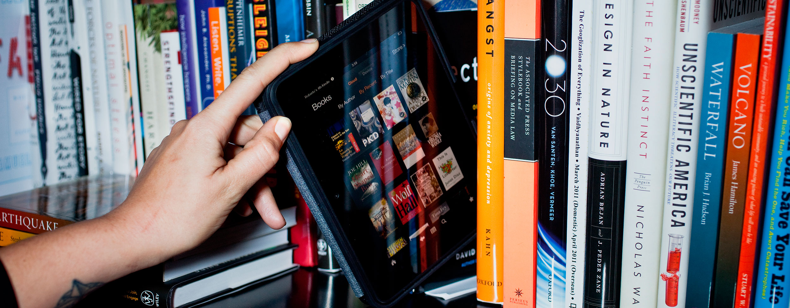

La vida está llena de elecciones: desde pequeños, las más banales generalmente; pasando por la juventud y la edad adulta, donde una buena —o mala— elección puede cambiar nuestras vidas por completo; hasta llegar a la vejez, donde podría decirse que _ya está todo el pescado vendido_ y, por lo general, vuelven a tener poca trascendencia; casi como cuando éramos niños.

Pero hay elecciones, como la que nos ocupa, que el simple hecho de tener que elegir entre una y otra ya me parece una estupidez. ¿Por qué elegir entre libro en papel y libro electrónico? ¿Quién nos obliga a tener que decantarnos por una de ellas y desechar por completo la otra? A mí, de momento, nadie me ha amenazado a vida o muerte para que deba elegir entre una y otra, no sé a los demás. Pero si es tu caso denuncia.

Por cierto, que aunque en la imagen ilustrativa aparezca un lector de libros electrónicos con pantalla retroiluminada, cuando yo hablo de lectores de libros electrónicos siempre lo hago refiriéndome a alguno con pantalla de tinta electrónica. Si no las comparaciones variarían un poco.

A continuación haré dos listas con las cosas que, según mi opinión, hacen destacar un formato respecto al otro. Y que son las que, en mayor medida, y según para qué ocasión, a mí me hacen decantarme por un formato u otro.

### Algunos pros y contras del libro en papel

- **Es tangible**. Parece una obviedad, pero es así: el libro en papel es tangible. Y yo, aunque suene anticuado, prefiero pagar por algo que puedo poseer que por algo que quién sabe cuándo deje de ser compatible con el lector de libros electrónicos que tengo y se quede en algo por lo que pagué que ya no me sirve para nada.
- **Más pesado**. Aunque en según qué situaciones no es molestia; por ejemplo: si podemos apoyarlos en una mesa o incluso en nuestras propias piernas, ya tiene que ser una antología de cuentos muy finita para que consigamos que un libro impreso en papel sea más ligero que un lector de libros electrónicos.
- **Ocupa más espacio físico**, pero **el espacio ocupado es más bonito**. Tener un montón de libros requiere de suficiente espacio si queremos conservarlos de forma adecuada; eso es un hecho. Ahora bien, si disponemos de estanterías donde poder organizarlos dan un ambiente acogedor a la habitación donde estén. Y los libros son a una decoración doméstica lo que el color negro y marrón a la ropa y sus complementos: encajan bien sea cual sea el estilo.
- **Si no te gusta ¡véndelo!** A veces podemos tener la tentación de adquirir un nuevo libro porque creamos que nos llama la atención, porque tenga una portada bonita —no digas que no, va— o porque te lo ha recomendado alguien que no conocía suficientemente bien tus gustos literarios. No importa, no pasa nada: ¡podemos venderlo! Es cierto que no recuperaremos el total del dinero invertido en él, pero sí una parte. Y si creemos que esa parte no es suficientemente atractiva y nos sentimos generosos siempre podremos donarlo a una biblioteca o a algunas ONG, seguro que lo recibirán con los brazos abiertos.

### Algunos pros y contras del libro electrónico

- Generalmente **es más económico**. Aunque [el libro en formato digital no es tan económico como debería](http://fjp.es/precio-de-los-libros-en-papel-y-electronicos/ "Precio de los libros: en papel y electrónico"), y ni siquiera es más económico en todos los casos —en éstos, los menos, siempre me decanto por la compra en papel: **tangible** y **más económico—**, se puede generalizar libremente dando por hecho que son más económicos. Y a veces, aunque prefiera pagar por algo tangible que por algo que no lo es, hay precios demasiado prohibitivos como para plantearse siquiera su compra. Y éste es un buen punto a favor del libro digital.
- **Más liviano**. Aunque los lectores electrónicos tienen su peso, la media de peso de éstos es siempre menor incluso que la mayoría de libros impresos en ediciones de bolsillo, por lo que cargar durante mucho tiempo con ellos puede resultar más cómodo con éstos que con sus homónimos en papel.
- **Ocupa menos espacio físico**, pero **como objeto decorativo no es gran cosa**. Seamos claros: si tenemos una casa pequeña con espacio reducido un lector de libros electrónicos es nuestra solución; porque puede albergar montones de libros sin aumentar ni su espacio ni su peso físico. Ahora bien ¿quién dejaría un lector de libros encima de una estantería o encimera a modo decorativo?
- **Si no te gusta un libro te fastidias**. Libro electrónico comprado, comprado queda —hablo del libro en sí, no del lector—; así lo dicta el [DRM](https://es.wikipedia.org/wiki/Gestión_digital_de_derechos), no hay más. No podemos venderlo de segunda mano, en la mayoría de los casos tan siquiera podemos prestarlo, y aunque nos sintamos generosos no podemos donarlo a nadie. Generalmente es más económico, como decía en el punto uno, pero si no te gusta la inversión queda hecha y no hay marcha atrás.

### Conclusiones finales

Ahora que alguien me explique: ¿por qué he de renunciar a las ventajas que cada uno de estos formatos me ofrecen? Para mí lo más conflictivo de lo anteriormente dicho es el espacio y peso que ocupan; concretamente cuando estoy fuera de casa y no puedo llevarme tantos libros físicos como quisiera. La forma con la que he resuelto esto: ¿leo en casa? electrónico o papel; ¿leo fuera de casa? siempre electrónico. ¿Por qué elegir? ¡Pudiendo disfrutar de ambos!

Anímate y comparte en los comentarios tu opinión al respecto. ¿Sueles elegir? En caso de darse la elección ¿qué formato es el vencedor en tu caso?
