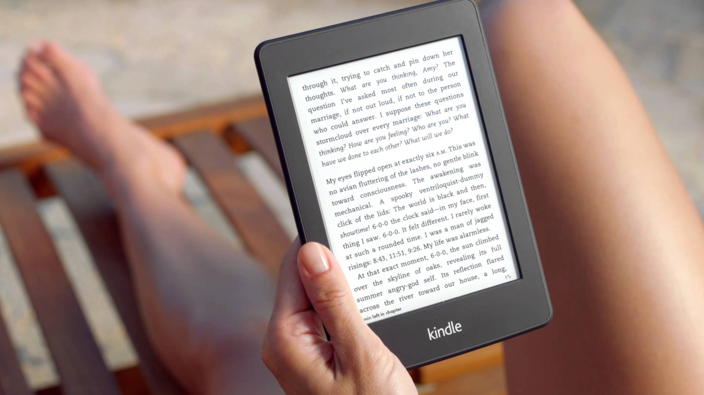

Quiero aportar mi punto de vista sobre esta cuestión que, sin duda, tiene un sinfín de matices y de puntos de vista diferentes. **No tengo una implicación directa en la cadena de fabricación de un libro**… por lo que, creo, puedo tener una visión más imparcial sobre este asunto.

Primero **daré por hecho que el precio de los libros en papel es un precio justo**; en algunos casos esto sería mucho suponer, y casi mejor sería decir que **el precio es el que es y punto**, pero haré una concesión en esto para que se vea que voy de buena fe.

Partiendo de la base de que un libro en papel tiene un precio justo, sea el que sea, debemos ver qué es lo que hace que ese libro cueste lo que cuesta; quién va repartiéndose cada uno de los céntimos que van sumándose hasta hacer el montante total que debes abonar a la tienda donde lo compres para llevarte el libro a casa.

Biblioteca pública de Estocolmo

Cabe dejar claro que **este análisis no afecta a los libros auto editados**: en esos casos los precios suelen ser bastante inferiores ya que suele ser una única persona —el autor— quien trabaja en esa obra —salvo que necesite un ilustrador—, y también normalmente estas personas suelen ser más conscientes de la diferencia abismal de precio que supone un libro en formato físico por encima de uno en formato electrónico.

### Reparto de gastos en la fabricación de un libro

- **Autor:** la persona que tiene la idea, quien la escribe, quien le da forma y, en definitiva: quien se estruja el coco para que nosotros podamos pasar un buen rato evadiéndonos de la realidad del día a día. Podría pensarse que esta persona es la que más dinero se lleva con la venta de cada ejemplar, pero no es correcto: **el autor material de la obra se lleva entre un 6% y un 8%** del total de la venta del ejemplar en cuestión.

- **Agente:** algunos escritores cuentan con un agente que es el encargado de conseguir mejores condiciones para el autor del libro; éste suele conseguir que la parte que se lleva el autor ascienda un poco: **alrededor del 10%**, pero obviamente esta persona también se lleva una parte de ese porcentaje: **alrededor del 3%**, por lo que al final lo que consigue de más para el autor se lo lleva él; eso sí: **a cambio de otros beneficios al margen de lo económico que puedan pactarse con las editoriales**.

- **Editorial**

- **Editor:** la persona que, dentro de la editorial, se encarga de coordinar y supervisar al resto de trabajadores; incluyendo también, en cierto modo, incluso el trabajo del autor del libro. Es también quien se encarga en la editorial de decidir si un libro se publica, suponiéndole —o no— una calidad o un nivel de marketing suficiente como para sacar un beneficio que compense a la editorial; y en función de esta previsión se aprueba o rechaza el proyecto.
- **Corrector:** esto lo diré con un poco de humor: es la persona que se encarga de que algunos autores no dejen el diccionario como si acabara de enfrentarse a Liam Neeson en una de las películas de Venganza.
- **Ilustrador:** se encarga principalmente de buscar la ilustración adecuada para las portadas de los libros; quienes se decantan —o no— por un libro según sea su portada deben echarle la culpa a esta persona en algunos casos por poner una portada increíblemente buena a un libro cuyo contenido no le hace justicia. En los casos de los libros ilustrados esta persona tiene, obviamente, mucho más trabajo.
- **Marketing:** dependiendo de quién sea el autor el gasto que supone esta parte incrementará más o menos; hay campañas de marketing muy modestas —empleando, sobre todo, el uso de las redes sociales—; otras, en las que también se crea una página web centrada en procurar información y contenidos extra para los lectores; y luego, algo menos frecuente, campañas que intentan conseguir _best sellers_ para autores consagrados —o el _famosete_ de turno que ni siquiera ha escrito una línea de texto— donde ya puedan entrar apariciones publicitarias en prensa, radio, televisión, carteles publicitarios en las calles, etc.
- **Producción:** para la producción de un libro se necesita una **imprenta**, que plasme en papel lo que **a estas alturas en su origen ya suele ser en formato electrónico**, y obviamente proporcionarle **tinta** —que todos los que hemos usado aunque sea una sola vez en la vida una impresora sabemos que en realidad es sangre de unicornio— y **papel** donde poder estampar el contenido.
- **Logística:** cuando los libros salen de la imprenta **necesitan ser transportados a un lugar donde almacenarlos** para su posterior distribución, necesitan **ese lugar donde poder ser almacenados**, y de nuevo **un transporte que los lleve desde el lugar de almacenaje a los diferentes puntos de venta**.
- **Comerciales:** el personal encargado de ir moviéndose por todos los posibles puntos de venta para anunciar la fecha publicación del libro en cuestión y, en la medida de lo posible, procurarse una puesta de carteles y un punto de venta llamativo dentro del local que consiga la máxima difusión y venta posible del libro.

- **Punto de venta**

- **Empleados:** gente con superpoderes y paciencia infinita encargada de asesorarte con tus —innumerables— dudas, de ayudarte a encontrar ese libro que tanto buscas y, por lo general, también de cobrarte y envolverte para regalo —si se requiere— lo que hayas comprado.
- **Alquiler del local** e **impuestos:** aquí no hay demasiado que explicar ya que es algo habitual en todos nosotros.

- **IVA:** superreducido —4% actualmente— en el caso de los libros en papel y general —21% actualmente— en el caso de los electrónicos. Esto de que los electrónicos no se consideren igualmente libros y no gocen de los mismos privilegios fiscales que los impresos da para artículo aparte.

### Lo que un libro electrónico no necesita

Como ya comenté antes, en el apartado de producción: actualmente **los libros suelen _nacer_ ya en formato electrónico**; los autores los escriben en sus ordenadores utilizando diferentes aplicaciones, según se sientan más cómodos y las preferencias personales de cada cual.

**Las campañas de marketing suelen ser enfocadas al libro físico**, aunque en algunas se haga también mención a que existe una publicación **alternativa** en formato electrónico —porque para algunas editoriales actualmente lo digital tiene menor importancia y relevancia que lo impreso—. En algunas campañas ni siquiera se menciona esta posibilidad, por lo que tienes que buscar en tu tienda habitual si es que no se anuncia porque ni siquiera existe la opción o porque **pasan olímpicamente** de ella aunque exista; en estos casos convendremos en que muy eficaz la campaña de marketing no es que esté siendo, al menos en cuanto a los libros electrónicos se refiere.

Resulta obvio, pero pese a ello: **en los libros digitales no existe producción alguna**. No se requieren imprentas, los árboles pueden estar tranquilos porque no serán talados para este fin y los unicornios, si los hubiese, no tendrán que someterse a extracción de sangre alguna para la impresión de los textos e imágenes en papel.

Tampoco necesitan transporte ni almacenaje: **ya que son intangibles no necesitan ser transportados a ningún lugar, ni ser almacenados para su posterior reparto a puntos de venta**.

**El trabajo de los comerciales tampoco es necesario**, ya que en estos casos suelen ser las propias tiendas de venta de libros electrónicos quienes, en función del número de descargas o visitas, promocionan en mayor o menor medida dándole un hueco en su página inicial a aquellos que puedan proporcionarle mayores beneficios económicos.

En cuanto al punto de venta online, sí es cierto que tiene ciertos gastos, pero **son enormemente reducidos en comparación a los gastos que supone un punto de venta físico**. No es necesario siquiera que exista un local físico, puesto que todas las transacciones serán online. Siendo fieles a la verdad aquí sí se necesita espacio de almacenaje en algún disco duro para que quien compre ese libro pueda descargárselo, pero todos sabemos que es una cantidad de espacio irrisoria y **cualquier plan económico de alojamiento web podría almacenar unos cuantos cientos de libros electrónicos sin problema**. Y este alojamiento, junto con el nombre de dominio que suelen abonarse en conjunto mediante un único pago anual, **representan un gasto irrisorio si se compara con el de un punto de venta físico**.

### Reflexiones finales

Quienes poseemos un lector de libros electrónicos no lo hacemos únicamente para poder comprar libros a menor precio: también es por la comodidad de poder llevar un buen montón de libros encima en un único «libro»; porque el número de páginas que tenga un tomo no implica que vayamos a estar sosteniendo mayor peso durante más tiempo; o porque podemos acomodar el tamaño de la fuente mostrada arreglo a como lo veamos mejor o como se nos canse menos la vista, independientemente del gusto personal de cada editor.

Pese a que el precio de los libros electrónicos cada vez tiende a ir más a la baja y cada vez hay más libros incluso por menos de un euro, la realidad es que en más casos de los deseables el precio no se ajusta en la totalidad al margen de beneficios que posee respecto a un libro físico, teniendo en cuenta todos los gastos anteriormente mencionados que se evitan por no ser necesarios.

Voy con algunos ejemplos de top ventas o últimas novedades del momento en Amazon. [Grey, de E.L. James](http://www.amazon.es/gp/product/8425393817): papel 17€, Kindle 9,50€. [La chica del tren, de Paula Hawkins](http://www.amazon.es/gp/product/8408141473): tapa blanda 10,30€, Kindle 12,34€. [Ciudades de papel, de John Green](http://www.amazon.es/gp/product/8415594283): tapa blanda 14,21€, Kindle 8,54. [Harry Potter y la piedra filosofal](http://www.amazon.es/gp/product/B005CRQ3I4): tapa blanda 6,65€, Kindle 7,99€. [Cazadores de sombras 1: ciudad de hueso](http://www.amazon.es/gp/product/8408083805): tapa blanda 12,30€, Kindle 7,59€. [Buscando a Alaska, de John Green](http://www.amazon.es/gp/product/8415594445): papel 14,21€, Kindle 8,54€. [El misterio de Salem's Lot, de Stephen King](http://www.amazon.es/gp/product/8497931025): tapa blanda 8,33€, Kindle 9,46€. [Trilogía de la Fundación, de Isaac Asimov](http://www.amazon.es/gp/product/B006543F8Y): tapa dura 14,21€, Kindle 10,44€. [El juego de Ender, de Orson Scott Card](http://www.amazon.es/gp/product/B00DSNF5OM): papel 7,60€, Kindle 7,59€. [El Silmarillion, de J. R. R. Tolkien](http://www.amazon.es/gp/product/8445077538): papel 10,40€, Kindle 6,64€. [El nombre del viento, de Patrick Rothfuss](http://www.amazon.es/gp/product/B006BD4C2W): papel 9,46€, Kindle 9,02€. [La clave está en Rebeca, de Ken Follett](http://www.amazon.es/gp/product/B00HQLB6TK): tapa blanda 8,51€, Kindle 5,69€. [La traición de Roma, de Santiago Posteguillo](http://www.amazon.es/gp/product/B00699M9HI): tapa blanda 5,65€, Kindle 5,22€. [Trilogía Martín Ojo de Plata, de Matilde Asensi](http://www.amazon.es/gp/product/B00LPDPGK0): tapa blanda 12,30€, Kindle 9,99€.

Ejemplos, creo, para todos los gustos. Y como ésos pueden encontrarse a patadas allá donde busques. En el mejor de los casos podemos ver como **la diferencia entre el precio del ejemplar en papel y electrónico es tan ínfima que se le supone al soporte digital un margen de beneficios tremendo**; en el peor de los casos, **siendo difícil diferenciar la línea que separa el precio justo y la desfachatez**, vemos los libros cuya versión digital **no sólo no es mucho más económica que su homónima en papel sino que es incluso más cara**. Sobre lo cual no tengo palabras para definir el despropósito que me parece.

Hay quienes defienden la teoría de que un precio óptimo para un libro digital son X euros por cada Y páginas. Yo prefiero tener en cuenta, como hemos visto, qué hace que un libro físico cueste lo que cuesta y restarle al digital todo lo que no es necesario para publicar en este soporte. Estaréis de acuerdo en que el margen de beneficios que obtienen de las ventas digitales es desproporcionado; y que, aunque quienes se dedican a esto prefieran estar ciegos a la realidad: son estos precios, el sentirse estafados en cada compra, lo que propicia que existan páginas web de descargas donde encontrar —aunque de forma _ilegal_— estos libros que buscamos sin que se nos quede cara de imbécil durante el proceso de compra. Y tampoco es que el precio justo para estos libros sea 0€, pero es que entre unos y otros al final acaban pareciendo más una posesión de lujo que una necesaria fuente de cultura al alcance de cualquier persona como en realidad debería ser.
