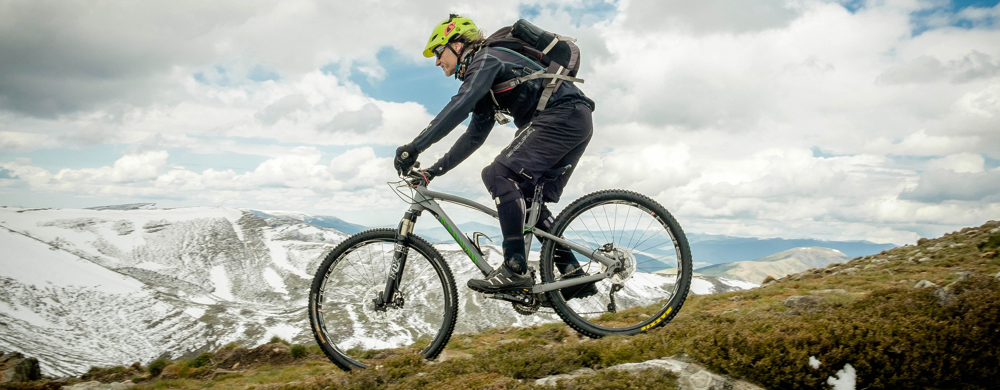

**Es muy fácil querer cambiar algo**; muy fácil decirlo, **ponerlo en práctica ya no lo es tanto**.

Aunque todo lo que diré a continuación sirve para todo tipo de cambios, me enfocaré en cambios físicos, de los cuales tengo temas de conversación durante horas: a todos nos gustaría cambiar algo, en mayor o menor medida, en nuestro cuerpo; ahora, la pregunta es **¿por qué no lo hacemos?** Porque **una cosa es querer y otra ponerse a ello**.

**No es fácil cambiar** y **mucho menos si no estás convencido de querer y de poder hacerlo**. Primero **necesitas creer que puedes**, después ya se verá si implica mayor o menor esfuerzo del previamente considerado, pero sin ese convencimiento inicial **algo difícil puede convertirse en imposible** _en un abrir y cerrar de ojos_.

Viendo mi caso en perspectiva, gente más lejana que no ha ido viendo y leyendo la evolución, creen que hay algún tipo de _truco_ en mi cambio físico. Es gente, normalmente, que no conoce el significado de la palabra **perseverancia**.

Está muy bien contratar los servicios de alguien que nos ayude a conseguir ese cambio, pero ni es necesario ni nos asegura un éxito si no ponemos de nuestra parte todo como si no contásemos con ningún tipo de ayuda externa. Los cambios no son fáciles, repito; y aunque traten de vendernos que exista una _pastillita mágica_ que haga nuestros deseos realidad con el menor esfuerzo posible suele ser mentira y una pérdida de tiempo —y de dinero.

Más ganas y menos tonterías y excusas. Cualquiera que sea el cambio que queramos afrontar podemos saber qué necesitamos para conseguirlo con una rápida consulta por internet. Hay que ponerse a ello y dejar atrás las excusas. A todos nos gustaría ir en bicicleta con la [Pinarello](http://pinarello.es/index.php/es/pinarello) con la que Chris Froome ganó el último Tour de Francia pero ¿es posible? ¿es necesario? la respuesta a ambas preguntas es la misma: no. No busques la mejor de las condiciones para afrontar un cambio; convierte una condición cualquiera en tu ocasión si es que de verdad quieres afrontar ese cambio. Si no estás poniéndote excusas tontas a ti mismo; y ponérselas a los demás tiene un pase, pero engañarse a uno mismo ya tiene delito.

Foto: [trackMTB.com](http://www.trackmtb.com/viaje-mtb-soria-pico-urbion/)

Retomando lo que decía antes del _truco_: cuando la gente no concibe un cambio drástico, o lo ve tan duro como para siquiera pensar en llevarlo a cabo, no contempla que cualquier otra persona sí sea capaz de proponérselo **y conseguirlo** con la **actitud adecuada** y **dosis extra de perseverancia**. No te dejes influenciar por nadie y sigue adelante. Poca gente creía en mi cambio, en que yo fuese capaz de hacerlo realidad. Muchos aún piensan que hay _truco_ —una operación, puedo suponer—; y siempre toparás con quien cuando pregunta cómo lo has conseguido, cuando ya has demostrado que sí podías, da igual lo que digas porque no creerán absolutamente nada de lo que puedas decir.

Siempre es más fácil de asimilar que hay un _truco_, que están ocultando parte de verdad en lo que cuentan, que asimilar que **otra persona ha conseguido algo que tú ni siquiera has intentado**.

**No es fácil cambiar algo**, pero por intentarlo no se pierde nada ¿no?

Si me sigues desde hace poco y no sabes cuál es mi cambio échale un ojo a este artículo: «[De 124,6kg a 89kg en 365 días](http://fjp.es/de-124-6kg-a-89kg-en-365-dias/)»
