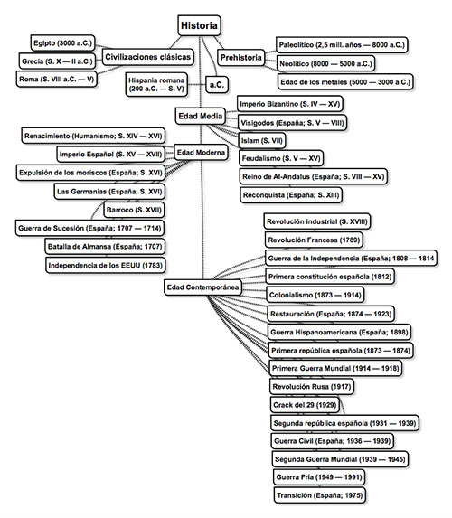
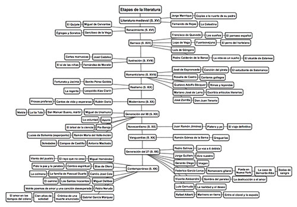
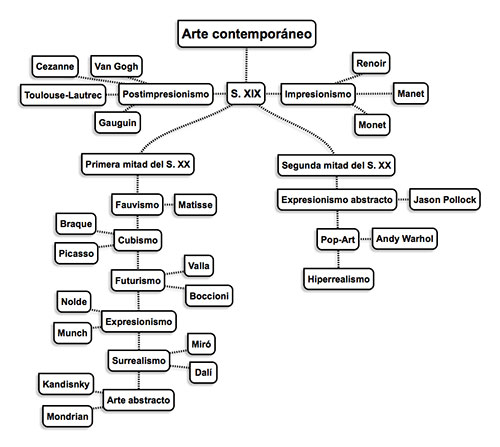

Dado que estoy estudiando estas asignaturas, y que el libro que estoy siguiendo deja un pelín que desear en cuanto a organización, me he creado unas líneas del tiempo con una aplicación para crear _mapas mentales_. En principio iba a ser algo rápido y para uso personal, para ver si consigo desatascarme un poco y lo veo más claro así, pero después he pensado que esto le podría ser útil a más personas así que me he animado a compartirlo aquí para que pueda hacer uso de ellas cualquiera.

Añado una imagen previsualizando un poco la nota mental y tras ella un botón de descarga, desde donde podrás descargar un archivo PDF listo para imprimir.

### Historia

En esta línea temporal incluyo los principales acontecimientos históricos europeos y españoles ordenados cronológicamente y separados por períodos históricos: prehistoria, civilizaciones clásicas, Edad Media, Edad Moderna y Edad Contemporánea.

 \[download id="5633"\]

### Literatura

En esta línea temporal se listan los movimientos literarios españoles junto con los principales autores españoles e hispanoamericanos de cada movimiento y algunas de sus obras más importantes.

 \[download id="5637"\]

### Arte

Aquí listo todos los movimientos artísticos de la época contemporánea ordenados cronológicamente; para el siglo XX hago una división para la primera mitad y la segunda mitad de siglo. Para cada movimiento también listo algunos de los artistas más relevantes del movimiento.

 \[download id="5641"\]
