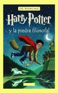
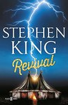
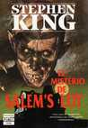
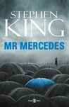
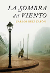
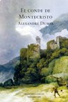
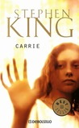
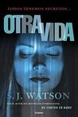

Aunque ya estamos terminando enero, entre unas cosas y otras todavía no había publicado mi lista de mejores lecturas. Y es que aunque en general no experimento demasiado y suelo voy a lo seguro cuando elijo un libro para leer —de ahí mis altas puntuaciones— todos los años hay algunos destacados que brillan entre el resto: los elegidos; normalmente porque aunque creyera que iban a gustarme no esperaba que lo hicieran tanto. Y son libros que recomendaría a ciegas a cualquiera que pueda leerme, porque creo firmemente que merecen la pena. He de añadir que algunos me han complicado la vida para colocarlos en una posición determinada, porque todos ellos sobresalen entre el resto de lecturas y tengo un maravilloso recuerdo de todos ellos por igual. Allá va:

5

[Harry Potter y la piedra filosofal](http://fjp.es/harry-potter-y-la-piedra-filosofal-de-j-k-rowling/), de [J. K. Rowling](http://fjp.es/autor/j-k-rowling/)

**Comprar:** \[papel id="8478884459"\] \[ebook id="B005CRQ3I4"\] **Editorial:** Salamandra [ficha del libro](http://salamandra.info/libro/harry-potter-y-piedra-filosofal)

Este libro no sólo está en esta lista por como es en sí mismo, que también, sino por cómo me hizo sentir. Primero: imbécil, por no haberle dado su merecida oportunidad cuando era niño, cuando en realidad formaba parte de su público objetivo; después: como un niño, aunque ya haga años que me salieron pelos en las piernas. Es un libro muy entretenido, con una de las historias fantásticas más bonitas que recuerdo; y si, como a mí, eso de las edades en los libros también te parece un cuento chino no te arrepentirás de darle una oportunidad. Si quieres más información visita mi [reseña de Harry Potter y la piedra filosofal, de J. K. Rowling](http://fjp.es/harry-potter-y-la-piedra-filosofal-de-j-k-rowling/).

4

[Revival](http://fjp.es/revival-de-stephen-king/), de [Stephen King](http://fjp.es/autor/stephen-king/)

**Comprar:** \[papel id="8401015383"\] \[ebook id="B012BMZ8MY"\] **Editorial:** Plaza & Janés [ficha del libro](http://www.megustaleer.com/libro/revival/ES0127675)

Es el único libro de esta lista que no se encuentra dentro de mi [estantería de libros favoritos](http://fjp.es/puntuacion/favoritos/), pero que a nadie le haga pensar por ello que es peor que el resto: es una de mis mejores lecturas de 2015. El motivo de la baja puntuación, y ya explico en la propia reseña que me fastidia mucho dárselo, es porque creo que aunque al final sí hay visos de él, en gran parte de este libro no hay mucho rastro de aquel Stephen King que nos enamoró a todos. Cosa que sí lo encontré en mayor medida, por ejemplo, en _Mr. Mercedes_; aunque como todo: para gustos, colores. El personaje del protagonista, Jamie, está perfectamente trabajado, como suele ser habitual en este autor; la historia es sencillamente genial, y el «reve» Jacobs es para mí lo mejor de éste y de muchos otros libros tanto de Stephen King como de otros autores, es necesario leer la historia de ese hombre completamente trastornado con apariencia tan normal como pueda tener un hombre de la iglesia. Si quieres más información visita mi [reseña de Revival, de Stephen King](http://fjp.es/revival-de-stephen-king/).

3

[El misterio de Salem's Lot](http://fjp.es/el-misterio-de-salems-lot-de-stephen-king/), de [Stephen King](http://fjp.es/autor/stephen-king/)

**Comprar:** \[papel id="8497931025"\] **Editorial:** Plaza & Janés [ficha del libro](http://www.megustaleer.com/libro/el-misterio-de-salems-lot/ES0003790)

Es, sencillamente, una de las mejores historias de vampiros que puedas leer. Straker y Barlow son dos vampiros de los de toda la vida: imponentes, fuertes, astutos y profundamente viejos; nada de esas modernidades que los niños tienen que leer hoy en día. Y no hay en ellos ni rastro de luciérnagas. Pero sobre todo, mi debilidad en esta historia es Mark Petrie: el niño que cambia el transcurso de la historia que ya es más que habitual en los libros escritos por Stephen King. Pero en éste, especialmente, lo ha dotado de una personalidad tan genial que es imposible no enamorarse de él. Si quieres más información visita mi [reseña de Salem's Lot, de Stephen King](http://fjp.es/el-misterio-de-salems-lot-de-stephen-king/).

2

[Mr. Mercedes](http://fjp.es/mr-mercedes-de-stephen-king/), de [Stephen King](http://fjp.es/autor/stephen-king/)

**Comprar:** \[papel id="8401343119"\] \[ebook id="B00NY7S3I2"\] **Editorial:** Plaza & Janés [ficha del libro](http://www.megustaleer.com/libro/mr-mercedes/ES0123740)

Como decía antes: en éste sí veo buena parte de esa esencia del Stephen King que amamos; _Mr. Mercedes_ es el primer volumen de una trilogía, y no es de terror sino de un experimento con la novela policiaca. Lo veo como un chorro de aire fresco dentro de la vasta bibliografía del señor King; dentro de una mente tan prodigiosa, capaz de escribir al año un número tan elevado de páginas, a veces es sano cambiar de estilo para despejar la mente, y es lo que ha demostrado con este libro, que el señor King no estaba dormido y que en cualquier momento te sorprende con una historia, como ésta, que no en vano ha recibido tan buena crítica. ¡Ya estoy esperando como loco _Finders Keepers_! O como quiera que se vaya a llamar en español. Si quieres más información visita mi [reseña de Mr. Mercedes, de Stephen King](http://fjp.es/mr-mercedes-de-stephen-king/).

1

[La sombra del viento](http://fjp.es/la-sombra-del-viento-de-carlos-ruiz-zafon/), de [Carlos Ruiz Zafón](http://fjp.es/autor/carlos-ruiz-zafon/)

**Comprar:** \[papel id="8408043641"\] \[ebook id="B0064RAX32"\] **Editorial:** Editorial Planeta [ficha del libro](http://www.planetadelibros.com/la-sombra-del-viento-libro-8831.html)

Descubrir a este señor ha sido para mí, sin duda, lo mejor del año. Hay autores que, no sé bien por qué, al principio soy algo reticentes a darles una oportunidad, pero en ocasiones, como ésta, después me siento ridículo por no habérsela dado antes. Todo lo que pueda decir de este libro se quedará corto, por eso lo mejor es que lo leas si todavía no lo leíste. Al principio es posible que, hasta que te acostumbres, y sobre todo si no sueles leer libros clásicos, la forma de escribir de Zafón te resulte extraña, pero una vez le coges el punto estarás devorando el libro sin siquiera darte cuenta. Maravilloso. Si quieres más información visita mi [reseña de La sombra del viento, de Carlos Ruiz Zafón](http://fjp.es/la-sombra-del-viento-de-carlos-ruiz-zafon/).

### Menciones especiales

Por último, fuera del ranking, quiero destacar estos tres libros.

En primer lugar: [El conde de Montecristo](http://fjp.es/el-conde-de-montecristo-de-alexandre-dumas/) de [Alexandre Dumas](http://fjp.es/autor/alexandre-dumas/), es uno de esos libros que postergué durante demasiado tiempo, y no por su número de páginas sino por su fama. Siempre lo digo, pero es que es así: soy una persona rara, o más bien mi mente piensa de forma extraña en algunas cosas, y cuando un libro es tan conocido como éste y tiene tanta relevancia en la literatura me da miedo leerlo… por simple miedo a que no me guste. Está claro que cada uno tiene sus gustos, y que no a todos nos tiene por qué gustar lo mismo, pero me imagino en la situación de que uno de los grandes clásicos no me guste y ¿qué hago? ¿con qué cara pongo yo aquí que me ha parecido un bodrio infumable? Y por eso mismo había retrasado tanto su lectura, porque en principio, y sin haberlo leído, me parecía una historia genial. Y por suerte, al menos en este caso, así fue. Salvo una breve parte del libro que me pareció bastante prescindible, y que ya lo indico en la reseña, el resto me parece un libro de diez. El personaje del conde es admirable, y en muchas ocasiones, obviamente ya fuera de su celda, deseaba con todas mis fuerzas ser él. Porque aprender todo lo que aprendió el conde mola, pensar como piensa el conde mola, y que todo el mundo te tenga el respeto y casi la veneración que le tenían al conde mola, y en definitiva: porque ser el conde mola mucho.

En siguiente lugar: [Carrie](http://fjp.es/carrie-de-stephen-king/) de [Stephen King](http://fjp.es/autor/stephen-king/), uno de los poquitos que tenía conciencia de haber leído de Stephen King siendo yo pequeño. Y es que descubrir a la señorita Carrie White de pequeño tiene tela. Debería ser un libro de referencia para todos aquellos niños que sufren bullying en el colegio; para que les demuestre que, aunque no debería suceder y siempre es mejor poner otros medios que no incluyan la violencia por parte del acosado, si alguien merece que le ocurran cosas malas no son ellos sino los acosadores. Puestos a que se suiciden no son ellos quienes deberían dar ese paso sino esos cobardes que valiéndose de la debilidad de otros desahogan sus frustraciones de esa forma. Algún día los acosados se olvidarán de sus inseguridades y creerán en su propia fuerza, como la señorita Carrie, y serán los acosadores quienes tendrán que pedir el cambio de colegio porque no puedan hacer frente al problema que ellos mismos han ocasionado.

Y por último, una de las últimas lecturas del año, pero que se merece esta mención por lo increíble que me pareció: [Otra vida](http://fjp.es/otra-vida-de-s-j-watson/) de [S. J. Watson](http://fjp.es/autor/s-j-watson/), se trata de una historia de suspense puro, que al principio flojea un poquito pero a la mínima que te das cuenta estás topándote con una historia impresionante en la que los que considerabas buenos no son tan buenos como parecen y aquellos que te parecían ser malos en realidad estaban siendo manipulados por los buenos para que parecieran malos cuando en realidad no lo son. Llega un momento en el que ya apenas sabes quién eres tú mismo ni qué estás haciendo… esto último si acaso un poco exagerado, pero en serio: merece mucho la pena leer este libro.

Y hasta aquí. ¿Has leído alguno de estos libros? ¿Te han parecido tan buenos como a mí? Anímate y cuéntame tu opinión en los comentarios.
