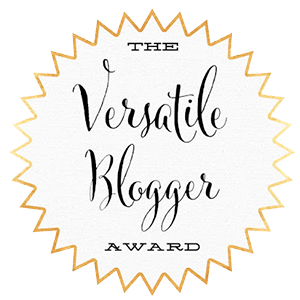

Me ha nominado la gran Bettie, de [Cuaderno de Retales](http://cuadernoderetales.blogspot.com.es), a realizar el tag [Versatile Blogger Award](http://cuadernoderetales.blogspot.com.es/2016/05/tag-premio-versatile-blogger-award.html), que además es un premio por ser un blogero versátil. Y otra cosa no sé, pero como blog personal que es (aunque está bastante enfocado a una de mis mayores pasiones: la literatura) podéis encontrar por estos lares cualquier cosa que se me pase por la cabeza. Incluso a veces os doy la brasa con mis movidas, como ahora.

Porque en este tag _sólo_ tengo que contar siete cosas sobre mí que no sepáis; y digo _sólo_, pero en realidad es _nada más y nada menos_, porque acabaría rápido diciendo cosas como que **me encanta leer** y que para mí **no es nada fácil hablar sobre mí mismo**, y menos todavía si es para hablar bien, pero por poco que me conozcáis ya sabréis eso y sería hacer trampa.

Espero que con estas cosas me conozcáis un poco mejor, si es que no lo sabíais de antemano; y si os pilla de nuevo algunas cosas no os asustéis ni salgáis corriendo, que en el fondo soy un chaval majete. ¡Vamos allá!

1. **Me encantan los trajes**. La primera no podía ser otra sino ésta. Me dan seguridad, me encanta como me sientan, en contra de lo que muchos opinan: yo voy comodísimo con ellos. ¿La pega? Que mi situación actual no me permite usarlos tanto como me gustaría. Me encantaría tener un trabajo que me permitiera usarlos siempre que quisiera… y ya puestos, que también me permitiera viajar en avión de un lugar a otro. Pero ahora mismo con tener un trabajo ya me conformaba.
2. **Adoro las plumas estilográficas**. Aunque hace tiempo ya comenté [algo sobre la caligrafía](http://fjp.es/caligrafia-transformando-letras-en-arte/), no es algo que haya dicho demasiado por estos lares; incluso cuando mi caligrafía era pésima, poco más allá de un jeroglífico, y me avergonzaba profundamente de ella, disfrutaba como un enano escribiendo con pluma estilográfica. Para mí escribir empuñando una estilográfica no es sólo escribir, es también una forma de relajarme, de disfrutar, de desconectar… Me gustan sobre todo los plumines finos: F e incluso EF, aunque no le harías ascos a uno flexible de los de antaño, de esos que transforman cualquier caligrafía, por mala que sea, en una obra de arte.
3. **No me gusta cumplir años**. Para mí hace mucho que dejaron de ser una fiesta. Y no es por el hecho de cumplirlos, o de hacerse mayor… En fin, eso no me preocupa, ése es el precio que hay que pagar por haber nacido, es propio del ser humano. Lo que me preocupa es alcanzar un año más sin haber hecho nada que merezca la pena o de lo que pueda sentirme orgulloso. Y yo no me siento orgulloso de mí mismo con cualquier cosa. Cuando de pequeño me preguntaban: ¿qué te ves haciendo cuando seas mayor? ¿Dónde vivirás? O cosas así… sin duda, la respuesta a ninguna de todas esas típicas preguntas tiene en absoluto que ver con mi vida actual y, preveo, la de los próximos años. Y eso es lo que no me gusta en realidad.
4. **Soy donante de médula**. Y vosotros también deberíais serlo. Me gustaría que antes de morirme sonara el teléfono y fueran los de la [fundación Josep Carreras](https://www.fcarreras.org/es/donantes-de-medula_194) diciéndome que soy compatible con alguien que lo necesite. Ese día sí podré decir que he hecho algo útil en mi vida, mucho más importante que cualquier cosa que pueda hacer de cualquier otra forma. Ojalá llegue algún día ese momento.
5. **Me gustan las motos y las bicis**. Y no me gusta conducir coches. Me gusta conducir motos, porque me es más fácil que un coche, y además por la sensación de libertad que te dan; me gustan las bicis por el mismo motivo que las motos mas aparte que son más económicas y encima sirven para perder algún kilito que tengamos por ahí escondido, de esos que cuestan más de irse que a los jóvenes de hoy emanciparse. Tristemente también me incluso en esto último.
6. **Me encanta el diseño web**. De hecho, antes de que supiera de qué escribir aquí, el motivo real para tener una web y después convertirla en un blog fue poder ir practicando lo que vaya aprendiendo. Y otra cosa más: por el momento nunca fui a ningún sitio a aprender, lo poco o mucho que pueda saber es todo autodidacta, a base de investigar y del infalible método prueba y error. Si las cosas van bien puede que esto pronto cambie y reciba clases de programación, pero para eso todavía falta un poco de tiempo…
7. **Soy tímido e introvertido**. Cuando conozco a alguien en persona (y suele ser en rara ocasión) nunca sé qué decir, cómo actuar, ni básicamente sé nada; las primeras impresiones que debo de causar en la gente deben ser de aúpa… Luego, cuando tengo confianza, cuando me suelto, puedo tener largas conversaciones (que me encantan) y hasta decir alguna que otra cosa interesante e inteligente. ¿Lo malo? Que sólo aquellas personas que no se han desanimado cuando parezco imbécil al principio llegan a conocer cómo soy realmente.

Tendría que nominar a alguien, pero ya sabéis que esa parte nunca la cumplo, porque nunca sé quién querrá hacer los tags. Si alguien quiere seguir este tag os animo a que lo digáis en los comentarios para poder conoceros un poco mejor.

P.D: si no os han gustado las cosas que os he contado sobre mí echadle la culpa a Bettie. :P
